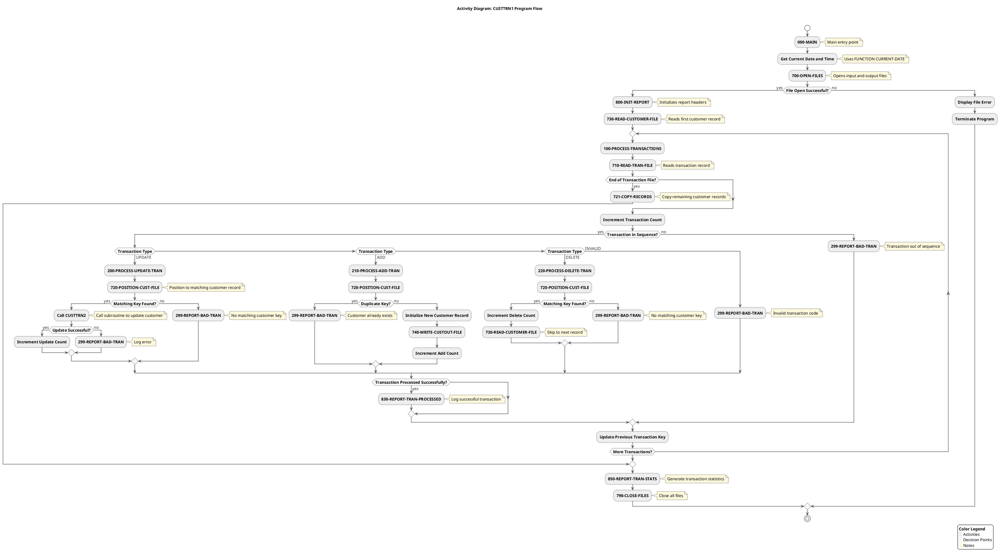
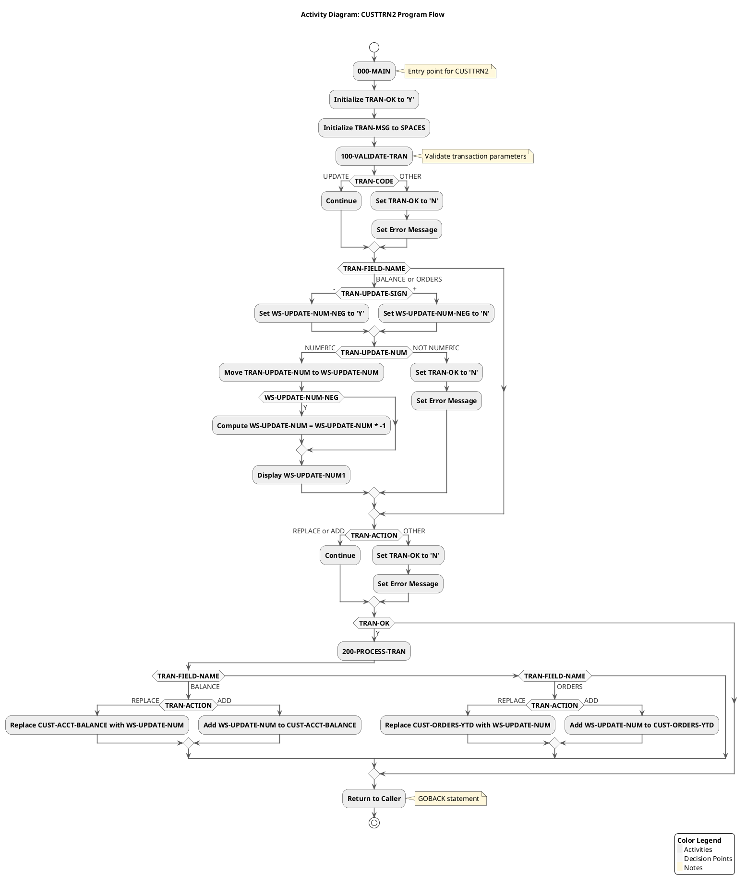

# Activity Diagram for Each COBOL Program

## Purpose
This document provides the Cypher query and PlantUML script for generating Activity Diagrams that visualize the internal logic flow of each COBOL program. The diagrams show paragraph flows, conditional logic, PERFORM statements, and file I/O operations.


## Cypher Query for Neo4j

```cypher
// Clear previous data if needed
MATCH (n) DETACH DELETE n;

// Create COBOL Programs
CREATE (custtrn1:Program {name: "CUSTTRN1", description: "Main transaction processing program"})
CREATE (custtrn2:Program {name: "CUSTTRN2", description: "Transaction update subroutine"})

// Create CUSTTRN1 Paragraphs
CREATE (main1:Paragraph {name: "000-MAIN", program: "CUSTTRN1"})
CREATE (processTrans:Paragraph {name: "100-PROCESS-TRANSACTIONS", program: "CUSTTRN1"})
CREATE (processUpdate:Paragraph {name: "200-PROCESS-UPDATE-TRAN", program: "CUSTTRN1"})
CREATE (processAdd:Paragraph {name: "210-PROCESS-ADD-TRAN", program: "CUSTTRN1"})
CREATE (processDelete:Paragraph {name: "220-PROCESS-DELETE-TRAN", program: "CUSTTRN1"})
CREATE (reportBadTran:Paragraph {name: "299-REPORT-BAD-TRAN", program: "CUSTTRN1"})
CREATE (openFiles:Paragraph {name: "700-OPEN-FILES", program: "CUSTTRN1"})
CREATE (readTranFile:Paragraph {name: "710-READ-TRAN-FILE", program: "CUSTTRN1"})
CREATE (positionCustFile:Paragraph {name: "720-POSITION-CUST-FILE", program: "CUSTTRN1"})
CREATE (copyRecords:Paragraph {name: "721-COPY-RECORDS", program: "CUSTTRN1"})
CREATE (readCustomerFile:Paragraph {name: "730-READ-CUSTOMER-FILE", program: "CUSTTRN1"})
CREATE (writeCustoutFile:Paragraph {name: "740-WRITE-CUSTOUT-FILE", program: "CUSTTRN1"})
CREATE (closeFiles:Paragraph {name: "790-CLOSE-FILES", program: "CUSTTRN1"})
CREATE (initReport:Paragraph {name: "800-INIT-REPORT", program: "CUSTTRN1"})
CREATE (reportTranProcessed:Paragraph {name: "830-REPORT-TRAN-PROCESSED", program: "CUSTTRN1"})
CREATE (reportTranStats:Paragraph {name: "850-REPORT-TRAN-STATS", program: "CUSTTRN1"})

// Create CUSTTRN2 Paragraphs
CREATE (main2:Paragraph {name: "000-MAIN", program: "CUSTTRN2"})
CREATE (validateTran:Paragraph {name: "100-VALIDATE-TRAN", program: "CUSTTRN2"})
CREATE (processTran:Paragraph {name: "200-PROCESS-TRAN", program: "CUSTTRN2"})

// Create File Operations
CREATE (customerFile:File {name: "CUSTOMER-FILE", type: "INPUT"})
CREATE (customerFileOut:File {name: "CUSTOMER-FILE-OUT", type: "OUTPUT"})
CREATE (transactionFile:File {name: "TRANSACTION-FILE", type: "INPUT"})
CREATE (reportFile:File {name: "REPORT-FILE", type: "OUTPUT"})

// Connect CUSTTRN1 Paragraphs
CREATE (main1)-[:PERFORMS]->(openFiles)
CREATE (main1)-[:PERFORMS]->(initReport)
CREATE (main1)-[:PERFORMS]->(readCustomerFile)
CREATE (main1)-[:PERFORMS {condition: "UNTIL WS-TRAN-EOF = 'Y'"}]->(processTrans)
CREATE (main1)-[:PERFORMS]->(reportTranStats)
CREATE (main1)-[:PERFORMS]->(closeFiles)

CREATE (processTrans)-[:PERFORMS]->(readTranFile)
CREATE (processTrans)-[:EVALUATES {condition: "WS-TRAN-EOF NOT = 'Y'"}]->(readTranFile)
CREATE (processTrans)-[:EVALUATES {condition: "TRAN-KEY < WS-PREV-TRAN-KEY"}]->(reportBadTran)
CREATE (processTrans)-[:EVALUATES {condition: "TRAN-CODE = 'UPDATE'"}]->(processUpdate)
CREATE (processTrans)-[:EVALUATES {condition: "TRAN-CODE = 'ADD   '"}]->(processAdd)
CREATE (processTrans)-[:EVALUATES {condition: "TRAN-CODE = 'DELETE'"}]->(processDelete)
CREATE (processTrans)-[:EVALUATES {condition: "TRAN-CODE = OTHER"}]->(reportBadTran)
CREATE (processTrans)-[:EVALUATES {condition: "WS-TRAN-OK = 'Y'"}]->(reportTranProcessed)

CREATE (processUpdate)-[:PERFORMS]->(positionCustFile)
CREATE (processUpdate)-[:EVALUATES {condition: "CUST-KEY NOT = TRAN-KEY OR WS-CUST-FILE-EOF = 'Y'"}]->(reportBadTran)
CREATE (processUpdate)-[:CALLS]->(custtrn2)
CREATE (processUpdate)-[:EVALUATES {condition: "WS-TRAN-OK NOT = 'Y'"}]->(reportBadTran)

CREATE (processAdd)-[:PERFORMS]->(positionCustFile)
CREATE (processAdd)-[:EVALUATES {condition: "CUST-KEY = TRAN-KEY"}]->(reportBadTran)
CREATE (processAdd)-[:PERFORMS]->(writeCustoutFile)

CREATE (processDelete)-[:PERFORMS]->(positionCustFile)
CREATE (processDelete)-[:EVALUATES {condition: "CUST-KEY NOT = TRAN-KEY OR WS-CUST-FILE-EOF = 'Y'"}]->(reportBadTran)
CREATE (processDelete)-[:PERFORMS]->(readCustomerFile)

CREATE (readTranFile)-[:READS]->(transactionFile)
CREATE (readTranFile)-[:EVALUATES {condition: "WS-TRAN-EOF = 'Y'"}]->(copyRecords)
CREATE (readTranFile)-[:EVALUATES {condition: "WS-TRANFILE-STATUS NOT IN ('00', '10')"}]->(reportBadTran)

CREATE (positionCustFile)-[:EVALUATES {condition: "CUST-KEY < TRAN-KEY AND WS-CUST-FILE-EOF NOT = 'Y'"}]->(copyRecords)

CREATE (copyRecords)-[:PERFORMS]->(writeCustoutFile)
CREATE (copyRecords)-[:PERFORMS]->(readCustomerFile)

CREATE (readCustomerFile)-[:READS]->(customerFile)
CREATE (readCustomerFile)-[:EVALUATES {condition: "WS-CUSTFILE-STATUS NOT IN ('00', '04', '10')"}]->(reportBadTran)

CREATE (writeCustoutFile)-[:WRITES]->(customerFileOut)
CREATE (writeCustoutFile)-[:EVALUATES {condition: "WS-CUSTOUT-STATUS NOT = '00'"}]->(reportBadTran)

CREATE (openFiles)-[:OPENS]->(customerFile)
CREATE (openFiles)-[:OPENS]->(customerFileOut)
CREATE (openFiles)-[:OPENS]->(transactionFile)
CREATE (openFiles)-[:OPENS]->(reportFile)
CREATE (openFiles)-[:EVALUATES {condition: "WS-CUSTFILE-STATUS NOT = '00'"}]->(main1)
CREATE (openFiles)-[:EVALUATES {condition: "WS-CUSTOUT-STATUS NOT = '00'"}]->(main1)
CREATE (openFiles)-[:EVALUATES {condition: "WS-TRANFILE-STATUS NOT = '00'"}]->(main1)

CREATE (closeFiles)-[:CLOSES]->(customerFile)
CREATE (closeFiles)-[:CLOSES]->(transactionFile)
CREATE (closeFiles)-[:CLOSES]->(reportFile)

CREATE (initReport)-[:WRITES]->(reportFile)
CREATE (reportBadTran)-[:WRITES]->(reportFile)
CREATE (reportTranProcessed)-[:WRITES]->(reportFile)
CREATE (reportTranStats)-[:WRITES]->(reportFile)

// Connect CUSTTRN2 Paragraphs
CREATE (main2)-[:PERFORMS]->(validateTran)
CREATE (main2)-[:EVALUATES {condition: "TRAN-OK = 'Y'"}]->(processTran)

CREATE (validateTran)-[:EVALUATES {condition: "TRAN-CODE = 'UPDATE '"}]->(validateTran)
CREATE (validateTran)-[:EVALUATES {condition: "TRAN-CODE = OTHER"}]->(main2)
CREATE (validateTran)-[:EVALUATES {condition: "TRAN-FIELD-NAME IN ('BALANCE ', 'ORDERS  ')"}]->(validateTran)
CREATE (validateTran)-[:EVALUATES {condition: "TRAN-UPDATE-NUM NOT NUMERIC"}]->(main2)
CREATE (validateTran)-[:EVALUATES {condition: "TRAN-ACTION IN ('REPLACE ', 'ADD     ')"}]->(validateTran)
CREATE (validateTran)-[:EVALUATES {condition: "TRAN-ACTION = OTHER"}]->(main2)

CREATE (processTran)-[:EVALUATES {condition: "TRAN-FIELD-NAME = 'BALANCE '"}]->(processTran)
CREATE (processTran)-[:EVALUATES {condition: "TRAN-FIELD-NAME = 'ORDERS  '"}]->(processTran)
CREATE (processTran)-[:EVALUATES {condition: "TRAN-ACTION = 'REPLACE '"}]->(processTran)
CREATE (processTran)-[:EVALUATES {condition: "TRAN-ACTION = 'ADD     '"}]->(processTran)

// Connect Programs
CREATE (custtrn1)-[:CALLS]->(custtrn2);
```

## PlantUML Script for CUSTTRN1



## PlantUML Script for CUSTTRN2



## Diagram Description

The Activity Diagrams for each COBOL program visualize the internal logic flow of the programs, showing:

1. **Paragraph Flows**: The sequence of paragraphs executed in each program, including the main entry points and the flow between paragraphs.

2. **Conditional Logic**: Decision points represented by IF and EVALUATE statements that determine the program's execution path.

3. **PERFORM Statements**: The relationships between paragraphs, showing which paragraphs call (PERFORM) other paragraphs.

4. **File I/O Operations**: File operations such as OPEN, READ, WRITE, and CLOSE, showing how the program interacts with external files.

### CUSTTRN1 Program

CUSTTRN1 is the main transaction processing program that:
- Opens input and output files
- Initializes reports
- Reads customer and transaction records
- Processes different types of transactions (UPDATE, ADD, DELETE)
- Generates transaction statistics
- Closes files

The program handles various error conditions, such as file I/O errors, invalid transactions, and sequence errors.

### CUSTTRN2 Program

CUSTTRN2 is a subroutine called by CUSTTRN1 to process UPDATE transactions:
- Validates transaction parameters
- Processes updates to customer balance or orders
- Handles different update actions (REPLACE, ADD)
- Returns control to CUSTTRN1 with success/failure status

These diagrams provide a detailed understanding of the program logic, making it easier for developers to understand the code and for stakeholders to grasp the business processes implemented in the COBOL programs.

### Prompt 1: Generate Cypher Query for Neo4j

```
You are tasked with creating a Cypher query to extract the main process flow from a Neo4j database containing a COBOL application structure. The query will be used to generate an activity diagram.

The COBOL application consists of two main programs:
1. CUSTTRN1: The main program that handles transaction processing
2. CUSTTRN2: A subroutine called by CUSTTRN1 to process update transactions

The Neo4j database has the following node types:
- COBOLProgram: Represents COBOL programs
- COBOLParagraph: Represents paragraphs in COBOL programs
- COBOLFile: Represents files used by COBOL programs

And the following relationship types:
- CONTAINS: Links programs to their paragraphs
- COBOLPerform: Represents PERFORM statements in COBOL
- COBOLCall: Represents CALL statements in COBOL
- READS/WRITES: Represents file operations

Create a comprehensive Cypher query that extracts:
1. The main process flow starting from CUSTTRN1's main paragraph (000-MAIN)
2. The transaction processing flow (100-PROCESS-TRANSACTIONS)
3. The different paths for processing transactions (UPDATE, ADD, DELETE)
4. Error handling paths (299-REPORT-BAD-TRAN)
5. The interaction between CUSTTRN1 and CUSTTRN2
6. File operations

The query should be structured as a series of MATCH statements combined with UNION to capture all aspects of the process flow. Ensure the query is optimized and focuses on the relationships that are most relevant for understanding the business process.
```

### Prompt 2: Generate PlantUML Activity Diagram

```
You are tasked with creating a PlantUML activity diagram that visualizes the main process flow of a COBOL application based on data extracted from a Neo4j database using the following Cypher query:

[INSERT CYPHER QUERY FROM PROMPT 1]

The COBOL application processes customer transactions with the following main components:

1. CUSTTRN1: Main program that:
   - Opens files (700-OPEN-FILES)
   - Initializes reports (800-INIT-REPORT)
   - Processes transactions (100-PROCESS-TRANSACTIONS)
   - Handles different transaction types:
     - UPDATE (200-PROCESS-UPDATE-TRAN)
     - ADD (210-PROCESS-ADD-TRAN)
     - DELETE (220-PROCESS-DELETE-TRAN)
   - Reports errors (299-REPORT-BAD-TRAN)
   - Generates statistics (850-REPORT-TRAN-STATS)
   - Closes files (790-CLOSE-FILES)

2. CUSTTRN2: Subroutine called by CUSTTRN1 to:
   - Validate transactions (100-VALIDATE-TRAN)
   - Process update transactions (200-PROCESS-TRAN)

Create a detailed activity diagram that:
1. Shows the overall flow from start to end
2. Clearly illustrates decision points and their outcomes
3. Highlights error handling paths
4. Distinguishes between the two programs (CUSTTRN1 and CUSTTRN2)
5. Includes file operations
6. Uses appropriate styling for better readability

The diagram should be visually appealing and easy to understand for both technical and non-technical stakeholders. Use swimlanes to separate the activities of CUSTTRN1 and CUSTTRN2. Include detailed activity descriptions that explain what each step does.

Ensure the PlantUML script is syntactically correct and optimized for rendering a clear, professional diagram.
```
