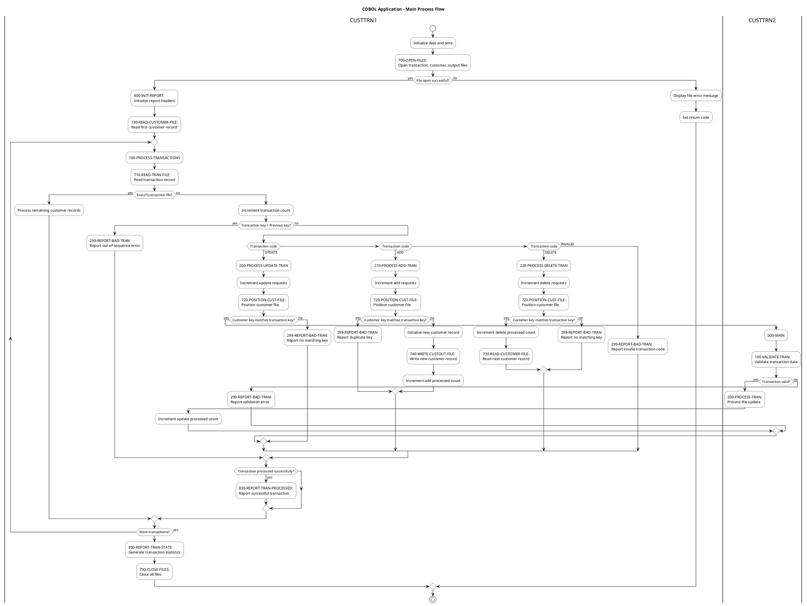

# Activity Diagram for Main Process Flow

## Purpose
This document provides a comprehensive activity diagram illustrating the main process flow of the COBOL application, focusing on transaction processing workflow, decision points, and error handling paths. The diagram is designed to provide a clear understanding of the business process implemented by the application.

## Key Elements
- Transaction processing workflow (UPDATE, ADD, DELETE)
- Decision points
- Error handling paths
- Program interaction between CUSTTRN1 and CUSTTRN2

## Cypher Query for Neo4j
The following Cypher query extracts the main process flow from the Neo4j database:

```cypher
// Main process flow starting from CUSTTRN1's main paragraph
MATCH path = (p:COBOLProgram {name: "CUSTTRN1"})-[:CONTAINS]->(para:COBOLParagraph {name: "000-MAIN"})-[:COBOLPerform*1..2]->(nextPara:COBOLParagraph)
RETURN path

UNION

// Transaction processing flow
MATCH path = (p:COBOLProgram {name: "CUSTTRN1"})-[:CONTAINS]->(para:COBOLParagraph {name: "100-PROCESS-TRANSACTIONS"})-[:COBOLPerform]->(nextPara:COBOLParagraph)
RETURN path

UNION

// Transaction type handling (UPDATE, ADD, DELETE)
MATCH path = (p:COBOLProgram {name: "CUSTTRN1"})-[:CONTAINS]->(para:COBOLParagraph)-[:COBOLPerform]->(nextPara:COBOLParagraph)
WHERE para.name IN ["200-PROCESS-UPDATE-TRAN", "210-PROCESS-ADD-TRAN", "220-PROCESS-DELETE-TRAN"]
RETURN path

UNION

// Error handling paths
MATCH path = (p:COBOLProgram {name: "CUSTTRN1"})-[:CONTAINS]->(para:COBOLParagraph)-[:COBOLPerform]->(errPara:COBOLParagraph {name: "299-REPORT-BAD-TRAN"})
RETURN path

UNION

// Interaction between CUSTTRN1 and CUSTTRN2
MATCH path = (p1:COBOLProgram {name: "CUSTTRN1"})-[:CONTAINS]->(para:COBOLParagraph {name: "200-PROCESS-UPDATE-TRAN"})-[:COBOLCall]->(p2:COBOLProgram {name: "CUSTTRN2"})
RETURN path

UNION

// CUSTTRN2 internal flow
MATCH path = (p:COBOLProgram {name: "CUSTTRN2"})-[:CONTAINS]->(para:COBOLParagraph {name: "000-MAIN"})-[:COBOLPerform*1..2]->(nextPara:COBOLParagraph)
RETURN path

UNION

// File operations
MATCH path = (p:COBOLProgram)-[:CONTAINS]->(para:COBOLParagraph)-[:READS|WRITES]->(file:COBOLFile)
WHERE p.name IN ["CUSTTRN1", "CUSTTRN2"]
RETURN path
```

## PlantUML Activity Diagram



### Prompt 1: Generate Cypher Query for Neo4j

```
You are tasked with creating a Cypher query to extract the main process flow from a Neo4j database containing a COBOL application structure. The query will be used to generate an activity diagram.

The COBOL application consists of two main programs:
1. CUSTTRN1: The main program that handles transaction processing
2. CUSTTRN2: A subroutine called by CUSTTRN1 to process update transactions

The Neo4j database has the following node types:
- COBOLProgram: Represents COBOL programs
- COBOLParagraph: Represents paragraphs in COBOL programs
- COBOLFile: Represents files used by COBOL programs

And the following relationship types:
- CONTAINS: Links programs to their paragraphs
- COBOLPerform: Represents PERFORM statements in COBOL
- COBOLCall: Represents CALL statements in COBOL
- READS/WRITES: Represents file operations

Create a comprehensive Cypher query that extracts:
1. The main process flow starting from CUSTTRN1's main paragraph (000-MAIN)
2. The transaction processing flow (100-PROCESS-TRANSACTIONS)
3. The different paths for processing transactions (UPDATE, ADD, DELETE)
4. Error handling paths (299-REPORT-BAD-TRAN)
5. The interaction between CUSTTRN1 and CUSTTRN2
6. File operations

The query should be structured as a series of MATCH statements combined with UNION to capture all aspects of the process flow. Ensure the query is optimized and focuses on the relationships that are most relevant for understanding the business process.
```

### Prompt 2: Generate PlantUML Activity Diagram

```
You are tasked with creating a PlantUML activity diagram that visualizes the main process flow of a COBOL application based on data extracted from a Neo4j database using the following Cypher query:

[INSERT CYPHER QUERY FROM PROMPT 1]

The COBOL application processes customer transactions with the following main components:

1. CUSTTRN1: Main program that:
   - Opens files (700-OPEN-FILES)
   - Initializes reports (800-INIT-REPORT)
   - Processes transactions (100-PROCESS-TRANSACTIONS)
   - Handles different transaction types:
     - UPDATE (200-PROCESS-UPDATE-TRAN)
     - ADD (210-PROCESS-ADD-TRAN)
     - DELETE (220-PROCESS-DELETE-TRAN)
   - Reports errors (299-REPORT-BAD-TRAN)
   - Generates statistics (850-REPORT-TRAN-STATS)
   - Closes files (790-CLOSE-FILES)

2. CUSTTRN2: Subroutine called by CUSTTRN1 to:
   - Validate transactions (100-VALIDATE-TRAN)
   - Process update transactions (200-PROCESS-TRAN)

Create a detailed activity diagram that:
1. Shows the overall flow from start to end
2. Clearly illustrates decision points and their outcomes
3. Highlights error handling paths
4. Distinguishes between the two programs (CUSTTRN1 and CUSTTRN2)
5. Includes file operations
6. Uses appropriate styling for better readability

The diagram should be visually appealing and easy to understand for both technical and non-technical stakeholders. Use swimlanes to separate the activities of CUSTTRN1 and CUSTTRN2. Include detailed activity descriptions that explain what each step does.

Ensure the PlantUML script is syntactically correct and optimized for rendering a clear, professional diagram.
```

## Benefits
This activity diagram provides a clear understanding of the business process implemented by the application, making it easier for all stakeholders to understand the transaction processing workflow, decision points, and error handling paths.