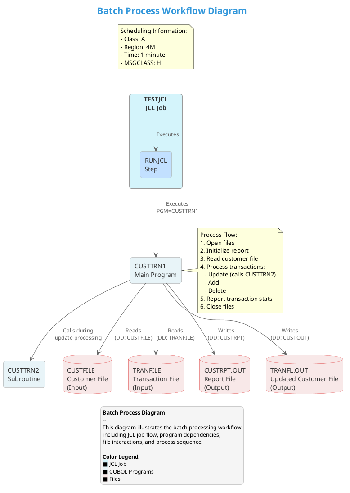

# Batch Process Diagram

## Purpose
This document provides a comprehensive visualization of the batch processing workflow in the COBOL application, focusing on JCL job flow, dependencies between jobs, scheduling information, and file dependencies.

## Cypher Query for Neo4j

The following Cypher query extracts the batch processing workflow from the Neo4j database:

```cypher
// Query to extract JCL job and its relationships
MATCH (jcl:COBOLJcl {name: "TESTJCL"})
RETURN jcl

UNION

// Query to extract COBOL programs executed by the JCL job
MATCH (jcl:COBOLJcl {name: "TESTJCL"})-[r]->(prog:COBOLProgram)
RETURN jcl, r, prog

UNION

// Query to extract file dependencies for the COBOL programs
MATCH (prog:COBOLProgram {name: "CUSTTRN1"})-[:CONTAINS]->(para:COBOLParagraph)-[:CONTAINS]->(fileOp:COBOLFileOperation)
WHERE fileOp.operation IN ["input", "output"]
RETURN prog, para, fileOp

UNION

// Query to extract program calls between COBOL programs
MATCH (prog1:COBOLProgram {name: "CUSTTRN1"})-[:CONTAINS]->(para:COBOLParagraph)-[:CONTAINS]->(call)
WHERE call.rawCode CONTAINS "CALL 'CUSTTRN2'"
RETURN prog1, para, call

UNION

// Query to extract the called program
MATCH (prog2:COBOLProgram {name: "CUSTTRN2"})
RETURN prog2
```

## PlantUML Batch Process Diagram



## Benefits
This batch process diagram provides a clear understanding of the operational aspects of the system, including:

1. **JCL Job Flow**: Visualizes how the TESTJCL job executes the CUSTTRN1 program.
2. **Program Dependencies**: Shows the relationship between CUSTTRN1 (main program) and CUSTTRN2 (subroutine).
3. **File Dependencies**: Illustrates the input files (CUSTFILE, TRANFILE) and output files (CUSTRPT.OUT, TRANFL.OUT) used in the process.
4. **Process Sequence**: Details the sequence of operations within the CUSTTRN1 program.
5. **Scheduling Information**: Provides information about job scheduling parameters.

This visualization helps operations teams understand the system's batch processing workflow, assists developers in maintaining and enhancing the system, and provides stakeholders with a clear picture of the operational aspects of the application.


## Prompt 1: Neo4j Cypher Query Generation

```
You are a Neo4j and COBOL expert tasked with creating a Cypher query to extract batch processing workflow data from a Neo4j database containing information about a legacy COBOL application.

## Context
The database contains information about a COBOL application with the following components:
- JCL jobs (labeled as COBOLJcl)
- COBOL programs (labeled as COBOLProgram)
- COBOL paragraphs (labeled as COBOLParagraph)
- File operations (labeled as COBOLFileOperation)
- Relationships between these components

## Requirements
Create a comprehensive Cypher query that extracts:
1. The JCL job named "TESTJCL"
2. The COBOL programs executed by this JCL job
3. The file dependencies (input and output) for these COBOL programs
4. The program calls between COBOL programs (specifically CUSTTRN1 calling CUSTTRN2)
5. Any relevant paragraphs and operations that illustrate the batch processing workflow

## Important Considerations
- The query should use UNION clauses to combine different aspects of the workflow
- The query should be optimized for visualization in a batch process diagram
- Include comments explaining each part of the query
- The main COBOL programs are CUSTTRN1 (main program) and CUSTTRN2 (subroutine)
- File operations have an "operation" property that can be "input" or "output"
- Program calls can be identified by searching for "CALL" in the rawCode property

## Expected Output Format
Provide a complete Cypher query with comments that can be executed against a Neo4j database to extract all the necessary information for creating a batch process diagram.
```

## Prompt 2: PlantUML Batch Process Diagram Generation

```
You are a UML and COBOL expert tasked with creating a PlantUML script to visualize a batch process diagram for a legacy COBOL application.

## Context
I have extracted data from a Neo4j database about a COBOL application's batch processing workflow using the following Cypher query:

[INSERT CYPHER QUERY FROM PROMPT 1 HERE]

The query results show:
- A JCL job named "TESTJCL" with a step "RUNJCL" that executes the COBOL program "CUSTTRN1"
- CUSTTRN1 reads from input files (CUSTFILE, TRANFILE) and writes to output files (CUSTRPT.OUT, TRANFL.OUT)
- CUSTTRN1 calls CUSTTRN2 as a subroutine during update transaction processing
- The main process flow in CUSTTRN1 includes: opening files, initializing reports, reading customer files, processing transactions (update, add, delete), reporting transaction statistics, and closing files
- Scheduling information for the JCL job includes Class A, Region 4M, Time 1 minute, and MSGCLASS H

## Requirements
Create a comprehensive PlantUML script that visualizes:
1. The JCL job flow
2. Dependencies between programs
3. File dependencies
4. Process sequence
5. Scheduling information

## Important Considerations
- Use appropriate UML notation for different components (rectangles for programs, databases for files, etc.)
- Include styling for better visualization (colors, fonts, etc.)
- Add notes to explain process flow and scheduling information
- Include a legend to explain the diagram elements
- The diagram should be visually appealing and easy to understand for both technical and non-technical stakeholders
- Optimize the layout for clarity and readability

## Expected Output Format
Provide a complete PlantUML script that can be used to generate a comprehensive batch process diagram. The script should include styling, notes, and a legend to enhance understanding.
```

## Usage Instructions

1. **First Pipeline Step**:
    - Input the first prompt into GPT-4o
    - The model will generate a Neo4j Cypher query
    - Review and validate the query against your Neo4j database

2. **Second Pipeline Step**:
    - Copy the Cypher query output from the first step
    - Replace `[INSERT CYPHER QUERY FROM PROMPT 1 HERE]` in the second prompt with the copied query
    - Input the updated second prompt into GPT-4o
    - The model will generate a PlantUML script for the batch process diagram

3. **Diagram Generation**:
    - Use the PlantUML script with a PlantUML renderer to generate the final diagram
    - Review the diagram for accuracy and completeness
    - Make any necessary adjustments to the script for better visualization

## Important Notes

- The prompts are designed to work specifically with the structure of the Neo4j database containing the COBOL application data
- The Cypher query assumes specific node labels and relationship types as described in the prompt
- The PlantUML script assumes specific components and relationships as described in the prompt
- Adjustments may be needed based on the actual structure of your Neo4j database and the specific requirements of your batch process diagram