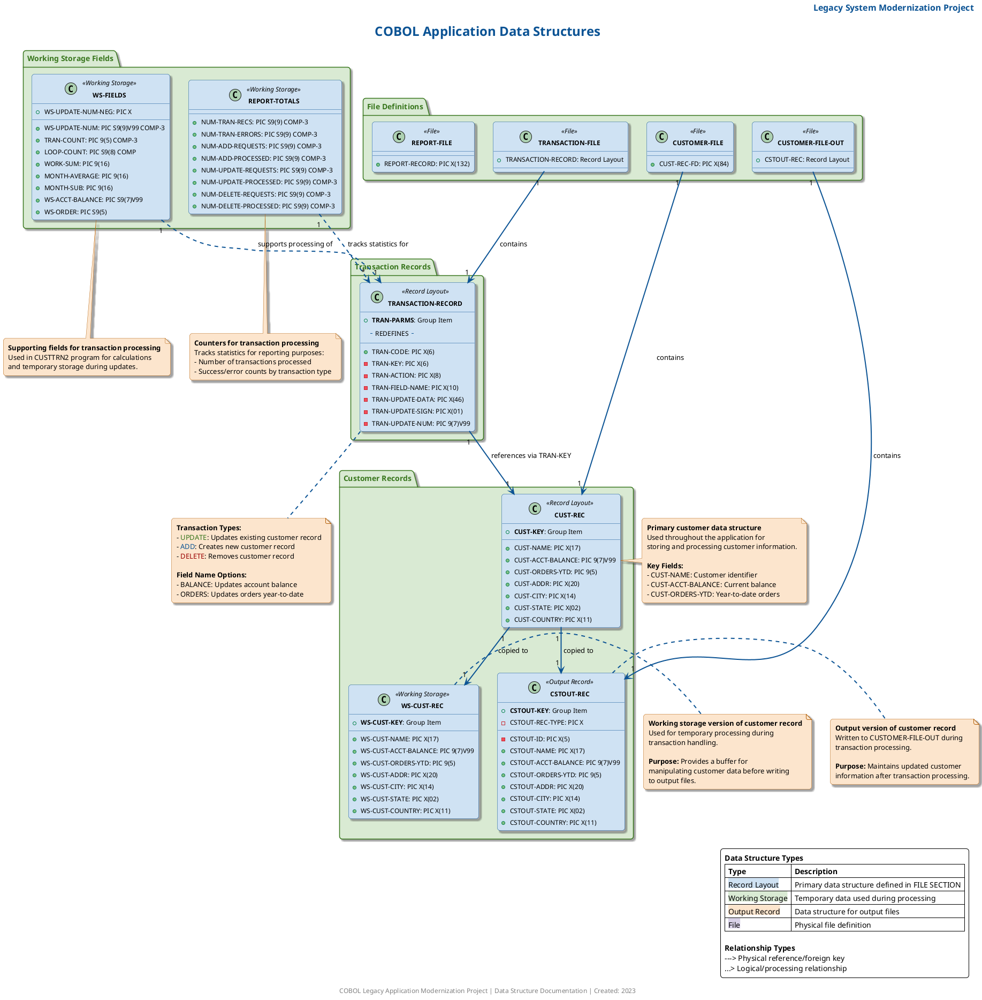

# Class Diagram for COBOL Data Structures

## Purpose
This document provides the necessary scripts to generate a class diagram representing the data structures used in the COBOL programs. The diagram visualizes record layouts, field definitions with data types, and relationships between data structures.

## Key Elements
- Record layouts (CUST-REC, TRANSACTION-RECORD)
- Field definitions with data types
- Relationships between data structures

## Benefits
- Provides clear understanding of the data model
- Facilitates system comprehension for both technical and non-technical stakeholders
- Supports maintenance and enhancement activities

## Neo4j Cypher Query

```cypher
// Clear existing data if needed
MATCH (n) DETACH DELETE n;

// Create Record Layouts
CREATE (custRec:RecordLayout {name: "CUST-REC", description: "Customer Record Layout"})
CREATE (tranRec:RecordLayout {name: "TRANSACTION-RECORD", description: "Transaction Record Layout"})
CREATE (cstoutRec:RecordLayout {name: "CSTOUT-REC", description: "Customer Output Record Layout"})
CREATE (wsCustRec:RecordLayout {name: "WS-CUST-REC", description: "Working Storage Customer Record"});

// Create Fields for CUST-REC
CREATE (custKey:Field {name: "CUST-KEY", dataType: "Group Item"})
CREATE (custName:Field {name: "CUST-NAME", dataType: "PIC X(17)"})
CREATE (custAcctBalance:Field {name: "CUST-ACCT-BALANCE", dataType: "PIC 9(7)V99"})
CREATE (custOrdersYtd:Field {name: "CUST-ORDERS-YTD", dataType: "PIC 9(5)"})
CREATE (custAddr:Field {name: "CUST-ADDR", dataType: "PIC X(20)"})
CREATE (custCity:Field {name: "CUST-CITY", dataType: "PIC X(14)"})
CREATE (custState:Field {name: "CUST-STATE", dataType: "PIC X(02)"})
CREATE (custCountry:Field {name: "CUST-COUNTRY", dataType: "PIC X(11)"});

// Create Fields for TRANSACTION-RECORD
CREATE (tranCode:Field {name: "TRAN-CODE", dataType: "PIC X(6)"})
CREATE (tranParms:Field {name: "TRAN-PARMS", dataType: "Group Item"})
CREATE (tranKey:Field {name: "TRAN-KEY", dataType: "PIC X(6)"})
CREATE (tranAction:Field {name: "TRAN-ACTION", dataType: "PIC X(8)"})
CREATE (tranFieldName:Field {name: "TRAN-FIELD-NAME", dataType: "PIC X(10)"})
CREATE (tranUpdateData:Field {name: "TRAN-UPDATE-DATA", dataType: "PIC X(46)"})
CREATE (tranUpdateSign:Field {name: "TRAN-UPDATE-SIGN", dataType: "PIC X(01)"})
CREATE (tranUpdateNum:Field {name: "TRAN-UPDATE-NUM", dataType: "PIC 9(7)V99"});

// Create Fields for CSTOUT-REC
CREATE (cstoutKey:Field {name: "CSTOUT-KEY", dataType: "Group Item"})
CREATE (cstoutId:Field {name: "CSTOUT-ID", dataType: "PIC X(5)"})
CREATE (cstoutRecType:Field {name: "CSTOUT-REC-TYPE", dataType: "PIC X"})
CREATE (cstoutName:Field {name: "CSTOUT-NAME", dataType: "PIC X(17)"})
CREATE (cstoutAcctBalance:Field {name: "CSTOUT-ACCT-BALANCE", dataType: "PIC 9(7)V99"})
CREATE (cstoutOrdersYtd:Field {name: "CSTOUT-ORDERS-YTD", dataType: "PIC 9(5)"})
CREATE (cstoutAddr:Field {name: "CSTOUT-ADDR", dataType: "PIC X(20)"})
CREATE (cstoutCity:Field {name: "CSTOUT-CITY", dataType: "PIC X(14)"})
CREATE (cstoutState:Field {name: "CSTOUT-STATE", dataType: "PIC X(02)"})
CREATE (cstoutCountry:Field {name: "CSTOUT-COUNTRY", dataType: "PIC X(11)"});

// Create Fields for WS-CUST-REC
CREATE (wsCustKey:Field {name: "WS-CUST-KEY", dataType: "Group Item"})
CREATE (wsCustName:Field {name: "WS-CUST-NAME", dataType: "PIC X(17)"})
CREATE (wsCustAcctBalance:Field {name: "WS-CUST-ACCT-BALANCE", dataType: "PIC 9(7)V99"})
CREATE (wsCustOrdersYtd:Field {name: "WS-CUST-ORDERS-YTD", dataType: "PIC 9(5)"})
CREATE (wsCustAddr:Field {name: "WS-CUST-ADDR", dataType: "PIC X(20)"})
CREATE (wsCustCity:Field {name: "WS-CUST-CITY", dataType: "PIC X(14)"})
CREATE (wsCustState:Field {name: "WS-CUST-STATE", dataType: "PIC X(02)"})
CREATE (wsCustCountry:Field {name: "WS-CUST-COUNTRY", dataType: "PIC X(11)"});

// Connect Fields to Record Layouts
CREATE (custRec)-[:CONTAINS]->(custKey)
CREATE (custRec)-[:CONTAINS]->(custName)
CREATE (custRec)-[:CONTAINS]->(custAcctBalance)
CREATE (custRec)-[:CONTAINS]->(custOrdersYtd)
CREATE (custRec)-[:CONTAINS]->(custAddr)
CREATE (custRec)-[:CONTAINS]->(custCity)
CREATE (custRec)-[:CONTAINS]->(custState)
CREATE (custRec)-[:CONTAINS]->(custCountry)

CREATE (tranRec)-[:CONTAINS]->(tranCode)
CREATE (tranRec)-[:CONTAINS]->(tranParms)
CREATE (tranParms)-[:CONTAINS]->(tranKey)
CREATE (tranParms)-[:CONTAINS]->(tranAction)
CREATE (tranParms)-[:CONTAINS]->(tranFieldName)
CREATE (tranParms)-[:CONTAINS]->(tranUpdateData)
CREATE (tranUpdateData)-[:REDEFINES]->(tranUpdateSign)
CREATE (tranUpdateData)-[:REDEFINES]->(tranUpdateNum)

CREATE (cstoutRec)-[:CONTAINS]->(cstoutKey)
CREATE (cstoutKey)-[:CONTAINS]->(cstoutId)
CREATE (cstoutKey)-[:CONTAINS]->(cstoutRecType)
CREATE (cstoutRec)-[:CONTAINS]->(cstoutName)
CREATE (cstoutRec)-[:CONTAINS]->(cstoutAcctBalance)
CREATE (cstoutRec)-[:CONTAINS]->(cstoutOrdersYtd)
CREATE (cstoutRec)-[:CONTAINS]->(cstoutAddr)
CREATE (cstoutRec)-[:CONTAINS]->(cstoutCity)
CREATE (cstoutRec)-[:CONTAINS]->(cstoutState)
CREATE (cstoutRec)-[:CONTAINS]->(cstoutCountry)

CREATE (wsCustRec)-[:CONTAINS]->(wsCustKey)
CREATE (wsCustRec)-[:CONTAINS]->(wsCustName)
CREATE (wsCustRec)-[:CONTAINS]->(wsCustAcctBalance)
CREATE (wsCustRec)-[:CONTAINS]->(wsCustOrdersYtd)
CREATE (wsCustRec)-[:CONTAINS]->(wsCustAddr)
CREATE (wsCustRec)-[:CONTAINS]->(wsCustCity)
CREATE (wsCustRec)-[:CONTAINS]->(wsCustState)
CREATE (wsCustRec)-[:CONTAINS]->(wsCustCountry);

// Create Relationships between Record Layouts
CREATE (tranRec)-[:REFERENCES {description: "Transaction references Customer via key"}]->(custRec)
CREATE (custRec)-[:COPIED_TO {description: "Customer record copied to output"}]->(cstoutRec)
CREATE (custRec)-[:COPIED_TO {description: "Customer record copied to working storage"}]->(wsCustRec);

// Return all nodes and relationships
MATCH (n) RETURN n;
```


```cypher
// Cypher query to extract data structures from COBOL programs
MATCH (p:Program)-[:HAS_SECTION]->(s)
WHERE s.type IN ['FILE_SECTION', 'WORKING_STORAGE']
MATCH (s)-[:CONTAINS]->(d:DataEntry)
WITH p, s, d
OPTIONAL MATCH (d)-[:CONTAINS]->(f:Field)
RETURN p.name as Program, 
       s.type as Section, 
       d.name as DataStructure, 
       d.raw_code as RawCode,
       COLLECT({name: f.name, dataType: f.picture, value: f.value}) as Fields
ORDER BY Program, Section, DataStructure;
```

## PlantUML Script



## How to Use

### Neo4j Graph Database
1. Open Neo4j Browser
2. Copy and paste the Cypher query
3. Execute the query to create the graph representation of the data structures

### PlantUML Diagram
1. Copy the PlantUML script
2. Use an online PlantUML editor (like [PlantUML Online Server](http://www.plantuml.com/plantuml/uml/))
3. Paste the script and generate the diagram
4. Download the resulting image for documentation purposes

## Diagram Explanation

The class diagram visualizes:

1. **Record Layouts**: The main data structures (CUST-REC, TRANSACTION-RECORD, etc.) are represented as classes with stereotypes indicating their type.

2. **Field Definitions**: Each field within a record is shown with its data type, with key fields highlighted in bold.

3. **Relationships**: The connections between data structures are represented by arrows:
   - Transaction records reference customer records via the key field
   - Customer records are copied to output records
   - Customer records are copied to working storage
   - Files contain their respective record layouts

4. **Grouping**: Related structures are grouped in packages for better organization:
   - Customer Records
   - Transaction Records
   - Working Storage Fields
   - File Definitions

5. **Notes**: Detailed notes provide context about each structure's purpose, usage, and key fields.

6. **Legend**: A legend explains the color coding and relationship types used in the diagram.

This visualization helps stakeholders understand the data model of the COBOL application, facilitating maintenance, enhancement, and potential modernization efforts.


## Prompt 1: Neo4j Cypher Query Generation

```
You are tasked with creating a Neo4j Cypher query to extract data structures from a COBOL application for visualization purposes. The query should focus on extracting record layouts, field definitions, and relationships between data structures.

Input: The legacy_code_final.json file containing COBOL program definitions with the following structure:
- cobolPrograms: Array of COBOL programs
  - name: Program name
  - working_storage: Working storage section with data_entries
  - file_section: File section with data_entries
  - data_entries: Array of data structures
    - name: Structure name
    - raw_code: COBOL code defining the structure
    - fields: Array of fields within the structure

Requirements:
1. Extract all record layouts from FILE SECTION and WORKING-STORAGE SECTION
2. Identify field definitions with their data types
3. Determine relationships between data structures (contains, references, redefines)
4. Focus on key structures: CUST-REC, TRANSACTION-RECORD, CSTOUT-REC, WS-CUST-REC
5. Include program context to understand which program uses which data structure

The query should be optimized for Neo4j and return results that can be used to generate a comprehensive class diagram. Include comments explaining the purpose of each part of the query.

Output: A complete, executable Neo4j Cypher query that extracts the required information from the database.
```

## Prompt 2: PlantUML Script Generation

```
You are tasked with creating a PlantUML script to generate a class diagram for COBOL data structures based on the results of a Neo4j query. The diagram should be visually appealing, business-elegant, and understandable by both technical and non-technical stakeholders.

Input: The results of the following Neo4j Cypher query:
[INSERT RESULTS FROM PROMPT 1 QUERY HERE]

Requirements:
1. Create a comprehensive class diagram showing:
   - Record layouts (CUST-REC, TRANSACTION-RECORD, etc.) as classes
   - Field definitions with their data types as class attributes
   - Relationships between data structures (contains, references, redefines)
   - Grouping of related structures in packages

2. Apply professional styling:
   - Use a business-elegant color scheme
   - Apply appropriate stereotypes to distinguish different types of structures
   - Include detailed notes explaining the purpose of key structures
   - Add a legend explaining the diagram elements
   - Use bold formatting for key fields
   - Include a title, header, and footer

3. Enhance readability:
   - Organize the layout for maximum clarity
   - Use appropriate spacing and padding
   - Apply consistent styling throughout
   - Include relationship descriptions

4. Add context through notes:
   - Explain transaction types and their purposes
   - Describe the role of each major data structure
   - Highlight key fields and their significance
   - Provide processing context where relevant

Output: A complete, executable PlantUML script that generates a professional-quality class diagram representing the COBOL data structures. The script should be well-commented and structured for easy maintenance.
```

This enhanced documentation provides a comprehensive view of the COBOL application's data structures, making it accessible and valuable for all stakeholders involved in understanding and modernizing the legacy system.