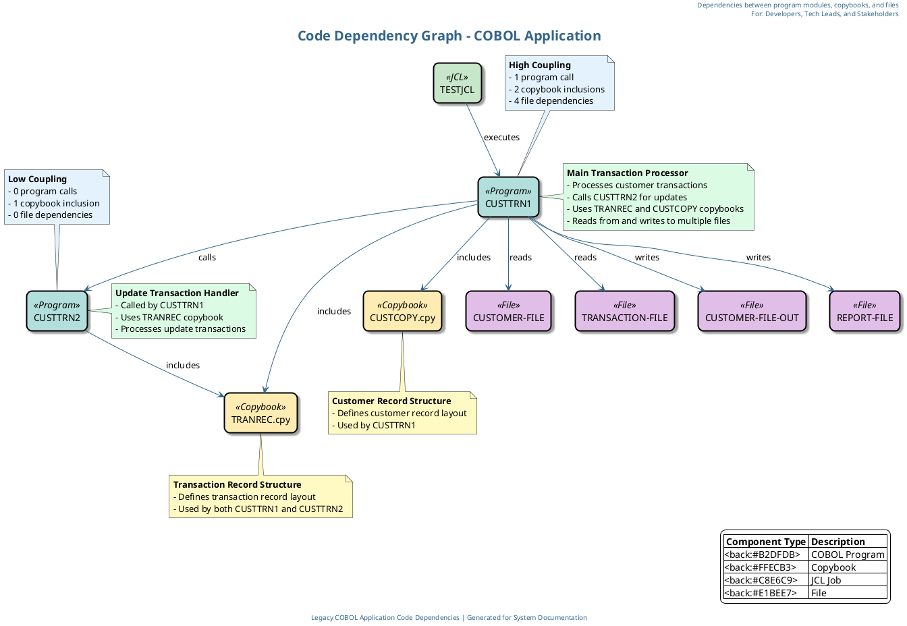

# Code Dependency Graph for COBOL Application

This document provides the Cypher query and PlantUML script for generating a code dependency graph of the COBOL application. The diagram visualizes dependencies between program modules, including program calls, copybook inclusions, and module dependencies.

## 1. Cypher Query for Neo4j

The following Cypher query extracts the code dependencies from Neo4j to build the dependency graph:

```cypher
// Code Dependency Graph Cypher Query
// This query extracts dependencies between program modules, including program calls,
// copybook inclusions, and module dependencies

// Match all COBOL programs
MATCH (program:COBOLProgram)

// Get program calls (direct dependencies between programs)
OPTIONAL MATCH (caller:COBOLProgram)-[:CONTAINS]->(:COBOLProcedureDivision)-[:CONTAINS]->
               (:COBOLParagraph)-[:CONTAINS]->(call:COBOLCall)
OPTIONAL MATCH (called:COBOLProgram)
WHERE called.name = call.name

// Get copybook inclusions
OPTIONAL MATCH (program:COBOLProgram)-[:USES]->(copybook:COBOLCopybook)

// Get JCL job dependencies (which programs are executed by which jobs)
OPTIONAL MATCH (job:COBOLJcl)-[:EXECUTES]->(program:COBOLProgram)

// Get file dependencies (which programs read/write which files)
OPTIONAL MATCH (program:COBOLProgram)-[:CONTAINS]->(:COBOLDataDivision)-[:CONTAINS]->
               (:COBOLFileSection)-[:CONTAINS]->(file:COBOLFileControl)

// Return all dependencies
RETURN 
    program.name as Program,
    collect(DISTINCT called.name) as CalledPrograms,
    collect(DISTINCT copybook.name) as UsedCopybooks,
    collect(DISTINCT job.name) as ExecutedByJobs,
    collect(DISTINCT file.name) as AccessedFiles
```

## 2. PlantUML Script for Code Dependency Graph

The following PlantUML script generates a code dependency graph based on the data extracted from Neo4j:



## 3. Code Dependency Graph Description

The code dependency graph visualizes the following elements:

### COBOL Programs
- **CUSTTRN1**: The main program that processes customer transactions
- **CUSTTRN2**: A subroutine called by CUSTTRN1 to process update transactions

### Copybooks
- **TRANREC.cpy**: Defines the transaction record structure, used by both CUSTTRN1 and CUSTTRN2
- **CUSTCOPY.cpy**: Defines the customer record structure, used by CUSTTRN1

### JCL Jobs
- **TESTJCL**: Executes CUSTTRN1 with specific file assignments

### Files
- **CUSTOMER-FILE**: Input file containing customer records
- **TRANSACTION-FILE**: Input file containing transaction records
- **CUSTOMER-FILE-OUT**: Output file for updated customer records
- **REPORT-FILE**: Output file for transaction processing reports

### Dependencies
- CUSTTRN1 calls CUSTTRN2
- CUSTTRN1 includes TRANREC.cpy and CUSTCOPY.cpy
- CUSTTRN2 includes TRANREC.cpy
- TESTJCL executes CUSTTRN1
- CUSTTRN1 reads from CUSTOMER-FILE and TRANSACTION-FILE
- CUSTTRN1 writes to CUSTOMER-FILE-OUT and REPORT-FILE

### Coupling Analysis
- CUSTTRN1 has high coupling with 1 program call, 2 copybook inclusions, and 4 file dependencies
- CUSTTRN2 has low coupling with 0 program calls, 1 copybook inclusion, and 0 file dependencies

## 4. Benefits of the Code Dependency Graph

The code dependency graph provides several benefits for understanding and maintaining the COBOL application:

1. **Visualizes Module Dependencies**: Clearly shows which programs call other programs and which copybooks are included by which programs
2. **Identifies Highly Coupled Components**: Highlights programs with many dependencies, which may be candidates for refactoring
3. **Reveals Reuse Patterns**: Shows which copybooks are reused across multiple programs
4. **Supports Impact Analysis**: Helps assess the impact of changes to specific components
5. **Aids in Modernization Planning**: Provides insights for breaking down monolithic applications into microservices

## 5. GPT-4o Prompts for Pipeline

### Prompt 1: Generate Cypher Query

```
You are tasked with creating a Cypher query for Neo4j to extract data for a code dependency graph of a COBOL application. The diagram should visualize dependencies between program modules, including program calls, copybook inclusions, and module dependencies.

The application consists of:
1. COBOL Programs: CUSTTRN1 (main program) and CUSTTRN2 (subroutine)
2. Copybooks: TRANREC.cpy and CUSTCOPY.cpy
3. JCL Job: TESTJCL
4. Files: CUSTOMER-FILE, TRANSACTION-FILE, CUSTOMER-FILE-OUT, REPORT-FILE

Key dependencies:
- CUSTTRN1 calls CUSTTRN2
- CUSTTRN1 includes TRANREC.cpy and CUSTCOPY.cpy
- CUSTTRN2 includes TRANREC.cpy
- TESTJCL executes CUSTTRN1
- CUSTTRN1 reads from and writes to various files

The Neo4j database contains nodes with labels like COBOLProgram, COBOLCopybook, COBOLJcl, and COBOLFileControl, and relationships like CONTAINS, USES, EXECUTES, etc.

Create a comprehensive Cypher query that extracts all these dependencies to be used for generating a code dependency graph. Include comments in the query to explain each section.

The query should be designed to work with the legacy_code_final.json data structure, which has been imported into Neo4j. Ensure the query handles cases where some relationships might not exist by using OPTIONAL MATCH where appropriate.

Your output should be only the Cypher query with clear comments, ready to be executed in a Neo4j database.
```

### Prompt 2: Generate PlantUML Script

```
Using the results from the following Cypher query, create a PlantUML script to generate a code dependency graph for a COBOL application:

[INSERT CYPHER QUERY RESULT HERE]

The code dependency graph should:
1. Visualize dependencies between program modules, including program calls, copybook inclusions, and module dependencies
2. Include COBOL Programs (CUSTTRN1, CUSTTRN2), Copybooks (TRANREC.cpy, CUSTCOPY.cpy), JCL Job (TESTJCL), and Files (CUSTOMER-FILE, TRANSACTION-FILE, CUSTOMER-FILE-OUT, REPORT-FILE)
3. Show all dependencies between components (calls, includes, executes, reads, writes)
4. Use appropriate styling to distinguish between different types of components
5. Include a title, header, and legend
6. Add detailed descriptive notes for key components explaining their purpose and functionality
7. Include metrics or notes about coupling to help identify highly coupled components

The diagram should be visually appealing and easy to understand for all stakeholders, including developers, tech leads, executives, and business stakeholders. Use color coding, clear labels, and professional styling to enhance readability and create a business-elegant presentation.

Specific requirements:
- Use a professional color scheme with complementary colors
- Add detailed notes explaining the purpose of each component
- Include coupling metrics to highlight refactoring opportunities
- Use shadowing and rounded corners for a modern look
- Ensure all relationships have descriptive labels
- Organize the layout for maximum clarity

Provide the complete PlantUML script that can be directly used to generate the code dependency graph. The script should be well-commented and structured for easy maintenance.
```