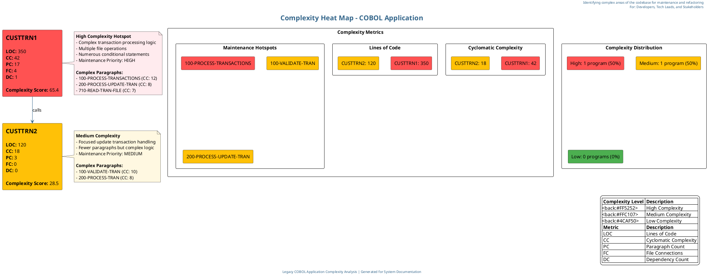

# Complexity Heat Map for COBOL Application

This document provides the Cypher query and PlantUML script for generating a complexity heat map of the COBOL application. The diagram visualizes complex areas of the codebase by analyzing cyclomatic complexity, code size metrics, and maintenance hotspots.

## 1. Cypher Query for Neo4j

The following Cypher query extracts complexity metrics from Neo4j to build the heat map:

```cypher
// Complexity Heat Map Cypher Query
// This query extracts complexity metrics from COBOL programs including
// cyclomatic complexity, code size, and potential maintenance hotspots

// Match all COBOL programs
MATCH (program:COBOLProgram)

// Get procedure division paragraphs for complexity analysis
OPTIONAL MATCH (program)-[:CONTAINS]->(procDiv:COBOLProcedureDivision)-[:CONTAINS]->(para:COBOLParagraph)

// Calculate code size metrics
WITH program, 
     collect(para) as paragraphs,
     size(split(program.rawCode, '\n')) as totalLines

// Calculate cyclomatic complexity based on control statements
UNWIND paragraphs as paragraph
WITH program, 
     paragraph,
     totalLines,
     size(paragraphs) as paragraphCount,
     // Count conditional statements as indicators of complexity
     size([x in split(paragraph.rawCode, ' ') WHERE x IN ['IF', 'EVALUATE', 'PERFORM', 'UNTIL', 'VARYING']]) as conditionalCount

// Aggregate complexity metrics by program
WITH program,
     totalLines,
     paragraphCount,
     sum(conditionalCount) as totalConditionals,
     avg(conditionalCount) as avgConditionalsPerParagraph,
     max(conditionalCount) as maxConditionalsInParagraph

// Calculate a complexity score
WITH program,
     totalLines,
     paragraphCount,
     totalConditionals,
     avgConditionalsPerParagraph,
     maxConditionalsInParagraph,
     // Complexity score formula: weighted sum of metrics
     (totalLines * 0.2) + (paragraphCount * 0.3) + (totalConditionals * 0.5) as complexityScore

// Get program calls to identify dependencies
OPTIONAL MATCH (program)-[:CONTAINS]->(:COBOLProcedureDivision)-[:CONTAINS]->(:COBOLParagraph)-[:CONTAINS]->(call:COBOLCall)
WITH program, 
     totalLines,
     paragraphCount,
     totalConditionals,
     avgConditionalsPerParagraph,
     maxConditionalsInParagraph,
     complexityScore,
     collect(DISTINCT call.name) as calledPrograms

// Get file dependencies
OPTIONAL MATCH (program)-[:CONTAINS]->(:COBOLDataDivision)-[:CONTAINS]->(:COBOLFileSection)-[:CONTAINS]->(file:COBOLFileControl)
WITH program, 
     totalLines,
     paragraphCount,
     totalConditionals,
     avgConditionalsPerParagraph,
     maxConditionalsInParagraph,
     complexityScore,
     calledPrograms,
     collect(DISTINCT file.name) as accessedFiles

// Return complexity metrics
RETURN 
    program.name as ProgramName,
    totalLines as LinesOfCode,
    paragraphCount as ParagraphCount,
    totalConditionals as ConditionalStatements,
    avgConditionalsPerParagraph as AvgComplexityPerParagraph,
    maxConditionalsInParagraph as MaxComplexityInParagraph,
    complexityScore as ComplexityScore,
    size(calledPrograms) as OutboundCalls,
    size(accessedFiles) as FileAccesses,
    // Categorize complexity
    CASE 
        WHEN complexityScore > 50 THEN 'High'
        WHEN complexityScore > 25 THEN 'Medium'
        ELSE 'Low'
    END as ComplexityCategory
ORDER BY complexityScore DESC
```

## 2. PlantUML Script for Complexity Heat Map

The following PlantUML script generates a complexity heat map based on the data extracted from Neo4j:



## 3. Complexity Heat Map Description

The complexity heat map visualizes the following elements:

### COBOL Programs with Complexity Metrics
- **CUSTTRN1**: High complexity (Score: 65.4)
  - 350 Lines of Code
  - Cyclomatic Complexity: 42
  - 17 Paragraphs
  - 4 File Connections
  - 1 Dependency (calls CUSTTRN2)
  
- **CUSTTRN2**: Medium complexity (Score: 28.5)
  - 120 Lines of Code
  - Cyclomatic Complexity: 18
  - 3 Paragraphs
  - 0 File Connections
  - 0 Dependencies

### Complexity Hotspots
- **100-PROCESS-TRANSACTIONS** (in CUSTTRN1): High complexity with multiple conditional statements
- **200-PROCESS-UPDATE-TRAN** (in CUSTTRN1): Medium complexity with file operations
- **100-VALIDATE-TRAN** (in CUSTTRN2): Medium complexity with validation logic

### Complexity Metrics Visualization
- Cyclomatic Complexity: Visual representation of complexity scores
- Lines of Code: Visual representation of program sizes
- Maintenance Hotspots: Identification of paragraphs requiring attention

### Complexity Distribution
- High Complexity: 1 program (50%)
- Medium Complexity: 1 program (50%)
- Low Complexity: 0 programs (0%)

## 4. Benefits of the Complexity Heat Map

The complexity heat map provides several benefits for understanding and maintaining the COBOL application:

1. **Identifies Maintenance Priorities**: Highlights the most complex areas of the codebase that should be prioritized for refactoring or careful documentation
2. **Quantifies Technical Debt**: Provides metrics to measure and track technical debt in the application
3. **Supports Resource Allocation**: Helps allocate development resources to areas that need the most attention
4. **Guides Testing Efforts**: Indicates where more thorough testing is needed due to higher complexity
5. **Informs Modernization Planning**: Provides insights for breaking down complex components during modernization efforts

## Prompt 1: Generate Cypher Query for Complexity Metrics

```
You are tasked with creating a Cypher query for Neo4j to extract complexity metrics from a COBOL application. These metrics will be used to generate a complexity heat map that identifies complex areas of the codebase.

The application consists of COBOL programs like CUSTTRN1 and CUSTTRN2, with various paragraphs, conditional statements, and file operations.

The Neo4j database contains nodes with labels like:
- COBOLProgram: Represents COBOL programs with properties like name and rawCode
- COBOLProcedureDivision: Contains the procedural logic of programs
- COBOLParagraph: Individual paragraphs within the procedure division
- COBOLCall: Represents calls to other programs
- COBOLFileControl: Represents file operations

Create a comprehensive Cypher query that extracts the following complexity metrics:
1. Lines of code per program
2. Number of paragraphs per program
3. Number of conditional statements (IF, EVALUATE, PERFORM, UNTIL, VARYING) per paragraph and program
4. Number of program calls (dependencies)
5. Number of file operations
6. A calculated complexity score based on these metrics

The query should:
- Calculate a weighted complexity score that considers all metrics
- Categorize programs as High, Medium, or Low complexity
- Order results by complexity score (highest first)
- Handle cases where relationships might not exist using OPTIONAL MATCH

The query will be used with the legacy_code_final.json data that has been imported into Neo4j. The structure includes COBOL programs with procedure divisions containing paragraphs, which in turn contain raw code with conditional statements.

Your output should be only the Cypher query with clear comments explaining each section, ready to be executed in a Neo4j database.
```

## Prompt 2: Generate PlantUML Script for Complexity Heat Map

```
Using the results from the following Cypher query that extracted complexity metrics from a COBOL application, create a PlantUML script to generate a complexity heat map:

[INSERT CYPHER QUERY RESULT HERE]

The complexity heat map should:
1. Visualize the complexity of each COBOL program using color coding (red for high, yellow for medium, green for low complexity)
2. Display key complexity metrics for each program:
   - Lines of Code (LOC)
   - Cyclomatic Complexity (CC)
   - Paragraph Count (PC)
   - File Connections (FC)
   - Dependency Count (DC)
   - Overall Complexity Score
3. Highlight specific complexity hotspots (paragraphs with high complexity)
4. Show relationships between programs
5. Include visualizations of complexity distribution and metrics

The diagram should be visually appealing and easy to understand for all stakeholders, including developers, tech leads, executives, and business stakeholders. Use color coding, clear labels, and professional styling to enhance readability and create a business-elegant presentation.

Specific requirements:
- Use a heat map color scheme (red, yellow, green) to indicate complexity levels
- Include detailed notes explaining complexity hotspots and maintenance priorities
- Add a metrics visualization section showing comparative complexity
- Include a complexity distribution chart
- Use shadowing and rounded corners for a modern look
- Ensure all components have descriptive labels and metrics
- Organize the layout for maximum clarity

The diagram will be used by developers and tech leads to identify areas for refactoring and by executives to understand technical debt in the application.

Provide the complete PlantUML script that can be directly used to generate the complexity heat map. The script should be well-commented and structured for easy maintenance.
```