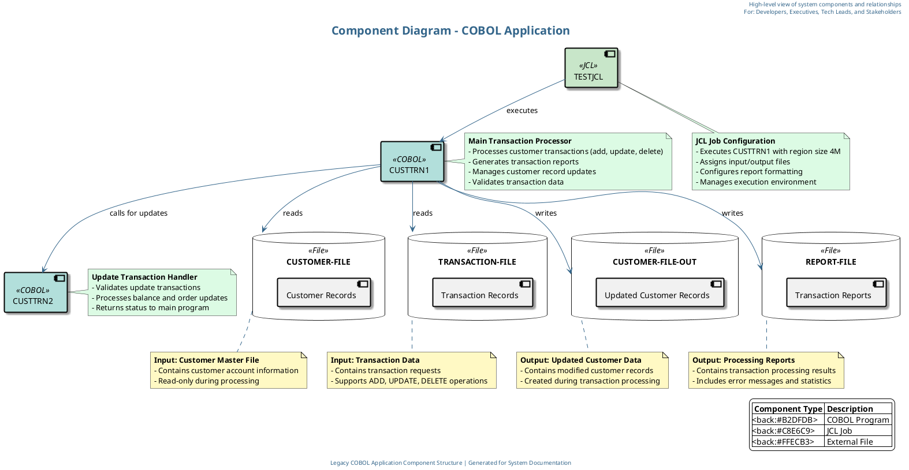

# Component Diagram for COBOL Application

This document provides the Cypher query and PlantUML script for generating a component diagram of the COBOL application. The diagram visualizes the high-level components of the system and their relationships.

## 1. Cypher Query for Neo4j

The following Cypher query extracts the relevant data from Neo4j to build the component diagram:

```cypher
// Match COBOL Programs
MATCH (program:COBOLProgram)
WHERE program.name IN ['CUSTTRN1', 'CUSTTRN2']

// Match JCL Jobs
OPTIONAL MATCH (job:JCLJob)
WHERE job.name = 'TESTJCL'

// Match Files used by the programs
OPTIONAL MATCH (file:COBOLFile)
WHERE file.name IN ['CUSTOMER-FILE', 'TRANSACTION-FILE', 'CUSTOMER-FILE-OUT', 'REPORT-FILE']

// Match relationships between programs
OPTIONAL MATCH (program1:COBOLProgram)-[call:CALLS]->(program2:COBOLProgram)
WHERE program1.name = 'CUSTTRN1' AND program2.name = 'CUSTTRN2'

// Match relationships between programs and files
OPTIONAL MATCH (program:COBOLProgram)-[reads:READS]->(inputFile:COBOLFile)
OPTIONAL MATCH (program:COBOLProgram)-[writes:WRITES]->(outputFile:COBOLFile)

// Match relationships between JCL jobs and programs
OPTIONAL MATCH (job:JCLJob)-[executes:EXECUTES]->(program:COBOLProgram)

// Return all components and relationships
RETURN program, job, file, call, reads, writes, executes
```

## 2. PlantUML Script for Component Diagram

The following PlantUML script generates a component diagram based on the data extracted from Neo4j:



## 3. Component Diagram Description

The component diagram visualizes the following elements:

### COBOL Programs
- **CUSTTRN1**: The main program that processes customer transactions (add, update, delete)
- **CUSTTRN2**: A subroutine called by CUSTTRN1 to process update transactions

### JCL Jobs
- **TESTJCL**: Executes CUSTTRN1 with specific file assignments and configuration

### External Files
- **CUSTOMER-FILE**: Input file containing customer records
- **TRANSACTION-FILE**: Input file containing transaction records
- **CUSTOMER-FILE-OUT**: Output file for updated customer records
- **REPORT-FILE**: Output file for transaction processing reports

### Relationships
- TESTJCL executes CUSTTRN1
- CUSTTRN1 calls CUSTTRN2 for update transactions
- CUSTTRN1 reads from CUSTOMER-FILE and TRANSACTION-FILE
- CUSTTRN1 writes to CUSTOMER-FILE-OUT and REPORT-FILE

## Prompt 1: Generate Cypher Query

```
You are tasked with creating a Cypher query for Neo4j to extract data for a component diagram of a COBOL application. The diagram should visualize the high-level components of the system and their relationships.

The application consists of:
1. COBOL Programs: CUSTTRN1 (main program) and CUSTTRN2 (subroutine)
2. JCL Job: TESTJCL
3. External Files: CUSTOMER-FILE, TRANSACTION-FILE, CUSTOMER-FILE-OUT, REPORT-FILE

Key relationships:
- CUSTTRN1 calls CUSTTRN2 for update transactions
- TESTJCL executes CUSTTRN1
- CUSTTRN1 reads from CUSTOMER-FILE and TRANSACTION-FILE
- CUSTTRN1 writes to CUSTOMER-FILE-OUT and REPORT-FILE

The Neo4j database contains nodes with labels like COBOLProgram, JCLJob, and COBOLFile, and relationships like CALLS, READS, WRITES, and EXECUTES.

Create a comprehensive Cypher query that extracts all these components and their relationships to be used for generating a component diagram. Include comments in the query to explain each section.

The query should be designed to work with the legacy_code_final.json data structure, which has been imported into Neo4j. Ensure the query handles cases where some relationships might not exist by using OPTIONAL MATCH where appropriate.

Your output should be only the Cypher query with clear comments, ready to be executed in a Neo4j database.
```

## Prompt 2: Generate PlantUML Script

```
Using the results from the following Cypher query, create a PlantUML script to generate a component diagram for a COBOL application:

[INSERT CYPHER QUERY RESULT HERE]

The component diagram should:
1. Visualize the high-level components of the system and their relationships
2. Include COBOL Programs (CUSTTRN1, CUSTTRN2), JCL Job (TESTJCL), and External Files (CUSTOMER-FILE, TRANSACTION-FILE, CUSTOMER-FILE-OUT, REPORT-FILE)
3. Show the relationships between components (calls, executes, reads, writes)
4. Use appropriate styling to distinguish between different types of components
5. Include a title, header, and legend
6. Add detailed descriptive notes for key components explaining their purpose and functionality

The diagram should be visually appealing and easy to understand for all stakeholders, including developers, executives, tech leads, and business stakeholders. Use color coding, clear labels, and professional styling to enhance readability and create a business-elegant presentation.

Specific requirements:
- Use a professional color scheme with complementary colors
- Add detailed notes explaining the purpose of each component
- Include a footer with relevant information
- Use shadowing and appropriate styling for a modern look
- Ensure all relationships have descriptive labels
- Organize the layout for maximum clarity

Provide the complete PlantUML script that can be directly used to generate the component diagram. The script should be well-commented and structured for easy maintenance.
```
