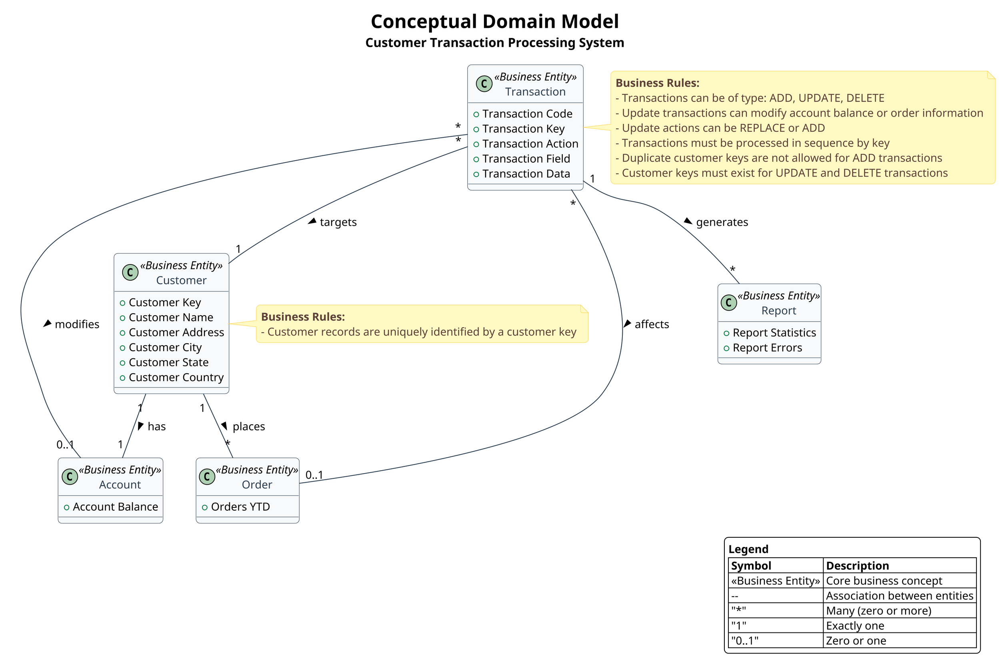

# Conceptual Domain Model for Customer Transaction System

## Overview

This document provides the Cypher query and PlantUML script for building a conceptual domain model of the legacy COBOL application. The model represents the business concepts and their relationships within the customer transaction processing system.

## Purpose

- **Purpose**: Represent the business concepts and their relationships
- **Target Audience**: All stakeholders (developers, executives, tech leads)
- **Key Elements**:
  - Business entities
  - Business rules
  - Domain vocabulary
- **Benefits**: Bridges the gap between technical implementation and business understanding

## Conceptual Domain Model

The conceptual domain model represents the core business entities and their relationships in the customer transaction system. The system primarily manages customer records and processes different types of transactions (add, update, delete) against these records.

### Business Entities

1. **Customer** - The core entity representing customer information
2. **Transaction** - Represents operations performed on customer records
3. **Account** - Represents customer's financial account information
4. **Order** - Represents customer's order information
5. **Report** - Represents transaction processing reports

### Business Rules

1. Customer records are uniquely identified by a customer key
2. Transactions can be of type: ADD, UPDATE, DELETE
3. Update transactions can modify account balance or order information
4. Update actions can be REPLACE or ADD
5. Transactions must be processed in sequence by key
6. Duplicate customer keys are not allowed for ADD transactions
7. Customer keys must exist for UPDATE and DELETE transactions

## Neo4j Cypher Query

The following Cypher query creates the conceptual domain model in Neo4j:

```cypher
// Clear existing data (optional)
MATCH (n) DETACH DELETE n;

// Create Business Entities
CREATE (customer:BusinessEntity {name: 'Customer', description: 'Core entity representing customer information'})
CREATE (transaction:BusinessEntity {name: 'Transaction', description: 'Operations performed on customer records'})
CREATE (account:BusinessEntity {name: 'Account', description: 'Customer financial account information'})
CREATE (order:BusinessEntity {name: 'Order', description: 'Customer order information'})
CREATE (report:BusinessEntity {name: 'Report', description: 'Transaction processing reports'})

// Create Business Attributes for Customer
CREATE (custKey:BusinessAttribute {name: 'Customer Key', description: 'Unique identifier for customer'})
CREATE (custName:BusinessAttribute {name: 'Customer Name', description: 'Name of the customer'})
CREATE (custAddr:BusinessAttribute {name: 'Customer Address', description: 'Address of the customer'})
CREATE (custCity:BusinessAttribute {name: 'Customer City', description: 'City of the customer'})
CREATE (custState:BusinessAttribute {name: 'Customer State', description: 'State of the customer'})
CREATE (custCountry:BusinessAttribute {name: 'Customer Country', description: 'Country of the customer'})

// Create Business Attributes for Transaction
CREATE (tranCode:BusinessAttribute {name: 'Transaction Code', description: 'Type of transaction (ADD, UPDATE, DELETE)'})
CREATE (tranKey:BusinessAttribute {name: 'Transaction Key', description: 'Key identifying the target customer'})
CREATE (tranAction:BusinessAttribute {name: 'Transaction Action', description: 'Action to perform (REPLACE, ADD)'})
CREATE (tranField:BusinessAttribute {name: 'Transaction Field', description: 'Field to modify (BALANCE, ORDERS)'})
CREATE (tranData:BusinessAttribute {name: 'Transaction Data', description: 'Data for the transaction'})

// Create Business Attributes for Account
CREATE (acctBalance:BusinessAttribute {name: 'Account Balance', description: 'Current balance in customer account'})

// Create Business Attributes for Order
CREATE (ordersYTD:BusinessAttribute {name: 'Orders YTD', description: 'Year-to-date order count'})

// Create Business Attributes for Report
CREATE (reportStats:BusinessAttribute {name: 'Report Statistics', description: 'Transaction processing statistics'})
CREATE (reportErrors:BusinessAttribute {name: 'Report Errors', description: 'Transaction processing errors'})

// Create Relationships between Entities
CREATE (customer)-[:HAS_ACCOUNT]->(account)
CREATE (customer)-[:PLACES]->(order)
CREATE (transaction)-[:TARGETS]->(customer)
CREATE (transaction)-[:MODIFIES]->(account)
CREATE (transaction)-[:AFFECTS]->(order)
CREATE (transaction)-[:GENERATES]->(report)

// Create Relationships between Entities and Attributes
CREATE (customer)-[:HAS_ATTRIBUTE]->(custKey)
CREATE (customer)-[:HAS_ATTRIBUTE]->(custName)
CREATE (customer)-[:HAS_ATTRIBUTE]->(custAddr)
CREATE (customer)-[:HAS_ATTRIBUTE]->(custCity)
CREATE (customer)-[:HAS_ATTRIBUTE]->(custState)
CREATE (customer)-[:HAS_ATTRIBUTE]->(custCountry)

CREATE (transaction)-[:HAS_ATTRIBUTE]->(tranCode)
CREATE (transaction)-[:HAS_ATTRIBUTE]->(tranKey)
CREATE (transaction)-[:HAS_ATTRIBUTE]->(tranAction)
CREATE (transaction)-[:HAS_ATTRIBUTE]->(tranField)
CREATE (transaction)-[:HAS_ATTRIBUTE]->(tranData)

CREATE (account)-[:HAS_ATTRIBUTE]->(acctBalance)
CREATE (order)-[:HAS_ATTRIBUTE]->(ordersYTD)
CREATE (report)-[:HAS_ATTRIBUTE]->(reportStats)
CREATE (report)-[:HAS_ATTRIBUTE]->(reportErrors)

// Create Business Rules
CREATE (rule1:BusinessRule {name: 'Unique Customer Key', description: 'Customer records are uniquely identified by a customer key'})
CREATE (rule2:BusinessRule {name: 'Transaction Types', description: 'Transactions can be of type: ADD, UPDATE, DELETE'})
CREATE (rule3:BusinessRule {name: 'Update Fields', description: 'Update transactions can modify account balance or order information'})
CREATE (rule4:BusinessRule {name: 'Update Actions', description: 'Update actions can be REPLACE or ADD'})
CREATE (rule5:BusinessRule {name: 'Transaction Sequence', description: 'Transactions must be processed in sequence by key'})
CREATE (rule6:BusinessRule {name: 'No Duplicate Keys', description: 'Duplicate customer keys are not allowed for ADD transactions'})
CREATE (rule7:BusinessRule {name: 'Key Must Exist', description: 'Customer keys must exist for UPDATE and DELETE transactions'})

// Connect Rules to Entities
CREATE (rule1)-[:APPLIES_TO]->(customer)
CREATE (rule2)-[:APPLIES_TO]->(transaction)
CREATE (rule3)-[:APPLIES_TO]->(transaction)
CREATE (rule4)-[:APPLIES_TO]->(transaction)
CREATE (rule5)-[:APPLIES_TO]->(transaction)
CREATE (rule6)-[:APPLIES_TO]->(transaction)
CREATE (rule7)-[:APPLIES_TO]->(transaction)

// Return all nodes and relationships
MATCH (n) RETURN n;
```

## PlantUML Diagram

The following PlantUML script creates a visual representation of the conceptual domain model:



## Visualization

To visualize the PlantUML diagram:
1. Copy the PlantUML script above
2. Paste it into a PlantUML editor (online or local)
3. Generate the diagram

For the Neo4j visualization:
1. Start your Neo4j database
2. Run the Cypher query in the Neo4j browser
3. Use the Neo4j visualization tools to explore the model

## Prompt 1: Generate Cypher Query for Neo4j Domain Model

```
You are tasked with creating a Cypher query to build a conceptual domain model in Neo4j for a legacy COBOL application. The model should represent business concepts and their relationships for a customer transaction processing system.

Input:
1. The file 'legacy_code_final.json' contains the COBOL program definitions with detailed structure
2. The file 'callgraph.txt' shows the program structure and call relationships

The COBOL application is a customer transaction processing system with two main programs:
- CUSTTRN1: Main program that processes transactions (add, update, delete)
- CUSTTRN2: Called by CUSTTRN1 to handle update transactions

Key business entities include:
1. Customer (with attributes like name, address, city, state, country)
2. Transaction (with types: ADD, UPDATE, DELETE)
3. Account (with balance information)
4. Order (with year-to-date information)
5. Report (for transaction statistics and errors)
6. File (physical files used in the system)
7. Process (business processes in the system)

Business rules include:
1. Customer records are uniquely identified by a customer key
2. Transactions can be of type: ADD, UPDATE, DELETE
3. Update transactions can modify account balance or order information
4. Update actions can be REPLACE or ADD
5. Transactions must be processed in sequence by key
6. Duplicate customer keys are not allowed for ADD transactions
7. Customer keys must exist for UPDATE and DELETE transactions
8. Transaction processing generates statistical reports

Create a comprehensive Cypher query that:
1. Creates all business entities as nodes with appropriate labels and properties
2. Creates all business attributes as nodes with appropriate labels and properties
3. Creates all business rules as nodes with appropriate labels and properties
4. Establishes relationships between entities, attributes, and rules
5. Uses clear and descriptive relationship types
6. Includes comments explaining the purpose of each section

The query should be well-structured, optimized for Neo4j, and suitable for visualization in the Neo4j browser.
```

## Prompt 2: Generate PlantUML Script for Domain Model Visualization

```
You are tasked with creating a PlantUML script to visualize a conceptual domain model for a legacy COBOL application. The visualization should be elegant, professional, and easily understandable by both technical and non-technical stakeholders.

Input:
1. The Cypher query below was used to create the domain model in Neo4j
2. The model represents a customer transaction processing system from a COBOL application

[INSERT CYPHER QUERY FROM PROMPT 1 OUTPUT HERE]

Create a comprehensive PlantUML script that:
1. Visualizes all business entities (Customer, Transaction, Account, Order, Report, File, Process)
2. Shows the attributes of each entity
3. Illustrates the relationships between entities with appropriate cardinality
4. Includes business rules as notes attached to relevant entities
5. Uses packages to group related entities
6. Implements a professional and elegant visual style with:
   - Appropriate colors and styling
   - Clear typography
   - Logical layout
   - Proper spacing and alignment
   - Informative title and legend

The diagram should be optimized for readability and comprehension by all stakeholders, including developers, executives, and tech leads. It should effectively bridge the gap between technical implementation and business understanding.

Use the following styling guidelines:
- Use a clean, professional color scheme
- Group related entities in packages
- Use orthogonal lines for relationships
- Include a descriptive title and legend
- Add appropriate notes for business rules
- Use stereotypes to indicate entity types
```


## Conclusion

This conceptual domain model provides a comprehensive view of the business concepts and their relationships in the customer transaction processing system. It serves as a bridge between the technical implementation details and the business understanding, making it valuable for all stakeholders involved in the system.