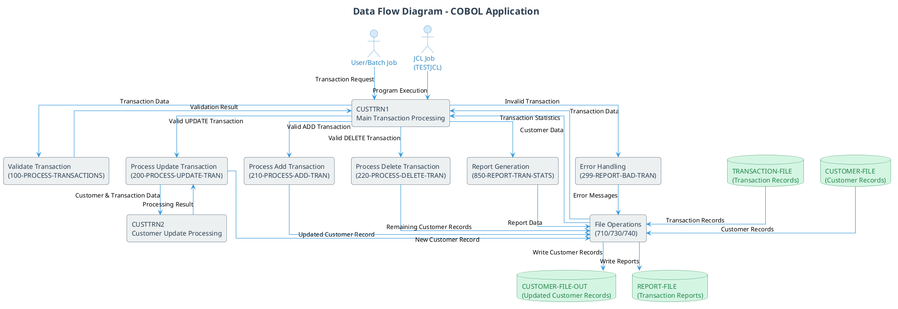

# Data Flow Diagram (DFD) for COBOL Application

## Purpose
This document provides the necessary scripts to generate a Data Flow Diagram (DFD) for the COBOL application. The diagram illustrates how data moves through the system, showing data sources, transformations, stores, and process boundaries.

## Key Elements
- Data sources and destinations
- Data transformations
- Data stores
- Process boundaries

## Benefits
The Data Flow Diagram (DFD) visualizes:
- How data flows through the COBOL application
- The relationships between different system components
- The transformation of data as it moves through processes
- The storage and retrieval of data

## Neo4j Cypher Query

The following Cypher query extracts the data flow information from the Neo4j database:

```cypher
// Data Flow Diagram Cypher Query
// This query extracts the data flow relationships in the COBOL application

// Find all programs
MATCH (program:COBOLProgram)

// Find paragraphs that read from or write to files
OPTIONAL MATCH (program)-[:CONTAINS]->(para:COBOLParagraph)-[fileOp:READS|WRITES]->(file:COBOLFile)

// Find program calls
OPTIONAL MATCH (program)-[:CONTAINS]->(callingPara:COBOLParagraph)-[:CALLS]->(calledProgram:COBOLProgram)

// Find paragraph performs
OPTIONAL MATCH (program)-[:CONTAINS]->(sourcePara:COBOLParagraph)-[:PERFORMS]->(targetPara:COBOLParagraph)

// Find file definitions
OPTIONAL MATCH (program)-[:CONTAINS]->(:COBOLDataDivision)-[:CONTAINS]->(:COBOLFileSection)-[:CONTAINS]->(fileDecl:COBOLFileControl)

// Return the results
RETURN 
    program.name as ProgramName,
    para.name as ParagraphName,
    type(fileOp) as FileOperation,
    file.name as FileName,
    callingPara.name as CallingParagraph,
    calledProgram.name as CalledProgram,
    sourcePara.name as SourceParagraph,
    targetPara.name as TargetParagraph,
    fileDecl.name as DeclaredFile
ORDER BY ProgramName, ParagraphName
```

## PlantUML Script

The following PlantUML script generates a comprehensive Data Flow Diagram for the COBOL application:



## Diagram Explanation

The Data Flow Diagram illustrates:

1. **External Entities**:
  - User/Batch Job: Initiates the transaction processing
  - JCL Job (TESTJCL): Executes the CUSTTRN1 program

2. **Processes**:
  - CUSTTRN1: Main program that orchestrates the transaction processing
  - Validate Transaction: Validates the format and content of transactions
  - Process Update/Add/Delete: Handles different types of transactions
  - CUSTTRN2: Subroutine specifically for processing customer updates
  - Report Generation: Creates transaction reports and statistics
  - Error Handling: Processes and reports transaction errors
  - File Operations: Handles reading from and writing to files

3. **Data Stores**:
  - TRANSACTION-FILE: Contains the transaction records to be processed
  - CUSTOMER-FILE: Contains the existing customer records
  - CUSTOMER-FILE-OUT: Stores the updated customer records
  - REPORT-FILE: Stores transaction reports and error messages

4. **Data Flows**:
  - The diagram shows how data moves between external entities, processes, and data stores
  - It illustrates the transformation of data as it passes through different processes
  - It highlights the validation and error handling paths
  - It shows the file operations that read from and write to data stores

This diagram provides a comprehensive view of the COBOL application's data flow, making it easier for all stakeholders to understand how the system processes data.


## Prompt 1: Generate Neo4j Cypher Query for Data Flow Extraction

```
You are a Neo4j and COBOL expert tasked with creating a Cypher query to extract data flow information from a Neo4j database containing COBOL application metadata. The query will be used to generate a Data Flow Diagram (DFD).

## Context
I have a Neo4j database containing metadata about a legacy COBOL application. The database has the following node types:
- COBOLProgram: Represents COBOL programs (e.g., CUSTTRN1, CUSTTRN2)
- COBOLParagraph: Represents paragraphs within COBOL programs
- COBOLFile: Represents files used by the COBOL programs
- COBOLFileControl: Represents file declarations in the File Section
- COBOLDataDivision: Contains the File Section
- COBOLFileSection: Contains file declarations

The relationships between these nodes include:
- [:CONTAINS]: Links programs to paragraphs, data divisions, etc.
- [:READS]: Links paragraphs to files they read from
- [:WRITES]: Links paragraphs to files they write to
- [:CALLS]: Links paragraphs to programs they call
- [:PERFORMS]: Links paragraphs to other paragraphs they perform

## Task
Create a comprehensive Cypher query that extracts all data flow information from this database. The query should:

1. Find all COBOL programs
2. Find all paragraphs that read from or write to files
3. Find all program calls between paragraphs and other programs
4. Find all paragraph performs (one paragraph calling another)
5. Find all file declarations in the File Section

The query should return the following information:
- Program names
- Paragraph names
- File operation types (READ or WRITE)
- File names
- Calling paragraph names
- Called program names
- Source paragraph names (for PERFORMS)
- Target paragraph names (for PERFORMS)
- Declared file names

The results should be ordered by program name and paragraph name for clarity.

## Output Format
Provide only the Cypher query without any explanations or additional text. The query should be ready to execute in a Neo4j database.
```

## Prompt 2: Generate PlantUML Data Flow Diagram from Neo4j Data

```
You are a visualization expert specializing in creating PlantUML diagrams for legacy systems. Your task is to create a comprehensive Data Flow Diagram (DFD) for a COBOL application using PlantUML.

## Context
I have extracted data flow information from a Neo4j database containing metadata about a COBOL application. The application consists of two main programs:

1. CUSTTRN1: The main program that processes customer transactions
2. CUSTTRN2: A subroutine called by CUSTTRN1 to process update transactions

The application processes three types of transactions:
- UPDATE: Updates existing customer records
- ADD: Adds new customer records
- DELETE: Deletes customer records

The application interacts with the following files:
- TRANSACTION-FILE: Contains transaction records to be processed
- CUSTOMER-FILE: Contains existing customer records
- CUSTOMER-FILE-OUT: Stores updated customer records
- REPORT-FILE: Stores transaction reports and error messages

## Neo4j Query Results
The following data was extracted from Neo4j (this is where the results from Prompt 1 would be inserted).

## Task
Create a PlantUML script that visualizes the data flow in this COBOL application. The diagram should show:

1. External Entities:
   - User/Batch Job: Initiates the transaction processing
   - JCL Job (TESTJCL): Executes the CUSTTRN1 program

2. Processes:
   - CUSTTRN1: Main program that orchestrates transaction processing
   - Validate Transaction (100-PROCESS-TRANSACTIONS): Validates transactions
   - Process Update/Add/Delete: Handles different transaction types
   - CUSTTRN2: Processes customer updates
   - Report Generation: Creates transaction reports
   - Error Handling: Processes transaction errors
   - File Operations: Handles file I/O

3. Data Stores:
   - TRANSACTION-FILE
   - CUSTOMER-FILE
   - CUSTOMER-FILE-OUT
   - REPORT-FILE

4. Data Flows:
   - Show how data moves between entities, processes, and data stores
   - Label the arrows with the type of data being transferred

## Requirements
- Use visually appealing styles and colors
- Make the diagram easy to understand for both technical and non-technical stakeholders
- Include a title and proper layout
- Use appropriate PlantUML notation for different elements (actors for external entities, rectangles for processes, databases for data stores)
- Ensure the diagram is comprehensive but not overly complex

## Output Format
Provide only the PlantUML script without any explanations or additional text. The script should be ready to use with PlantUML.
```
