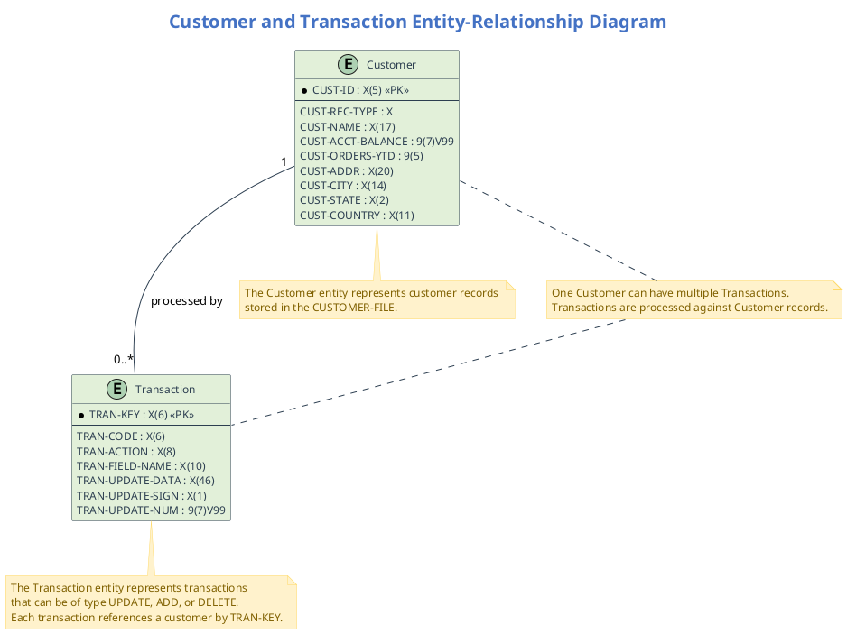

# Entity-Relationship Diagram (ERD) for COBOL Application

This document provides a detailed Entity-Relationship Diagram (ERD) for the COBOL application, focusing on the Customer and Transaction entities and their relationships.

## 1. Cypher Query for Neo4j

The following Cypher query extracts the Customer and Transaction entities and their relationships from the Neo4j database:

```cypher
// Cypher query to extract Customer and Transaction entities and their relationships
MATCH (custRec:COBOLStorage {name: "CUST-REC"})
WITH custRec
MATCH (custField:COBOLStorage)-[:BELONGS_TO*]->(custRec)
WHERE custField.level > 1 AND NOT custField.name CONTAINS "FILLER"
WITH collect(custField) AS customerFields, custRec

MATCH (tranRec:COBOLStorage {name: "TRANSACTION-RECORD"})
WITH customerFields, custRec, tranRec
MATCH (tranField:COBOLStorage)-[:BELONGS_TO*]->(tranRec)
WHERE tranField.level > 1 AND NOT tranField.name CONTAINS "FILLER"
WITH customerFields, custRec, collect(tranField) AS transactionFields, tranRec

MATCH (prog:COBOLProgram)-[:CONTAINS]->(para:COBOLParagraph)-[r:CALLS|PERFORMS]->(targetPara:COBOLParagraph)
WHERE para.name IN ["200-PROCESS-UPDATE-TRAN", "210-PROCESS-ADD-TRAN", "220-PROCESS-DELETE-TRAN"]
WITH customerFields, custRec, transactionFields, tranRec, collect(DISTINCT para) AS paragraphs

RETURN 
  custRec, 
  customerFields, 
  tranRec, 
  transactionFields, 
  paragraphs
```

## 2. PlantUML Script for ERD



## 3. Entity-Relationship Diagram Explanation

### Customer Entity
The Customer entity represents customer records stored in the CUSTOMER-FILE. Each customer has a unique identifier (CUST-ID) and contains information such as name, account balance, orders year-to-date, address, city, state, and country.

### Transaction Entity
The Transaction entity represents transactions that can be processed against customer records. Each transaction has a transaction key (TRAN-KEY) that references a customer. Transactions can be of type UPDATE, ADD, or DELETE and contain information about what field to update and the update data.

### Relationship
The relationship between Customer and Transaction entities is one-to-many (1:N). One customer can have multiple transactions processed against their record. The TRAN-KEY in the Transaction entity references the CUST-ID in the Customer entity.

## Prompt 1: Generate Cypher Query for Neo4j

```
I need to create a Cypher query for Neo4j to extract data for an Entity-Relationship Diagram (ERD) from a COBOL application. The application has two main entities:

1. Customer (CUST-REC) - Contains fields like CUST-ID, CUST-NAME, CUST-ACCT-BALANCE, CUST-ORDERS-YTD, CUST-ADDR, CUST-CITY, CUST-STATE, CUST-COUNTRY
2. Transaction (TRANSACTION-RECORD) - Contains fields like TRAN-CODE, TRAN-KEY, TRAN-ACTION, TRAN-FIELD-NAME, TRAN-UPDATE-DATA

In the Neo4j database, these entities are represented as nodes with the label "COBOLStorage". The Customer entity has a name property of "CUST-REC" and the Transaction entity has a name property of "TRANSACTION-RECORD". The fields of each entity are connected to their parent entity via a "BELONGS_TO" relationship.

The relationship between Customer and Transaction is established through program paragraphs that process transactions against customer records. These paragraphs are named "200-PROCESS-UPDATE-TRAN", "210-PROCESS-ADD-TRAN", and "220-PROCESS-DELETE-TRAN".

Please create a comprehensive Cypher query that:
1. Extracts the Customer and Transaction entities with all their fields
2. Identifies the relationship between these entities
3. Returns the data in a format suitable for creating an ERD

The query should be well-commented and optimized for performance.
```

## Prompt 2: Generate PlantUML Script for ERD

```
Using the data extracted from the following Cypher query, please create a detailed PlantUML script for an Entity-Relationship Diagram (ERD) that visualizes the Customer and Transaction entities and their relationships in a COBOL application:

[INSERT CYPHER QUERY RESULT HERE]

The ERD should:

1. Show the Customer entity with the following attributes:
   - CUST-ID (primary key)
   - CUST-REC-TYPE
   - CUST-NAME
   - CUST-ACCT-BALANCE
   - CUST-ORDERS-YTD
   - CUST-ADDR
   - CUST-CITY
   - CUST-STATE
   - CUST-COUNTRY

2. Show the Transaction entity with the following attributes:
   - TRAN-KEY (primary key)
   - TRAN-CODE
   - TRAN-ACTION
   - TRAN-FIELD-NAME
   - TRAN-UPDATE-DATA
   - TRAN-UPDATE-SIGN
   - TRAN-UPDATE-NUM

3. Illustrate the one-to-many (1:N) relationship between Customer and Transaction entities, where one customer can have multiple transactions.

4. Include descriptive notes explaining the entities and their relationship.

5. Use professional styling with appropriate colors, fonts, and layout for a business presentation to executives, developers, and stakeholders.

The PlantUML script should be well-structured, visually appealing, and provide a clear understanding of the data model for both technical and non-technical audiences.
```