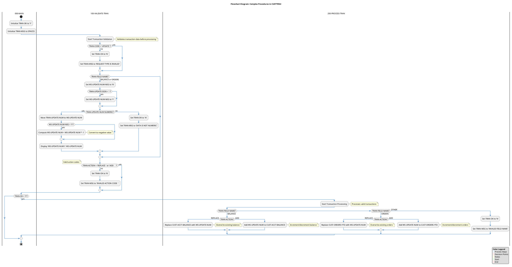

# Flowchart Diagram for Complex Procedures

## Purpose
This document provides the Cypher query and PlantUML script for generating a Flowchart Diagram that visualizes the complex business logic within specific procedures of the COBOL application. The diagram focuses on the detailed logic steps, decision points, calculations, and validation rules implemented in the CUSTTRN2 program.

## Neo4j Cypher Query

```cypher
// Clear previous data if needed
MATCH (n) DETACH DELETE n;

// Create program node
CREATE (custtrn2:Program {name: "CUSTTRN2", description: "Transaction update subroutine"})

// Create main procedure nodes
CREATE (mainProc:Procedure {name: "000-MAIN", description: "Main entry point for CUSTTRN2"})
CREATE (validateProc:Procedure {name: "100-VALIDATE-TRAN", description: "Validates transaction data"})
CREATE (processProc:Procedure {name: "200-PROCESS-TRAN", description: "Processes valid transactions"})

// Connect program to procedures
CREATE (custtrn2)-[:CONTAINS]->(mainProc)
CREATE (custtrn2)-[:CONTAINS]->(validateProc)
CREATE (custtrn2)-[:CONTAINS]->(processProc)

// Create flowchart nodes for 000-MAIN
CREATE (startMain:Start {name: "Start 000-MAIN"})
CREATE (initTranOk:Process {name: "Initialize TRAN-OK to 'Y'"})
CREATE (initTranMsg:Process {name: "Initialize TRAN-MSG to SPACES"})
CREATE (performValidate:Process {name: "PERFORM 100-VALIDATE-TRAN"})
CREATE (checkTranOk:Decision {name: "TRAN-OK = 'Y'?"})
CREATE (performProcess:Process {name: "PERFORM 200-PROCESS-TRAN"})
CREATE (endMain:End {name: "End 000-MAIN"})

// Connect 000-MAIN flowchart nodes
CREATE (mainProc)-[:STARTS_WITH]->(startMain)
CREATE (startMain)-[:NEXT]->(initTranOk)
CREATE (initTranOk)-[:NEXT]->(initTranMsg)
CREATE (initTranMsg)-[:NEXT]->(performValidate)
CREATE (performValidate)-[:NEXT]->(checkTranOk)
CREATE (checkTranOk)-[:YES]->(performProcess)
CREATE (checkTranOk)-[:NO]->(endMain)
CREATE (performProcess)-[:NEXT]->(endMain)

// Create flowchart nodes for 100-VALIDATE-TRAN
CREATE (startValidate:Start {name: "Start 100-VALIDATE-TRAN"})
CREATE (checkTranCode:Decision {name: "TRAN-CODE = 'UPDATE '?"})
CREATE (invalidTranCode:Process {name: "Set TRAN-OK to 'N'"})
CREATE (invalidTranCodeMsg:Process {name: "Set TRAN-MSG to 'REQUEST TYPE IS INVALID'"})
CREATE (checkTranField:Decision {name: "TRAN-FIELD-NAME?"})
CREATE (initUpdateNumNeg:Process {name: "Set WS-UPDATE-NUM-NEG to 'N'"})
CREATE (checkUpdateSign:Decision {name: "TRAN-UPDATE-SIGN = '-'?"})
CREATE (setUpdateNumNeg:Process {name: "Set WS-UPDATE-NUM-NEG to 'Y'"})
CREATE (checkNumeric:Decision {name: "TRAN-UPDATE-NUM NUMERIC?"})
CREATE (invalidNumeric:Process {name: "Set TRAN-OK to 'N'"})
CREATE (invalidNumericMsg:Process {name: "Set TRAN-MSG to 'DATA IS NOT NUMERIC'"})
CREATE (moveUpdateNum:Process {name: "Move TRAN-UPDATE-NUM to WS-UPDATE-NUM"})
CREATE (checkNegative:Decision {name: "WS-UPDATE-NUM-NEG = 'Y'?"})
CREATE (computeNegative:Process {name: "Compute WS-UPDATE-NUM = WS-UPDATE-NUM * -1"})
CREATE (displayUpdateNum:Process {name: "Display 'WS-UPDATE-NUM1:' WS-UPDATE-NUM"})
CREATE (checkTranAction:Decision {name: "TRAN-ACTION = 'REPLACE ' or 'ADD     '?"})
CREATE (invalidAction:Process {name: "Set TRAN-OK to 'N'"})
CREATE (invalidActionMsg:Process {name: "Set TRAN-MSG to 'INVALID ACTION CODE   '"})
CREATE (endValidate:End {name: "End 100-VALIDATE-TRAN"})

// Connect 100-VALIDATE-TRAN flowchart nodes
CREATE (validateProc)-[:STARTS_WITH]->(startValidate)
CREATE (startValidate)-[:NEXT]->(checkTranCode)
CREATE (checkTranCode)-[:YES]->(checkTranField)
CREATE (checkTranCode)-[:NO]->(invalidTranCode)
CREATE (invalidTranCode)-[:NEXT]->(invalidTranCodeMsg)
CREATE (invalidTranCodeMsg)-[:NEXT]->(checkTranField)
CREATE (checkTranField)-[:BALANCE_OR_ORDERS]->(initUpdateNumNeg)
CREATE (checkTranField)-[:OTHER]->(checkTranAction)
CREATE (initUpdateNumNeg)-[:NEXT]->(checkUpdateSign)
CREATE (checkUpdateSign)-[:YES]->(setUpdateNumNeg)
CREATE (checkUpdateSign)-[:NO]->(checkNumeric)
CREATE (setUpdateNumNeg)-[:NEXT]->(checkNumeric)
CREATE (checkNumeric)-[:YES]->(moveUpdateNum)
CREATE (checkNumeric)-[:NO]->(invalidNumeric)
CREATE (invalidNumeric)-[:NEXT]->(invalidNumericMsg)
CREATE (invalidNumericMsg)-[:NEXT]->(checkTranAction)
CREATE (moveUpdateNum)-[:NEXT]->(checkNegative)
CREATE (checkNegative)-[:YES]->(computeNegative)
CREATE (checkNegative)-[:NO]->(displayUpdateNum)
CREATE (computeNegative)-[:NEXT]->(displayUpdateNum)
CREATE (displayUpdateNum)-[:NEXT]->(checkTranAction)
CREATE (checkTranAction)-[:YES]->(endValidate)
CREATE (checkTranAction)-[:NO]->(invalidAction)
CREATE (invalidAction)-[:NEXT]->(invalidActionMsg)
CREATE (invalidActionMsg)-[:NEXT]->(endValidate)

// Create flowchart nodes for 200-PROCESS-TRAN
CREATE (startProcess:Start {name: "Start 200-PROCESS-TRAN"})
CREATE (checkFieldName:Decision {name: "TRAN-FIELD-NAME?"})
CREATE (checkBalanceAction:Decision {name: "TRAN-ACTION?"})
CREATE (replaceBalance:Process {name: "Replace CUST-ACCT-BALANCE with WS-UPDATE-NUM"})
CREATE (addToBalance:Process {name: "Add WS-UPDATE-NUM to CUST-ACCT-BALANCE"})
CREATE (checkOrdersAction:Decision {name: "TRAN-ACTION?"})
CREATE (replaceOrders:Process {name: "Replace CUST-ORDERS-YTD with WS-UPDATE-NUM"})
CREATE (addToOrders:Process {name: "Add WS-UPDATE-NUM to CUST-ORDERS-YTD"})
CREATE (invalidField:Process {name: "Set TRAN-OK to 'N'"})
CREATE (invalidFieldMsg:Process {name: "Set TRAN-MSG to 'INVALID FIELD NAME'"})
CREATE (endProcess:End {name: "End 200-PROCESS-TRAN"})

// Connect 200-PROCESS-TRAN flowchart nodes
CREATE (processProc)-[:STARTS_WITH]->(startProcess)
CREATE (startProcess)-[:NEXT]->(checkFieldName)
CREATE (checkFieldName)-[:BALANCE]->(checkBalanceAction)
CREATE (checkFieldName)-[:ORDERS]->(checkOrdersAction)
CREATE (checkFieldName)-[:OTHER]->(invalidField)
CREATE (checkBalanceAction)-[:REPLACE]->(replaceBalance)
CREATE (checkBalanceAction)-[:ADD]->(addToBalance)
CREATE (replaceBalance)-[:NEXT]->(endProcess)
CREATE (addToBalance)-[:NEXT]->(endProcess)
CREATE (checkOrdersAction)-[:REPLACE]->(replaceOrders)
CREATE (checkOrdersAction)-[:ADD]->(addToOrders)
CREATE (replaceOrders)-[:NEXT]->(endProcess)
CREATE (addToOrders)-[:NEXT]->(endProcess)
CREATE (invalidField)-[:NEXT]->(invalidFieldMsg)
CREATE (invalidFieldMsg)-[:NEXT]->(endProcess)

// Create relationships between procedures
CREATE (performValidate)-[:CALLS]->(validateProc)
CREATE (performProcess)-[:CALLS]->(processProc)
```

## PlantUML Script



## Diagram Description

The Flowchart Diagram for Complex Procedures visualizes the detailed business logic implemented in the CUSTTRN2 program, focusing on:

1. **Transaction Validation Logic (100-VALIDATE-TRAN)**: 
   - Validation of transaction codes (must be 'UPDATE')
   - Validation of field names (must be 'BALANCE' or 'ORDERS')
   - Numeric data validation with sign handling
   - Action code validation (must be 'REPLACE' or 'ADD')

2. **Transaction Processing Logic (200-PROCESS-TRAN)**:
   - Field-specific processing for BALANCE and ORDERS
   - Different handling for REPLACE and ADD actions
   - Calculation logic for updating customer data
   - Error handling for invalid fields

3. **Decision Points**:
   - Key decision points that determine the flow of execution
   - Validation checks that ensure data integrity
   - Business rule enforcement through conditional logic

4. **Error Handling**:
   - Setting error flags and messages for invalid data
   - Preventing processing of invalid transactions

This diagram provides a detailed view of the complex business rules implemented in the code, making it valuable for both technical and business stakeholders to understand the system's behavior and validation requirements.

## Implementation Notes

### For Developers
- The validation logic ensures that only properly formatted transactions are processed
- Negative values are handled by setting a flag and applying a multiplication
- Error messages are specific to the type of validation failure

### For Business Analysts
- The diagram shows how business rules are enforced in the code
- Transaction validation ensures data integrity
- The processing logic implements the business operations for updating customer data

## Usage Instructions

### Neo4j Graph Database
1. Open Neo4j Browser
2. Execute the Cypher query provided above
3. Visualize the graph to see the relationships between procedures and flowchart elements

### PlantUML Diagram
1. Copy the PlantUML script to a PlantUML editor or tool
2. Generate the diagram
3. Use the diagram to understand the complex business logic in the CUSTTRN2 program


## Prompt 1: Generate Neo4j Cypher Query for Flowchart Diagram

```
You are tasked with creating a Neo4j Cypher query to extract data for a Flowchart Diagram that visualizes complex business logic within COBOL procedures. This query will be used as input for a subsequent prompt that will generate a PlantUML diagram.

## Input Files
You will be working with the following files:
1. legacy_code_final.json - Contains the COBOL program code with procedures, paragraphs, and business logic
2. callgraph.txt - Contains relationships between program elements

## Requirements
Create a Cypher query that:
1. Identifies the main procedures in the CUSTTRN2 program (000-MAIN, 100-VALIDATE-TRAN, 200-PROCESS-TRAN)
2. Maps the detailed control flow within each procedure, including:
   - Process steps (assignments, calculations)
   - Decision points (IF statements, EVALUATE statements)
   - Procedure calls (PERFORM statements)
   - Error handling logic
3. Captures the relationships between procedures
4. Represents the business logic accurately, especially:
   - Transaction validation rules
   - Field-specific processing (BALANCE, ORDERS)
   - Action-specific processing (REPLACE, ADD)
   - Error handling and messaging

## Output Format
The Cypher query should:
1. Create nodes for programs, procedures, and flowchart elements (start, process, decision, end)
2. Establish relationships between nodes to represent the flow of execution
3. Include descriptive properties for nodes (name, description)
4. Be structured to create a complete graph that can be visualized

## Important Considerations
- Ensure the query captures all decision points in the validation and processing logic
- Represent the nested conditional logic accurately
- Include error handling paths
- Make the query reusable by first clearing any existing data

The resulting Cypher query will be used to populate a Neo4j database, which will then serve as the data source for generating a PlantUML flowchart diagram.
```

## Prompt 2: Generate PlantUML Flowchart Diagram from Neo4j Data

```
You are tasked with creating a PlantUML script to generate a Flowchart Diagram that visualizes complex business logic within COBOL procedures. This script will use the data structure created by a Neo4j Cypher query.

## Input
The Neo4j database contains a graph representation of the CUSTTRN2 program's procedures, with nodes and relationships representing:
1. Programs (CUSTTRN2)
2. Procedures (000-MAIN, 100-VALIDATE-TRAN, 200-PROCESS-TRAN)
3. Flowchart elements:
   - Start/End points
   - Process steps
   - Decision points
   - Relationships between elements

## Requirements
Create a PlantUML script that:
1. Visualizes the complex business logic as a flowchart diagram
2. Organizes the diagram using swimlanes for different procedures
3. Clearly represents:
   - Process steps (assignments, calculations)
   - Decision points with conditional branches
   - Procedure calls
   - Error handling paths
4. Includes explanatory notes for key business rules
5. Uses appropriate styling for better readability and visual appeal

## Output Format
The PlantUML script should:
1. Include appropriate styling directives for colors, fonts, and shapes
2. Use swimlanes to separate different procedures
3. Represent the complete flow from start to end
4. Include a title, legend, and any necessary annotations
5. Be optimized for readability by both technical and business stakeholders

## Important Considerations
- The diagram should be business-elegant and professional
- Use color coding to distinguish different types of elements (processes, decisions, etc.)
- Include explanatory notes for complex business rules
- Ensure the diagram flows logically from top to bottom
- Make the diagram accessible to both technical and non-technical stakeholders
- Optimize the layout for clarity, even with complex nested conditions

The resulting PlantUML script will generate a comprehensive flowchart diagram that helps stakeholders understand the complex business logic implemented in the COBOL application.
```
