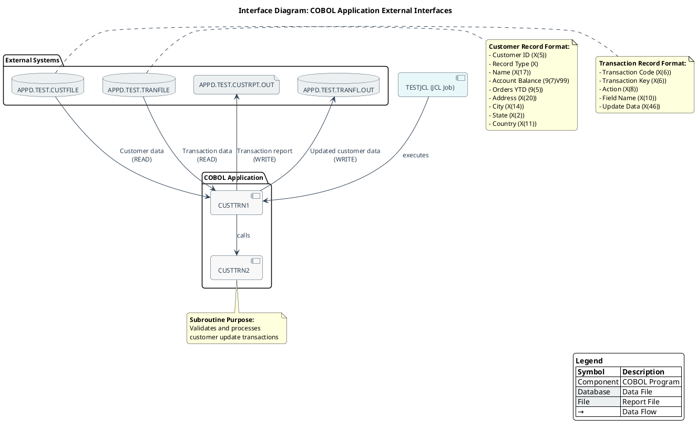

# Interface Diagram for COBOL Application

This document provides the Cypher query and PlantUML script for creating an Interface Diagram that documents the interfaces between the COBOL application and external systems.

## Purpose
The Interface Diagram visualizes how the COBOL application interacts with its environment, showing file interfaces, API interfaces (if any), data formats, and integration points. This diagram is designed for integration specialists, developers, tech leads, executives, and stakeholders.

## Cypher Query for Neo4j

```cypher
// Cypher query to extract interface information
// Find all COBOL programs
MATCH (program:COBOLProgram)

// Find file interfaces
OPTIONAL MATCH (program)-[:CONTAINS]->(para:COBOLParagraph)-[:READS|WRITES]->(file:COBOLFile)
WITH program, collect(DISTINCT {
  file: file,
  operation: 
    CASE 
      WHEN exists((para)-[:READS]->(file)) AND exists((para)-[:WRITES]->(file)) THEN "READ/WRITE"
      WHEN exists((para)-[:READS]->(file)) THEN "READ" 
      WHEN exists((para)-[:WRITES]->(file)) THEN "WRITE"
      ELSE "UNKNOWN"
    END,
  paragraph: para.name
}) AS fileInterfaces

// Find program calls (API interfaces)
OPTIONAL MATCH (program)-[:CONTAINS]->(callingPara:COBOLParagraph)-[:CALLS]->(calledProgram:COBOLProgram)
WITH program, fileInterfaces, collect(DISTINCT {
  calledProgram: calledProgram,
  paragraph: callingPara.name
}) AS programCalls

// Find JCL jobs that execute the programs
OPTIONAL MATCH (job:JCLJob)-[:EXECUTES]->(program)
WITH program, fileInterfaces, programCalls, collect(DISTINCT job) AS jobs

// Find data structures used in interfaces
OPTIONAL MATCH (program)-[:CONTAINS]->(section)-[:CONTAINS]->(dataEntry)
WHERE section.name IN ["WORKING-STORAGE SECTION", "LINKAGE SECTION", "FILE SECTION"]
WITH program, fileInterfaces, programCalls, jobs, 
     collect(DISTINCT {
       section: section.name,
       dataEntry: dataEntry.name,
       definition: dataEntry.raw_code
     }) AS dataStructures

// Return the complete interface information
RETURN program.name AS ProgramName,
       fileInterfaces,
       programCalls,
       jobs,
       dataStructures
```

## PlantUML Script



## Benefits

This Interface Diagram helps stakeholders understand:
1. How the COBOL application interacts with external systems
2. The data flow between components
3. The structure of data exchanged between interfaces
4. The integration points that might need attention during modernization efforts

The diagram serves as valuable documentation for integration specialists, developers, tech leads, executives, and other stakeholders involved in understanding or maintaining the COBOL application.

### Prompt 1: Generate Cypher Query for Interface Diagram

```
You are tasked with creating a Cypher query for Neo4j to extract interface information from a COBOL application. This query will be used to generate an Interface Diagram that documents how the COBOL application interacts with external systems.

The COBOL application consists of two programs:
1. CUSTTRN1 - Main program that processes customer transactions
2. CUSTTRN2 - Subroutine called by CUSTTRN1 to validate and process update transactions

The application interfaces with the following external files:
- CUSTOMER-FILE (input)
- TRANSACTION-FILE (input)
- CUSTOMER-FILE-OUT (output)
- REPORT-FILE (output)

In the Neo4j database, you'll find the following node types:
- COBOLProgram: Represents COBOL programs
- COBOLParagraph: Represents paragraphs within COBOL programs
- COBOLFile: Represents files used by COBOL programs
- JCLJob: Represents JCL jobs that execute COBOL programs

And the following relationship types:
- CONTAINS: Links programs to paragraphs, sections to data entries
- READS: Links paragraphs to files they read from
- WRITES: Links paragraphs to files they write to
- CALLS: Links paragraphs to programs they call
- EXECUTES: Links JCL jobs to programs they execute

Create a Cypher query that extracts:
1. All COBOL programs in the application
2. File interfaces (which programs read/write which files)
3. Program interfaces (which programs call other programs)
4. JCL jobs that execute the programs
5. Data structures used in interfaces

The query should be comprehensive and provide all necessary information for creating a detailed Interface Diagram.
```

### Prompt 2: Generate PlantUML Script for Interface Diagram

```
Using the results from the following Cypher query, create a PlantUML script to visualize an Interface Diagram for a COBOL application. The diagram should document the interfaces between the COBOL application and external systems.

[INSERT CYPHER QUERY RESULTS HERE]

The Interface Diagram should:

1. Show all file interfaces:
   - CUSTOMER-FILE (input to CUSTTRN1)
   - TRANSACTION-FILE (input to CUSTTRN1)
   - CUSTOMER-FILE-OUT (output from CUSTTRN1)
   - REPORT-FILE (output from CUSTTRN1)

2. Show program interfaces:
   - CUSTTRN1 calls CUSTTRN2

3. Show JCL job execution:
   - TESTJCL executes CUSTTRN1

4. Include data formats for key interfaces:
   - Customer record structure
   - Transaction record structure

5. Highlight integration points:
   - File I/O operations
   - Program calls

Design the diagram with these considerations:
- Target audience includes integration specialists, developers, tech leads, executives, and stakeholders
- Use a professional, business-elegant visual style
- Include a title, legend, and explanatory notes
- Group related elements using packages
- Use different shapes and colors to distinguish between different types of components
- Show data flow directions clearly with labeled arrows

The PlantUML script should be well-structured, visually appealing, and provide a comprehensive view of how the COBOL application interacts with its environment.
```
