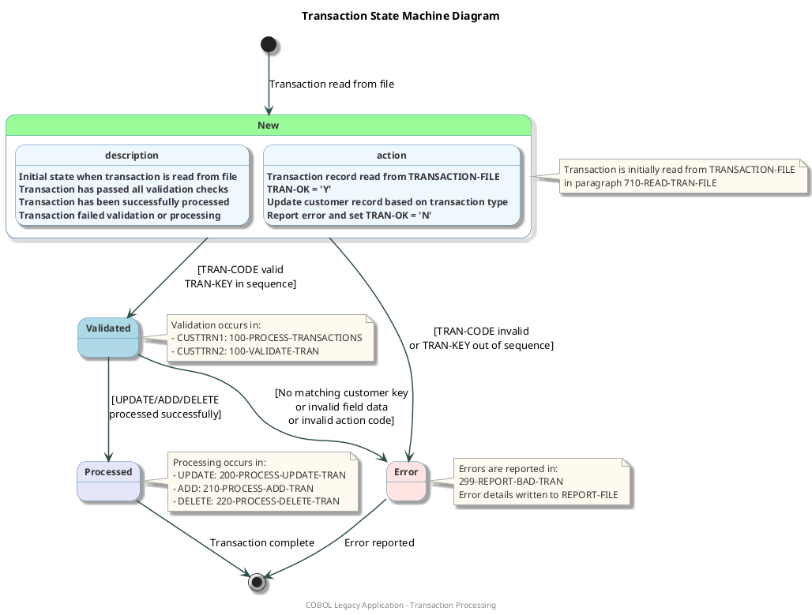

# State Machine Diagram for Transaction States

## Purpose
This diagram represents the different states a transaction can be in within the COBOL application, providing a clear visualization of the transaction lifecycle.

## Key Elements
- Transaction states (New, Validated, Processed, Error)
- State transitions
- Actions triggered by state changes
- Error handling paths

## Benefits
- Helps understand the lifecycle of transactions in the system
- Provides clear visualization of transaction flow
- Shows all possible error conditions and how they're handled
- Serves as documentation for the transaction processing logic
- Assists in maintenance and enhancement of the transaction processing system

## Transaction States Overview

The transaction processing system in the COBOL application follows a state machine pattern where transactions move through different states:

1. **New**: Initial state when a transaction is read from the transaction file
2. **Validated**: After passing validation checks for transaction code, field name, and action
3. **Processed**: After successful processing based on transaction type (UPDATE, ADD, DELETE)
4. **Error**: If validation fails or processing encounters an error

## Neo4j Cypher Query

The following Cypher query extracts the transaction state machine from the Neo4j database:

```cypher
// Query to extract transaction state information
MATCH (p:COBOLProgram)-[:CONTAINS]->(para:COBOLParagraph)
WHERE p.name IN ["CUSTTRN1", "CUSTTRN2"] 
AND para.name IN ["000-MAIN", "100-PROCESS-TRANSACTIONS", "100-VALIDATE-TRAN", 
                 "200-PROCESS-UPDATE-TRAN", "210-PROCESS-ADD-TRAN", 
                 "220-PROCESS-DELETE-TRAN", "299-REPORT-BAD-TRAN"]
RETURN p.name AS Program, para.name AS Paragraph, para.raw_code AS Code

UNION

// Extract transitions between paragraphs
MATCH path = (para1:COBOLParagraph)-[:PERFORMS|CALLS]->(para2:COBOLParagraph)
WHERE para1.name IN ["000-MAIN", "100-PROCESS-TRANSACTIONS", "100-VALIDATE-TRAN", 
                    "200-PROCESS-UPDATE-TRAN", "210-PROCESS-ADD-TRAN", 
                    "220-PROCESS-DELETE-TRAN"]
RETURN path

UNION

// Extract error handling paths
MATCH path = (para:COBOLParagraph)-[:PERFORMS]->(errPara:COBOLParagraph)
WHERE errPara.name = "299-REPORT-BAD-TRAN"
RETURN path
```

## PlantUML State Machine Diagram



## Diagram Explanation

The state machine diagram illustrates the lifecycle of transactions in the system:

1. **New State**:
   - Transactions begin in this state when read from the transaction file
   - The system checks if the transaction code is valid and if the transaction key is in sequence

2. **Validated State**:
   - Transactions that pass initial validation enter this state
   - The system sets TRAN-OK = 'Y' to indicate successful validation

3. **Processed State**:
   - Validated transactions are processed according to their transaction code (UPDATE, ADD, DELETE)
   - Customer records are updated, added, or deleted as appropriate

4. **Error State**:
   - Transactions enter this state if they fail validation or encounter processing errors
   - The system sets TRAN-OK = 'N' and reports the error details

## Technical Implementation

The transaction state machine is implemented across two COBOL programs:

1. **CUSTTRN1**: Main program that reads transactions and directs them through the appropriate processing path
2. **CUSTTRN2**: Subroutine called by CUSTTRN1 to validate and process UPDATE transactions

Key variables that control the state transitions:
- **WS-TRAN-OK**: Flag indicating if transaction is valid ('Y' or 'N')
- **WS-TRAN-EOF**: Flag indicating end of transaction file
- **TRAN-CODE**: Type of transaction (UPDATE, ADD, DELETE)
- **TRAN-KEY**: Unique identifier for the transaction

## Business Impact

Understanding the transaction state machine provides several business benefits:

1. **Risk Reduction**: Clearly identifies all possible error conditions and how they're handled
2. **Maintenance Efficiency**: Simplifies maintenance by providing a clear map of transaction processing
3. **Knowledge Transfer**: Facilitates knowledge transfer to new team members
4. **Process Improvement**: Identifies potential areas for process optimization
5. **Compliance Support**: Helps document the system for compliance and audit purposes

## Prompt 1: Generate Neo4j Cypher Query for Transaction States

```
I need to create a Cypher query for Neo4j to extract data about transaction states in a COBOL application. This query will be used to generate a state machine diagram.

The COBOL application consists of two main programs:
1. CUSTTRN1: The main program that reads transactions and processes them
2. CUSTTRN2: A subroutine called by CUSTTRN1 to validate and process UPDATE transactions

The transaction states I need to identify are:
- New: Initial state when a transaction is read from the transaction file
- Validated: After passing validation checks for transaction code, field name, and action
- Processed: After successful processing based on transaction type (UPDATE, ADD, DELETE)
- Error: If validation fails or processing encounters an error

Key paragraphs in the COBOL programs that handle these states:
- 000-MAIN: Entry point for both programs
- 100-PROCESS-TRANSACTIONS: Main transaction processing loop in CUSTTRN1
- 100-VALIDATE-TRAN: Validation routine in CUSTTRN2
- 200-PROCESS-UPDATE-TRAN, 210-PROCESS-ADD-TRAN, 220-PROCESS-DELETE-TRAN: Process different transaction types
- 299-REPORT-BAD-TRAN: Error handling routine

The Neo4j database contains nodes with these labels:
- COBOLProgram: Represents COBOL programs
- COBOLParagraph: Represents paragraphs within programs
- COBOLVariable: Represents variables used in the programs

And relationships:
- CONTAINS: Links programs to their paragraphs
- PERFORMS: Links paragraphs to other paragraphs they perform
- CALLS: Links paragraphs to other programs they call
- USES: Links paragraphs to variables they use
- HANDLES_ERROR: Links paragraphs to error handling paragraphs

Please create a comprehensive Cypher query that:
1. Identifies the relevant paragraphs in both programs
2. Extracts the transitions between states (based on PERFORMS and CALLS relationships)
3. Identifies error handling paths
4. Returns all the necessary information to understand the transaction state machine

The query should be optimized for Neo4j and include comments explaining each part.
```

## Prompt 2: Generate PlantUML State Machine Diagram

```
I need to create a PlantUML script for a state machine diagram that visualizes transaction states in a COBOL application. I'll provide the data extracted from Neo4j using a Cypher query.

Here's the data from Neo4j:
[PASTE THE OUTPUT FROM THE FIRST PROMPT'S CYPHER QUERY HERE]

The transaction states to be represented are:
1. New: Initial state when a transaction is read from the transaction file
2. Validated: After passing validation checks for transaction code, field name, and action
3. Processed: After successful processing based on transaction type (UPDATE, ADD, DELETE)
4. Error: If validation fails or processing encounters an error

The transitions between states are:
- New → Validated: When transaction code is valid and transaction key is in sequence
- New → Error: When transaction code is invalid or transaction key is out of sequence
- Validated → Processed: When transaction is successfully processed (UPDATE, ADD, DELETE)
- Validated → Error: When there's no matching customer key, invalid field data, or invalid action code
- Processed → [End]: Transaction complete
- Error → [End]: Error reported

Please create a visually appealing PlantUML script that:
1. Uses appropriate colors and styling for each state (use palegreen for New, lightblue for Validated, lavender for Processed, and mistyrose for Error)
2. Includes descriptive notes for each state explaining where in the code it's handled
3. Shows all transitions with clear labels
4. Includes a title and footer
5. Uses appropriate skinparam settings to make the diagram professional and readable
6. Includes detailed state descriptions and actions

The diagram should be detailed enough for developers, executives, tech leads, and stakeholders to understand the transaction lifecycle in the system.

Make sure the PlantUML script is complete and ready to use, with proper syntax and formatting.
```