# UML Diagrams for COBOL Application Understanding

This document provides a comprehensive list of UML diagrams that can be created to fully understand the COBOL application structure, behavior, and relationships. 
The report System functionin is refered on reports-system.md
## System Architecture Diagrams

### 1. Component Diagram
- **Purpose**: Visualize the high-level components of the system and their relationships
- **Key Elements**:
  - COBOL Programs (CUSTTRN1, CUSTTRN2)
  - JCL Jobs (TESTJCL)
  - External Files (CUSTFILE, TRANFILE, etc.)
  - System interfaces
- **Benefits**: Provides a bird's-eye view of the system architecture

#### 1.1 Component Diagram for COBOL Application

This document provides the necessary scripts to generate a component diagram for the COBOL application, focusing on the high-level components and their relationships and understand the system architecture from a reverse engineering perspective.

##### 1.2 Neo4j Cypher Query for Component Extraction

The following Cypher query extracts the component relationships from the Neo4j database. This query is designed to identify all key components of the COBOL application system including programs, JCL jobs, files, and their relationships:

```cypher
// Component Diagram Cypher Query
// This query extracts the relationships between COBOL programs, JCL jobs, and files

// Start with JCL jobs
MATCH (jcl:COBOLJcl)

// Get COBOL programs called by JCL
OPTIONAL MATCH (jcl)-[:EXECUTES]->(program:COBOLProgram)

// If no direct EXECUTES relationship, try to infer from raw code
WITH jcl, collect(program) as programs
WHERE size(programs) = 0
OPTIONAL MATCH (p:COBOLProgram)
WHERE jcl.rawCode CONTAINS p.name
WITH jcl, collect(p) as inferredPrograms

// Combine direct and inferred programs
MATCH (allProgram:COBOLProgram)
WHERE allProgram.name IN [p in inferredPrograms | p.name] 
   OR exists((jcl)-[:EXECUTES]->(allProgram))

// Get files used by programs
OPTIONAL MATCH (allProgram)-[:CONTAINS]->(:COBOLDataDivision)-[:CONTAINS]->(:COBOLFileSection)-[:CONTAINS]->(file:COBOLFileControl)

// Get program calls
OPTIONAL MATCH (allProgram)-[:CONTAINS]->(:COBOLProcedureDivision)-[:CONTAINS]->(:COBOLParagraph)-[:CONTAINS]->(call:COBOLCall)

// Get called programs
OPTIONAL MATCH (calledProgram:COBOLProgram)
WHERE calledProgram.name = call.name

// Return the results
RETURN 
    jcl.name as JCLName,
    allProgram.name as ProgramName,
    file.name as FileName,
    call.name as CalledProgramName,
    calledProgram.name as VerifiedCalledProgram
ORDER BY JCLName, ProgramName, FileName
```

##### 1.3 PlantUML Script for Component Visualization

The following PlantUML script creates a visually enhanced component diagram based on the COBOL application structure. This script is designed to present the technical components in a business-friendly way with clear relationships, color coding, and descriptive elements:

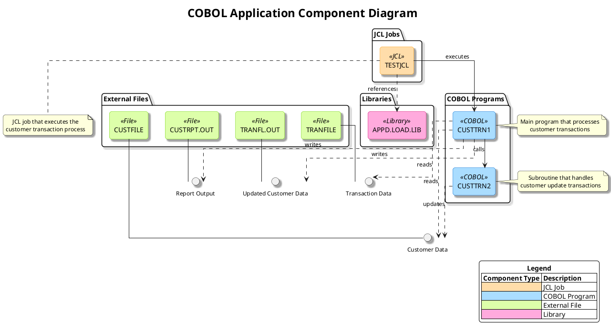

#### 1.3 Usage

1. Execute the Cypher query in a Neo4j database containing the COBOL application data
2. Use the PlantUML script to generate the component diagram
3. The diagram provides a high-level view of the system architecture, showing the relationships between COBOL programs, JCL jobs, and external files

#### 1.4 Visual Enhancements

1. **Color Coding**: Different component types (JCL Jobs, COBOL Programs, External Files, Libraries) use distinct color schemes for easy identification
2. **Organized Packaging**: Components are grouped into logical packages to show their functional relationships
3. **Interface Visualization**: Data flows are represented as interfaces between components
4. **Descriptive Notes**: Key components include explanatory notes about their purpose and function
5. **Relationship Types**: Different line styles indicate different types of relationships (execution, calls, data access)
6. **Professional Styling**: Clean layout with consistent spacing, rounded corners, and shadows for a professional appearance
7. **Comprehensive Legend**: Clear legend explaining all component types for easy reference
8. **Business Context**: Components are presented in a way that highlights their business significance

#### 1.5 Benefits

- Provides a bird's-eye view of the system architecture for better understanding of the legacy system
- Facilitates reverse engineering efforts by clearly showing component relationships and dependencies
- Helps identify integration points and system boundaries for modernization planning
- Serves as comprehensive documentation for knowledge transfer and onboarding
- Supports business decision-making by visualizing technical components in business context
- Improves overall understanding of the COBOL application's structure and behavior

#### 1.6 Prompt 1: Generate Cypher Query

```
You are tasked with creating a Cypher query for Neo4j to extract data for a component diagram of a COBOL application. The diagram should visualize the high-level components of the system and their relationships.

The application consists of:
1. COBOL Programs: CUSTTRN1 (main program) and CUSTTRN2 (subroutine)
2. JCL Job: TESTJCL
3. External Files: CUSTOMER-FILE, TRANSACTION-FILE, CUSTOMER-FILE-OUT, REPORT-FILE

Key relationships:
- CUSTTRN1 calls CUSTTRN2 for update transactions
- TESTJCL executes CUSTTRN1
- CUSTTRN1 reads from CUSTOMER-FILE and TRANSACTION-FILE
- CUSTTRN1 writes to CUSTOMER-FILE-OUT and REPORT-FILE

The Neo4j database contains nodes with labels like COBOLProgram, JCLJob, and COBOLFile, and relationships like CALLS, READS, WRITES, and EXECUTES.

Create a comprehensive Cypher query that extracts all these components and their relationships to be used for generating a component diagram. Include comments in the query to explain each section.

The query should be designed to work with the legacy_code_final.json data structure, which has been imported into Neo4j. Ensure the query handles cases where some relationships might not exist by using OPTIONAL MATCH where appropriate.

Your output should be only the Cypher query with clear comments, ready to be executed in a Neo4j database.
```

#### 1.6 Prompt 2: Generate PlantUML Script

```
Using the results from the following Cypher query, create a PlantUML script to generate a component diagram for a COBOL application:

[INSERT CYPHER QUERY RESULT HERE]

The component diagram should:
1. Visualize the high-level components of the system and their relationships
2. Include COBOL Programs (CUSTTRN1, CUSTTRN2), JCL Job (TESTJCL), and External Files (CUSTOMER-FILE, TRANSACTION-FILE, CUSTOMER-FILE-OUT, REPORT-FILE)
3. Show the relationships between components (calls, executes, reads, writes)
4. Use appropriate styling to distinguish between different types of components
5. Include a title, header, and legend
6. Add detailed descriptive notes for key components explaining their purpose and functionality

The diagram should be visually appealing and easy to understand for all stakeholders, including developers, executives, tech leads, and business stakeholders. Use color coding, clear labels, and professional styling to enhance readability and create a business-elegant presentation.

Specific requirements:
- Use a professional color scheme with complementary colors
- Add detailed notes explaining the purpose of each component
- Include a footer with relevant information
- Use shadowing and appropriate styling for a modern look
- Ensure all relationships have descriptive labels
- Organize the layout for maximum clarity

Provide the complete PlantUML script that can be directly used to generate the component diagram. The script should be well-commented and structured for easy maintenance.
```

### 2. Deployment Diagram
- **Purpose**: Show the physical deployment of the application components
- **Key Elements**:
  - Mainframe environment
  - File systems
  - Batch processing components
  - Physical data stores
- **Benefits**: Helps understand the operational environment and infrastructure dependencies

#### 2.1 Deployment Diagram for COBOL Application

This document provides the Cypher query and PlantUML script for generating a deployment diagram of the COBOL application. The deployment diagram shows the physical deployment of the application components, including the mainframe environment, file systems, batch processing components, and physical data stores.

#### 2.2 Purpose
- Visualize the physical deployment of the application components
- Show the infrastructure dependencies and operational environment
- Provide a clear understanding of how the application is deployed

#### 2.3 Cypher Query for Neo4j

```cypher
// Create Mainframe Environment
MATCH (n) WHERE n:MainframeEnvironment DETACH DELETE n;

// Create Mainframe Environment
CREATE (mainframe:MainframeEnvironment {name: "Mainframe Environment", description: "IBM z/OS Mainframe"})

// Create Load Library
CREATE (loadLib:DataStore {name: "APPD.LOAD.LIB", type: "Load Library", description: "Contains compiled COBOL programs"})

// Create COBOL Programs
CREATE (custtrn1:Program {name: "CUSTTRN1", type: "COBOL Program", description: "Main transaction processing program"})
CREATE (custtrn2:Program {name: "CUSTTRN2", type: "COBOL Program", description: "Subroutine for customer record updates"})

// Create JCL Job
CREATE (testjcl:Job {name: "TESTJCL", type: "JCL Job", description: "Executes the customer transaction processing"})

// Create Input Files
CREATE (custFile:DataStore {name: "APPD.TEST.CUSTFILE", type: "Customer File", description: "Input customer records", recordFormat: "FB", recordLength: 84})
CREATE (tranFile:DataStore {name: "APPD.TEST.TRANFILE", type: "Transaction File", description: "Input transaction records", recordFormat: "FB"})

// Create Output Files
CREATE (custRpt:DataStore {name: "APPD.TEST.CUSTRPT.OUT", type: "Report File", description: "Output transaction report", recordFormat: "FB", recordLength: 133})
CREATE (custOut:DataStore {name: "APPD.TEST.TRANFL.OUT", type: "Customer File", description: "Output updated customer records", recordFormat: "FB", recordLength: 84})

// Create System Output
CREATE (sysprint:DataStore {name: "SYSPRINT", type: "System Output", description: "System messages"})
CREATE (sysout:DataStore {name: "SYSOUT", type: "System Output", description: "System output"})

// Create Copybooks
CREATE (tranrec:Copybook {name: "TRANREC.cpy", type: "Copybook", description: "Transaction record layout"})
CREATE (custcopy:Copybook {name: "CUSTCOPY.cpy", type: "Copybook", description: "Customer record layout"})

// Create Relationships
CREATE (mainframe)-[:HOSTS]->(loadLib)
CREATE (mainframe)-[:HOSTS]->(custFile)
CREATE (mainframe)-[:HOSTS]->(tranFile)
CREATE (mainframe)-[:HOSTS]->(custRpt)
CREATE (mainframe)-[:HOSTS]->(custOut)
CREATE (mainframe)-[:HOSTS]->(sysprint)
CREATE (mainframe)-[:HOSTS]->(sysout)

CREATE (loadLib)-[:CONTAINS]->(custtrn1)
CREATE (loadLib)-[:CONTAINS]->(custtrn2)

CREATE (testjcl)-[:EXECUTES]->(custtrn1)
CREATE (custtrn1)-[:CALLS]->(custtrn2)

CREATE (custtrn1)-[:READS]->(custFile)
CREATE (custtrn1)-[:READS]->(tranFile)
CREATE (custtrn1)-[:WRITES]->(custRpt)
CREATE (custtrn1)-[:WRITES]->(custOut)
CREATE (custtrn1)-[:WRITES]->(sysprint)
CREATE (custtrn1)-[:WRITES]->(sysout)

CREATE (custtrn1)-[:INCLUDES]->(tranrec)
CREATE (custtrn1)-[:INCLUDES]->(custcopy)
CREATE (custtrn2)-[:INCLUDES]->(tranrec)

// Return all nodes and relationships for visualization
MATCH (n)-[r]->(m) RETURN n, r, m;
```

#### 2.4 PlantUML Script

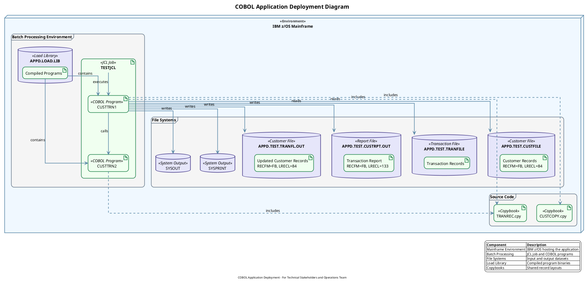

#### 2.5  Key Elements in the Diagram

1. **Mainframe Environment**
  - IBM z/OS Mainframe hosting all components

2. **Batch Processing Components**
  - TESTJCL: JCL job that executes the main program
  - CUSTTRN1: Main COBOL program for transaction processing
  - CUSTTRN2: Subroutine COBOL program for customer updates

3. **File Systems**
  - Input Files:
    - APPD.TEST.CUSTFILE: Customer master file
    - APPD.TEST.TRANFILE: Transaction input file
  - Output Files:
    - APPD.TEST.CUSTRPT.OUT: Transaction processing report
    - APPD.TEST.TRANFL.OUT: Updated customer master file
  - System Output:
    - SYSPRINT: System messages
    - SYSOUT: System output

4. **Physical Data Stores**
  - APPD.LOAD.LIB: Load library containing compiled programs
  - Copybooks:
    - TRANREC.cpy: Transaction record layout
    - CUSTCOPY.cpy: Customer record layout

#### 2.6 Benefits

- Provides a clear visualization of the operational environment
- Helps understand infrastructure dependencies
- Shows the physical deployment of all application components
- Illustrates data flow between components
- Supports infrastructure planning and maintenance

#### 2.7 Prompt 1: Generate Cypher Query

```
You are tasked with creating a Cypher query for Neo4j to extract data for a component diagram of a COBOL application. The diagram should visualize the high-level components of the system and their relationships.

The application consists of:
1. COBOL Programs: CUSTTRN1 (main program) and CUSTTRN2 (subroutine)
2. JCL Job: TESTJCL
3. External Files: CUSTOMER-FILE, TRANSACTION-FILE, CUSTOMER-FILE-OUT, REPORT-FILE

Key relationships:
- CUSTTRN1 calls CUSTTRN2 for update transactions
- TESTJCL executes CUSTTRN1
- CUSTTRN1 reads from CUSTOMER-FILE and TRANSACTION-FILE
- CUSTTRN1 writes to CUSTOMER-FILE-OUT and REPORT-FILE

The Neo4j database contains nodes with labels like COBOLProgram, JCLJob, and COBOLFile, and relationships like CALLS, READS, WRITES, and EXECUTES.

Create a comprehensive Cypher query that extracts all these components and their relationships to be used for generating a component diagram. Include comments in the query to explain each section.

The query should be designed to work with the legacy_code_final.json data structure, which has been imported into Neo4j. Ensure the query handles cases where some relationships might not exist by using OPTIONAL MATCH where appropriate.

Your output should be only the Cypher query with clear comments, ready to be executed in a Neo4j database.
```

#### 2.8 Prompt 2: Generate PlantUML Script

```
Using the results from the following Cypher query, create a PlantUML script to generate a component diagram for a COBOL application:

[INSERT CYPHER QUERY RESULT HERE]

The component diagram should:
1. Visualize the high-level components of the system and their relationships
2. Include COBOL Programs (CUSTTRN1, CUSTTRN2), JCL Job (TESTJCL), and External Files (CUSTOMER-FILE, TRANSACTION-FILE, CUSTOMER-FILE-OUT, REPORT-FILE)
3. Show the relationships between components (calls, executes, reads, writes)
4. Use appropriate styling to distinguish between different types of components
5. Include a title, header, and legend
6. Add detailed descriptive notes for key components explaining their purpose and functionality

The diagram should be visually appealing and easy to understand for all stakeholders, including developers, executives, tech leads, and business stakeholders. Use color coding, clear labels, and professional styling to enhance readability and create a business-elegant presentation.

Specific requirements:
- Use a professional color scheme with complementary colors
- Add detailed notes explaining the purpose of each component
- Include a footer with relevant information
- Use shadowing and appropriate styling for a modern look
- Ensure all relationships have descriptive labels
- Organize the layout for maximum clarity

Provide the complete PlantUML script that can be directly used to generate the component diagram. The script should be well-commented and structured for easy maintenance.
```

## Program Structure Diagrams

### 3. Class Diagram for Data Structures
- **Purpose**: Represent the data structures used in the COBOL programs
- **Target Audience**: Developers, data architects
- **Key Elements**:
  - Record layouts (CUST-REC, TRANSACTION-RECORD)
  - Field definitions with data types
  - Relationships between data structures
- **Benefits**: Provides clear understanding of the data model

#### 3.1 Class Diagram for COBOL Data Structures

#### 3.2 Purpose
This document provides the necessary scripts to generate a class diagram representing the data structures used in the COBOL programs. The diagram visualizes record layouts, field definitions with data types, and relationships between data structures.

#### 3.3 Key Elements
- Record layouts (CUST-REC, TRANSACTION-RECORD)
- Field definitions with data types
- Relationships between data structures

#### 3.4 Benefits
- Provides clear understanding of the data model
- Supports maintenance and enhancement activities

#### 3.5 Neo4j Cypher Query

```cypher
// Clear existing data if needed
MATCH (n) DETACH DELETE n;

// Create Record Layouts
CREATE (custRec:RecordLayout {name: "CUST-REC", description: "Customer Record Layout"})
CREATE (tranRec:RecordLayout {name: "TRANSACTION-RECORD", description: "Transaction Record Layout"})
CREATE (cstoutRec:RecordLayout {name: "CSTOUT-REC", description: "Customer Output Record Layout"})
CREATE (wsCustRec:RecordLayout {name: "WS-CUST-REC", description: "Working Storage Customer Record"});

// Create Fields for CUST-REC
CREATE (custKey:Field {name: "CUST-KEY", dataType: "Group Item"})
CREATE (custName:Field {name: "CUST-NAME", dataType: "PIC X(17)"})
CREATE (custAcctBalance:Field {name: "CUST-ACCT-BALANCE", dataType: "PIC 9(7)V99"})
CREATE (custOrdersYtd:Field {name: "CUST-ORDERS-YTD", dataType: "PIC 9(5)"})
CREATE (custAddr:Field {name: "CUST-ADDR", dataType: "PIC X(20)"})
CREATE (custCity:Field {name: "CUST-CITY", dataType: "PIC X(14)"})
CREATE (custState:Field {name: "CUST-STATE", dataType: "PIC X(02)"})
CREATE (custCountry:Field {name: "CUST-COUNTRY", dataType: "PIC X(11)"});

// Create Fields for TRANSACTION-RECORD
CREATE (tranCode:Field {name: "TRAN-CODE", dataType: "PIC X(6)"})
CREATE (tranParms:Field {name: "TRAN-PARMS", dataType: "Group Item"})
CREATE (tranKey:Field {name: "TRAN-KEY", dataType: "PIC X(6)"})
CREATE (tranAction:Field {name: "TRAN-ACTION", dataType: "PIC X(8)"})
CREATE (tranFieldName:Field {name: "TRAN-FIELD-NAME", dataType: "PIC X(10)"})
CREATE (tranUpdateData:Field {name: "TRAN-UPDATE-DATA", dataType: "PIC X(46)"})
CREATE (tranUpdateSign:Field {name: "TRAN-UPDATE-SIGN", dataType: "PIC X(01)"})
CREATE (tranUpdateNum:Field {name: "TRAN-UPDATE-NUM", dataType: "PIC 9(7)V99"});

// Create Fields for CSTOUT-REC
CREATE (cstoutKey:Field {name: "CSTOUT-KEY", dataType: "Group Item"})
CREATE (cstoutId:Field {name: "CSTOUT-ID", dataType: "PIC X(5)"})
CREATE (cstoutRecType:Field {name: "CSTOUT-REC-TYPE", dataType: "PIC X"})
CREATE (cstoutName:Field {name: "CSTOUT-NAME", dataType: "PIC X(17)"})
CREATE (cstoutAcctBalance:Field {name: "CSTOUT-ACCT-BALANCE", dataType: "PIC 9(7)V99"})
CREATE (cstoutOrdersYtd:Field {name: "CSTOUT-ORDERS-YTD", dataType: "PIC 9(5)"})
CREATE (cstoutAddr:Field {name: "CSTOUT-ADDR", dataType: "PIC X(20)"})
CREATE (cstoutCity:Field {name: "CSTOUT-CITY", dataType: "PIC X(14)"})
CREATE (cstoutState:Field {name: "CSTOUT-STATE", dataType: "PIC X(02)"})
CREATE (cstoutCountry:Field {name: "CSTOUT-COUNTRY", dataType: "PIC X(11)"});

// Create Fields for WS-CUST-REC
CREATE (wsCustKey:Field {name: "WS-CUST-KEY", dataType: "Group Item"})
CREATE (wsCustName:Field {name: "WS-CUST-NAME", dataType: "PIC X(17)"})
CREATE (wsCustAcctBalance:Field {name: "WS-CUST-ACCT-BALANCE", dataType: "PIC 9(7)V99"})
CREATE (wsCustOrdersYtd:Field {name: "WS-CUST-ORDERS-YTD", dataType: "PIC 9(5)"})
CREATE (wsCustAddr:Field {name: "WS-CUST-ADDR", dataType: "PIC X(20)"})
CREATE (wsCustCity:Field {name: "WS-CUST-CITY", dataType: "PIC X(14)"})
CREATE (wsCustState:Field {name: "WS-CUST-STATE", dataType: "PIC X(02)"})
CREATE (wsCustCountry:Field {name: "WS-CUST-COUNTRY", dataType: "PIC X(11)"});

// Connect Fields to Record Layouts
CREATE (custRec)-[:CONTAINS]->(custKey)
CREATE (custRec)-[:CONTAINS]->(custName)
CREATE (custRec)-[:CONTAINS]->(custAcctBalance)
CREATE (custRec)-[:CONTAINS]->(custOrdersYtd)
CREATE (custRec)-[:CONTAINS]->(custAddr)
CREATE (custRec)-[:CONTAINS]->(custCity)
CREATE (custRec)-[:CONTAINS]->(custState)
CREATE (custRec)-[:CONTAINS]->(custCountry)

CREATE (tranRec)-[:CONTAINS]->(tranCode)
CREATE (tranRec)-[:CONTAINS]->(tranParms)
CREATE (tranParms)-[:CONTAINS]->(tranKey)
CREATE (tranParms)-[:CONTAINS]->(tranAction)
CREATE (tranParms)-[:CONTAINS]->(tranFieldName)
CREATE (tranParms)-[:CONTAINS]->(tranUpdateData)
CREATE (tranUpdateData)-[:REDEFINES]->(tranUpdateSign)
CREATE (tranUpdateData)-[:REDEFINES]->(tranUpdateNum)

CREATE (cstoutRec)-[:CONTAINS]->(cstoutKey)
CREATE (cstoutKey)-[:CONTAINS]->(cstoutId)
CREATE (cstoutKey)-[:CONTAINS]->(cstoutRecType)
CREATE (cstoutRec)-[:CONTAINS]->(cstoutName)
CREATE (cstoutRec)-[:CONTAINS]->(cstoutAcctBalance)
CREATE (cstoutRec)-[:CONTAINS]->(cstoutOrdersYtd)
CREATE (cstoutRec)-[:CONTAINS]->(cstoutAddr)
CREATE (cstoutRec)-[:CONTAINS]->(cstoutCity)
CREATE (cstoutRec)-[:CONTAINS]->(cstoutState)
CREATE (cstoutRec)-[:CONTAINS]->(cstoutCountry)

CREATE (wsCustRec)-[:CONTAINS]->(wsCustKey)
CREATE (wsCustRec)-[:CONTAINS]->(wsCustName)
CREATE (wsCustRec)-[:CONTAINS]->(wsCustAcctBalance)
CREATE (wsCustRec)-[:CONTAINS]->(wsCustOrdersYtd)
CREATE (wsCustRec)-[:CONTAINS]->(wsCustAddr)
CREATE (wsCustRec)-[:CONTAINS]->(wsCustCity)
CREATE (wsCustRec)-[:CONTAINS]->(wsCustState)
CREATE (wsCustRec)-[:CONTAINS]->(wsCustCountry);

// Create Relationships between Record Layouts
CREATE (tranRec)-[:REFERENCES {description: "Transaction references Customer via key"}]->(custRec)
CREATE (custRec)-[:COPIED_TO {description: "Customer record copied to output"}]->(cstoutRec)
CREATE (custRec)-[:COPIED_TO {description: "Customer record copied to working storage"}]->(wsCustRec);

// Return all nodes and relationships
MATCH (n) RETURN n;
```

#### 3.6 PlantUML Script

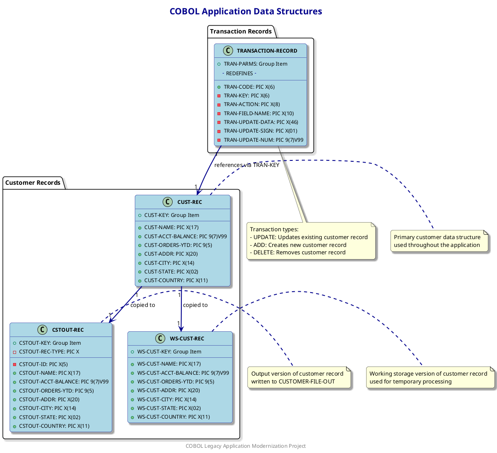

#### 3.7 Diagram Explanation

The class diagram visualizes:

1. **Record Layouts**: The main data structures (CUST-REC, TRANSACTION-RECORD, etc.) are represented as classes.

2. **Field Definitions**: Each field within a record is shown with its data type.

3. **Relationships**: The connections between data structures are represented by arrows:
  - Transaction records reference customer records via the key field
  - Customer records are copied to output records
  - Customer records are copied to working storage

4. **Grouping**: Related structures are grouped in packages for better organization.

5. **Notes**: Additional context is provided through notes that explain the purpose and usage of each structure.

#### 3.8 Prompt 1: Neo4j Cypher Query Generation

```
You are tasked with creating a Neo4j Cypher query to extract data structures from a COBOL application for visualization purposes. The query should focus on extracting record layouts, field definitions, and relationships between data structures.

Input: The legacy_code_final.json file containing COBOL program definitions with the following structure:
- cobolPrograms: Array of COBOL programs
  - name: Program name
  - working_storage: Working storage section with data_entries
  - file_section: File section with data_entries
  - data_entries: Array of data structures
    - name: Structure name
    - raw_code: COBOL code defining the structure
    - fields: Array of fields within the structure

Requirements:
1. Extract all record layouts from FILE SECTION and WORKING-STORAGE SECTION
2. Identify field definitions with their data types
3. Determine relationships between data structures (contains, references, redefines)
4. Focus on key structures: CUST-REC, TRANSACTION-RECORD, CSTOUT-REC, WS-CUST-REC
5. Include program context to understand which program uses which data structure

The query should be optimized for Neo4j and return results that can be used to generate a comprehensive class diagram. Include comments explaining the purpose of each part of the query.

Output: A complete, executable Neo4j Cypher query that extracts the required information from the database.
```

#### 3.9 Prompt 2: PlantUML Script Generation

```
You are tasked with creating a PlantUML script to generate a class diagram for COBOL data structures based on the results of a Neo4j query. The diagram should be visually appealing, business-elegant, and understandable by both technical and non-technical stakeholders.

Input: The results of the following Neo4j Cypher query:
[INSERT RESULTS FROM PROMPT 1 QUERY HERE]

Requirements:
1. Create a comprehensive class diagram showing:
   - Record layouts (CUST-REC, TRANSACTION-RECORD, etc.) as classes
   - Field definitions with their data types as class attributes
   - Relationships between data structures (contains, references, redefines)
   - Grouping of related structures in packages

2. Apply professional styling:
   - Use a business-elegant color scheme
   - Apply appropriate stereotypes to distinguish different types of structures
   - Include detailed notes explaining the purpose of key structures
   - Add a legend explaining the diagram elements
   - Use bold formatting for key fields
   - Include a title, header, and footer

3. Enhance readability:
   - Organize the layout for maximum clarity
   - Use appropriate spacing and padding
   - Apply consistent styling throughout
   - Include relationship descriptions

4. Add context through notes:
   - Explain transaction types and their purposes
   - Describe the role of each major data structure
   - Highlight key fields and their significance
   - Provide processing context where relevant

Output: A complete, executable PlantUML script that generates a professional-quality class diagram representing the COBOL data structures. The script should be well-commented and structured for easy maintenance.
```


### 4. Package Diagram
- **Purpose**: Organize COBOL programs and copybooks into logical groups
- **Target Audience**: Developers, architects
- **Key Elements**:
  - Program groupings
  - Copybook dependencies
  - Logical subsystems
- **Benefits**: Helps understand the modular structure of the application

#### 4.1 Package Diagram for COBOL Application

This document provides the necessary scripts to generate a Package Diagram for the COBOL application. The diagram organizes COBOL programs and copybooks into logical groups, showing program groupings, copybook dependencies, and logical subsystems.

#### 4.2 Benefits
- Helps understand the modular structure of the application
- Visualizes program groupings and dependencies
- Identifies logical subsystems within the application

#### 4.3 Neo4j Cypher Query
The following Cypher query extracts the package structure from the COBOL application data:

```cypher
// Match all COBOL programs
MATCH (program:COBOLProgram)

// Match copybooks used by programs
OPTIONAL MATCH (program)-[:USES]->(copybook:COBOLCopybook)

// Match program calls between programs
OPTIONAL MATCH (program)-[:CALLS]->(calledProgram:COBOLProgram)

// Group programs by their functional area
WITH program, 
     CASE 
       WHEN program.name CONTAINS 'CUST' THEN 'CustomerManagement'
       WHEN program.name CONTAINS 'TRAN' THEN 'TransactionProcessing'
       ELSE 'Utilities'
     END AS packageName,
     collect(DISTINCT copybook) AS usedCopybooks,
     collect(DISTINCT calledProgram) AS calledPrograms

// Return the results organized by package
RETURN packageName,
       collect({
         name: program.name,
         copybooks: [cb IN usedCopybooks WHERE cb IS NOT NULL | cb.name],
         calls: [cp IN calledPrograms WHERE cp IS NOT NULL | cp.name]
       }) AS programs
ORDER BY packageName
```

#### 4.4 PlantUML Script
The following PlantUML script generates the Package Diagram:

```plantuml
@startuml Package Diagram

' Set theme and styling for better visualization
!theme cerulean
skinparam backgroundColor white
skinparam packageStyle rectangle
skinparam packageBackgroundColor lightyellow
skinparam packageBorderColor black
skinparam packageFontColor black
skinparam packageFontSize 14
skinparam packageFontStyle bold
skinparam arrowColor #33658A
skinparam linetype ortho

' Title
title <size:20><b>COBOL Application Package Diagram</b></size>

' Legend
legend right
  <b>Package Diagram</b>
  |= Symbol |= Description |
  | <back:lightyellow>Package</back> | Logical grouping of programs |
  | <back:lightblue>Program</back> | COBOL program |
  | <back:lightgreen>Copybook</back> | COBOL copybook |
  | -----> | Dependency |
endlegend

' Define packages
package "Transaction Processing" as TransactionProcessing {
  [CUSTTRN1] as CUSTTRN1 #lightblue
  [CUSTTRN2] as CUSTTRN2 #lightblue
  note bottom of CUSTTRN1
    Main transaction processing program
    Handles ADD, UPDATE, DELETE operations
  end note
  note bottom of CUSTTRN2
    Subroutine for processing updates
    Called by CUSTTRN1
  end note
}

package "Data Structures" as DataStructures {
  [TRANREC.cpy] as TRANREC #lightgreen
  [CUSTCOPY.cpy] as CUSTCOPY #lightgreen
  note bottom of TRANREC
    Transaction record layout
    Used for processing transactions
  end note
  note bottom of CUSTCOPY
    Customer record layout
    Defines customer data structure
  end note
}

package "File Operations" as FileOperations {
  [File I/O] as FileIO #lightblue
  note bottom of FileIO
    File operations for:
    - CUSTOMER-FILE
    - TRANSACTION-FILE
    - CUSTOMER-FILE-OUT
    - REPORT-FILE
  end note
}

package "Reporting" as Reporting {
  [Report Generation] as ReportGen #lightblue
  note bottom of ReportGen
    Generates transaction reports
    and error messages
  end note
}

' Define relationships
CUSTTRN1 --> CUSTTRN2 : calls
CUSTTRN1 --> TRANREC : uses
CUSTTRN1 --> CUSTCOPY : uses
CUSTTRN2 --> TRANREC : uses
CUSTTRN2 --> CUSTCOPY : uses
CUSTTRN1 --> FileIO : performs
CUSTTRN1 --> ReportGen : performs

' Add overall system boundary
rectangle "COBOL Transaction Processing System" {
  TransactionProcessing
  DataStructures
  FileOperations
  Reporting
}

@enduml
```

#### 4.5 Diagram Explanation

The Package Diagram organizes the COBOL application into the following logical groups:

1. **Transaction Processing**
  - Contains the main transaction processing programs (CUSTTRN1, CUSTTRN2)
  - CUSTTRN1 is the main program that handles ADD, UPDATE, and DELETE operations
  - CUSTTRN2 is a subroutine called by CUSTTRN1 to process updates

2. **Data Structures**
  - Contains the copybooks that define the data structures used by the programs
  - TRANREC.cpy defines the transaction record layout
  - CUSTCOPY.cpy defines the customer record layout

3. **File Operations**
  - Represents the file I/O operations performed by the programs
  - Includes operations on CUSTOMER-FILE, TRANSACTION-FILE, CUSTOMER-FILE-OUT, and REPORT-FILE

4. **Reporting**
  - Represents the reporting functionality of the application
  - Includes generation of transaction reports and error messages

The diagram shows the dependencies between these components, illustrating how the programs use copybooks and call other programs.

#### 4.6 Prompt 1: Generate Cypher Query for Package Diagram

```
I need to create a Cypher query to extract data from a Neo4j database for a COBOL application package diagram. The database contains nodes labeled as COBOLProgram, COBOLCopyBook, and relationships between them.

The package diagram should:
1. Organize COBOL programs and copybooks into logical groups
2. Show program groupings, copybook dependencies, and logical subsystems
3. Help understand the modular structure of the application

The Neo4j database structure includes:
- Nodes labeled COBOLProgram with properties: name, filePath
- Nodes labeled COBOLCopyBook with properties: name, filePath
- Nodes labeled COBOLDataDivision with comments that indicate copybook imports
- Nodes labeled COBOLCall that represent program calls
- Relationships like CONTAINS that connect programs to their components

The COBOL application includes programs like CUSTTRN1 and CUSTTRN2, and copybooks like TRANREC.cpy and CUSTCOPY.cpy.

Please create a Cypher query that:
1. Identifies all COBOL programs
2. Extracts copybook dependencies from program comments
3. Identifies program calls between COBOL programs
4. Groups programs into logical subsystems based on naming conventions and functionality
5. Returns the program name, subsystem, used copybooks, and called programs

The query should be optimized for Neo4j and include comments explaining each step.
```

#### 4.7 Prompt 2: Generate PlantUML Script for Package Diagram

```
Using the results from the following Cypher query, create a PlantUML script for a package diagram that organizes COBOL programs and copybooks into logical groups:

[INSERT CYPHER QUERY RESULTS HERE]

The package diagram should:
1. Organize COBOL programs and copybooks into logical groups
2. Show program groupings, copybook dependencies, and logical subsystems
3. Help understand the modular structure of the application

The diagram is for a COBOL application with these components:
- Programs: CUSTTRN1 (main customer transaction processor), CUSTTRN2 (customer transaction subprocessor)
- Copybooks: TRANREC.cpy (transaction record layout), CUSTCOPY.cpy (customer record layout)
- JCL Jobs: TESTJCL (test job for CUSTTRN1)

Key relationships:
- CUSTTRN1 calls CUSTTRN2
- CUSTTRN1 imports TRANREC.cpy and CUSTCOPY.cpy
- CUSTTRN2 imports TRANREC.cpy
- TESTJCL executes CUSTTRN1

The PlantUML script should:
1. Use a professional, business-elegant style with appropriate colors and formatting
2. Include clear package names and meaningful stereotypes
3. Show all dependencies with appropriate arrows and labels
4. Add explanatory notes for clarity
5. Be well-structured and easy to read

The diagram will be viewed by developers, executives, tech leads, and stakeholders, so it should be detailed yet clear and visually appealing.
```


## Behavioral Diagrams

### 5. Activity Diagram for Main Process Flow
- **Purpose**: Visualize the overall business process flow
- **Key Elements**:
  - Transaction processing workflow
  - Decision points
  - Error handling paths
- **Benefits**: Provides a clear understanding of the business process implemented by the application

#### 5.2 Cypher Query for Neo4j

```cypher
// Clear previous data if needed
MATCH (n) DETACH DELETE n;

// Create main programs
CREATE (custtrn1:Program {name: "CUSTTRN1", description: "Main transaction processing program"})
CREATE (custtrn2:Program {name: "CUSTTRN2", description: "Transaction update subroutine"})

// Create main activities for CUSTTRN1
CREATE (start:Activity {name: "Start CUSTTRN1"})
CREATE (getDateTime:Activity {name: "Get Current Date and Time"})
CREATE (openFiles:Activity {name: "Open Files", description: "Open transaction, customer, and report files"})
CREATE (initReport:Activity {name: "Initialize Report"})
CREATE (readCustomer:Activity {name: "Read Customer File"})
CREATE (processTransactions:Activity {name: "Process Transactions Loop", description: "Process transactions until end of file"})
CREATE (reportStats:Activity {name: "Report Transaction Statistics"})
CREATE (closeFiles:Activity {name: "Close Files"})
CREATE (end:Activity {name: "End Program"})

// Create transaction processing activities
CREATE (readTran:Activity {name: "Read Transaction Record"})
CREATE (checkSequence:Decision {name: "Check Transaction Sequence"})
CREATE (identifyTranType:Decision {name: "Identify Transaction Type"})
CREATE (processUpdate:Activity {name: "Process UPDATE Transaction"})
CREATE (processAdd:Activity {name: "Process ADD Transaction"})
CREATE (processDelete:Activity {name: "Process DELETE Transaction"})
CREATE (reportBadTran:Activity {name: "Report Bad Transaction", description: "Log error and continue processing"})
CREATE (reportProcessed:Activity {name: "Report Processed Transaction"})

// Create update transaction activities
CREATE (positionCustFile:Activity {name: "Position Customer File"})
CREATE (checkMatchingKey:Decision {name: "Check for Matching Key"})
CREATE (callCusttrn2:Activity {name: "Call CUSTTRN2 Subroutine"})
CREATE (checkUpdateSuccess:Decision {name: "Check Update Success"})
CREATE (incrementUpdateCount:Activity {name: "Increment Update Count"})

// Create add transaction activities
CREATE (checkDuplicateKey:Decision {name: "Check for Duplicate Key"})
CREATE (initNewCustomer:Activity {name: "Initialize New Customer Record"})
CREATE (writeCustomer:Activity {name: "Write Customer Record"})
CREATE (incrementAddCount:Activity {name: "Increment Add Count"})

// Create delete transaction activities
CREATE (checkKeyExists:Decision {name: "Check if Key Exists"})
CREATE (incrementDeleteCount:Activity {name: "Increment Delete Count"})
CREATE (readNextCustomer:Activity {name: "Read Next Customer Record"})

// Create CUSTTRN2 activities
CREATE (startCusttrn2:Activity {name: "Start CUSTTRN2"})
CREATE (validateTran:Activity {name: "Validate Transaction"})
CREATE (checkValidation:Decision {name: "Check Validation Result"})
CREATE (processTran:Activity {name: "Process Transaction"})
CREATE (endCusttrn2:Activity {name: "End CUSTTRN2"})

// Create file error handling activities
CREATE (checkFileStatus:Decision {name: "Check File Status"})
CREATE (displayFileError:Activity {name: "Display File Error"})
CREATE (terminateProgram:Activity {name: "Terminate Program"})

// Connect main flow
CREATE (start)-[:NEXT]->(getDateTime)
CREATE (getDateTime)-[:NEXT]->(openFiles)
CREATE (openFiles)-[:NEXT]->(checkFileStatus)
CREATE (checkFileStatus)-[:SUCCESS]->(initReport)
CREATE (checkFileStatus)-[:ERROR]->(displayFileError)
CREATE (displayFileError)-[:NEXT]->(terminateProgram)
CREATE (terminateProgram)-[:NEXT]->(end)
CREATE (initReport)-[:NEXT]->(readCustomer)
CREATE (readCustomer)-[:NEXT]->(processTransactions)
CREATE (processTransactions)-[:COMPLETE]->(reportStats)
CREATE (reportStats)-[:NEXT]->(closeFiles)
CREATE (closeFiles)-[:NEXT]->(end)

// Connect transaction processing flow
CREATE (processTransactions)-[:PROCESS]->(readTran)
CREATE (readTran)-[:NEXT]->(checkSequence)
CREATE (checkSequence)-[:OUT_OF_SEQUENCE]->(reportBadTran)
CREATE (checkSequence)-[:IN_SEQUENCE]->(identifyTranType)
CREATE (identifyTranType)-[:UPDATE]->(processUpdate)
CREATE (identifyTranType)-[:ADD]->(processAdd)
CREATE (identifyTranType)-[:DELETE]->(processDelete)
CREATE (identifyTranType)-[:INVALID]->(reportBadTran)
CREATE (reportBadTran)-[:NEXT]->(readTran)
CREATE (processUpdate)-[:NEXT]->(reportProcessed)
CREATE (processAdd)-[:NEXT]->(reportProcessed)
CREATE (processDelete)-[:NEXT]->(reportProcessed)
CREATE (reportProcessed)-[:NEXT]->(readTran)

// Connect update transaction flow
CREATE (processUpdate)-[:CALLS]->(positionCustFile)
CREATE (positionCustFile)-[:NEXT]->(checkMatchingKey)
CREATE (checkMatchingKey)-[:NO_MATCH]->(reportBadTran)
CREATE (checkMatchingKey)-[:MATCH]->(callCusttrn2)
CREATE (callCusttrn2)-[:NEXT]->(checkUpdateSuccess)
CREATE (checkUpdateSuccess)-[:FAILURE]->(reportBadTran)
CREATE (checkUpdateSuccess)-[:SUCCESS]->(incrementUpdateCount)

// Connect add transaction flow
CREATE (processAdd)-[:CALLS]->(positionCustFile)
CREATE (positionCustFile)-[:NEXT]->(checkDuplicateKey)
CREATE (checkDuplicateKey)-[:DUPLICATE]->(reportBadTran)
CREATE (checkDuplicateKey)-[:NO_DUPLICATE]->(initNewCustomer)
CREATE (initNewCustomer)-[:NEXT]->(writeCustomer)
CREATE (writeCustomer)-[:NEXT]->(incrementAddCount)

// Connect delete transaction flow
CREATE (processDelete)-[:CALLS]->(positionCustFile)
CREATE (positionCustFile)-[:NEXT]->(checkKeyExists)
CREATE (checkKeyExists)-[:NOT_EXISTS]->(reportBadTran)
CREATE (checkKeyExists)-[:EXISTS]->(incrementDeleteCount)
CREATE (incrementDeleteCount)-[:NEXT]->(readNextCustomer)

// Connect CUSTTRN2 flow
CREATE (callCusttrn2)-[:CALLS]->(startCusttrn2)
CREATE (startCusttrn2)-[:NEXT]->(validateTran)
CREATE (validateTran)-[:NEXT]->(checkValidation)
CREATE (checkValidation)-[:VALID]->(processTran)
CREATE (checkValidation)-[:INVALID]->(endCusttrn2)
CREATE (processTran)-[:NEXT]->(endCusttrn2)
CREATE (endCusttrn2)-[:RETURNS_TO]->(callCusttrn2)

// Create program relationship
CREATE (custtrn1)-[:CALLS]->(custtrn2);
```

#### 5.3 PlantUML Script

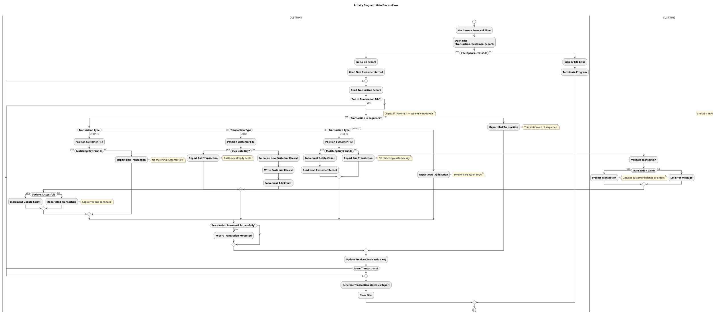

#### 5.4 Diagram Description

The Activity Diagram for Main Process Flow visualizes the overall business process implemented by the COBOL application. It shows:

1. **Main Program Flow**: The sequence of operations from program start to end, including file operations, transaction processing, and reporting.

2. **Transaction Processing**: The different paths for processing UPDATE, ADD, and DELETE transactions.

3. **Decision Points**: Key decision points that determine the flow of execution, such as file status checks, transaction validation, and error conditions.

4. **Error Handling**: The paths taken when errors occur, including reporting bad transactions and handling file errors.

5. **Program Interaction**: The interaction between CUSTTRN1 (main program) and CUSTTRN2 (subroutine) during update transaction processing.

#### 5.5 Prompt 1: Generate Cypher Query for Neo4j

```
You are tasked with creating a Cypher query to extract the main process flow from a Neo4j database containing a COBOL application structure. The query will be used to generate an activity diagram.

The COBOL application consists of two main programs:
1. CUSTTRN1: The main program that handles transaction processing
2. CUSTTRN2: A subroutine called by CUSTTRN1 to process update transactions

The Neo4j database has the following node types:
- COBOLProgram: Represents COBOL programs
- COBOLParagraph: Represents paragraphs in COBOL programs
- COBOLFile: Represents files used by COBOL programs

And the following relationship types:
- CONTAINS: Links programs to their paragraphs
- COBOLPerform: Represents PERFORM statements in COBOL
- COBOLCall: Represents CALL statements in COBOL
- READS/WRITES: Represents file operations

Create a comprehensive Cypher query that extracts:
1. The main process flow starting from CUSTTRN1's main paragraph (000-MAIN)
2. The transaction processing flow (100-PROCESS-TRANSACTIONS)
3. The different paths for processing transactions (UPDATE, ADD, DELETE)
4. Error handling paths (299-REPORT-BAD-TRAN)
5. The interaction between CUSTTRN1 and CUSTTRN2
6. File operations

The query should be structured as a series of MATCH statements combined with UNION to capture all aspects of the process flow. Ensure the query is optimized and focuses on the relationships that are most relevant for understanding the business process.
```

#### 5.6 Prompt 2: Generate PlantUML Activity Diagram

```
You are tasked with creating a PlantUML activity diagram that visualizes the main process flow of a COBOL application based on data extracted from a Neo4j database using the following Cypher query:

[INSERT CYPHER QUERY FROM PROMPT 1]

The COBOL application processes customer transactions with the following main components:

1. CUSTTRN1: Main program that:
   - Opens files (700-OPEN-FILES)
   - Initializes reports (800-INIT-REPORT)
   - Processes transactions (100-PROCESS-TRANSACTIONS)
   - Handles different transaction types:
     - UPDATE (200-PROCESS-UPDATE-TRAN)
     - ADD (210-PROCESS-ADD-TRAN)
     - DELETE (220-PROCESS-DELETE-TRAN)
   - Reports errors (299-REPORT-BAD-TRAN)
   - Generates statistics (850-REPORT-TRAN-STATS)
   - Closes files (790-CLOSE-FILES)

2. CUSTTRN2: Subroutine called by CUSTTRN1 to:
   - Validate transactions (100-VALIDATE-TRAN)
   - Process update transactions (200-PROCESS-TRAN)

Create a detailed activity diagram that:
1. Shows the overall flow from start to end
2. Clearly illustrates decision points and their outcomes
3. Highlights error handling paths
4. Distinguishes between the two programs (CUSTTRN1 and CUSTTRN2)
5. Includes file operations
6. Uses appropriate styling for better readability

The diagram should be visually appealing and easy to understand for both technical and non-technical stakeholders. Use swimlanes to separate the activities of CUSTTRN1 and CUSTTRN2. Include detailed activity descriptions that explain what each step does.

Ensure the PlantUML script is syntactically correct and optimized for rendering a clear, professional diagram.
```

### 6. Sequence Diagram for Transaction Processing
- **Purpose**: Show the interactions between programs and components during transaction processing
- **Target Audience**: Developers, tech leads
- **Key Elements**:
  - Program calls (CUSTTRN1 calling CUSTTRN2)
  - File operations
  - Error handling sequences
- **Benefits**: Illustrates the dynamic behavior and interaction between components

This document provides a detailed sequence diagram illustrating the transaction processing flow in the COBOL application, specifically focusing on the interaction between CUSTTRN1 and CUSTTRN2 programs, file operations, and error handling sequences.

#### 6.1 Cypher Query for Neo4j
The following Cypher query can be used to extract the transaction processing flow from the Neo4j database:

```cypher
// Cypher query to extract transaction processing flow
MATCH path = (p1:COBOLProgram {name: "CUSTTRN1"})-[:CONTAINS]->(para1:COBOLParagraph)-[:PERFORMS|CALLS*1..3]->(para2)
WHERE para1.name IN ["000-MAIN", "100-PROCESS-TRANSACTIONS", "200-PROCESS-UPDATE-TRAN", "210-PROCESS-ADD-TRAN", "220-PROCESS-DELETE-TRAN"]
RETURN path

UNION

MATCH path = (p1:COBOLProgram {name: "CUSTTRN1"})-[:CONTAINS]->(para:COBOLParagraph)-[:READS|WRITES]->(file:COBOLFile)
RETURN path

UNION

MATCH path = (p1:COBOLProgram {name: "CUSTTRN1"})-[:CALLS]->(p2:COBOLProgram {name: "CUSTTRN2"})
RETURN path

UNION

MATCH path = (p1:COBOLProgram {name: "CUSTTRN2"})-[:CONTAINS]->(para:COBOLParagraph)
RETURN path

UNION

MATCH path = (para:COBOLParagraph)-[:HANDLES_ERROR]->(errorPara:COBOLParagraph)
WHERE para.name IN ["200-PROCESS-UPDATE-TRAN", "710-READ-TRAN-FILE", "730-READ-CUSTOMER-FILE", "740-WRITE-CUSTOUT-FILE"]
RETURN path
```

#### 6.2 PlantUML Sequence Diagram

```plantuml
@startuml Transaction Processing Sequence Diagram

' Define participants with custom styling
skinparam participant {
    BackgroundColor #F8F8F8
    BorderColor #2C3E50
    FontColor #2C3E50
}

skinparam sequence {
    ArrowColor #2C3E50
    LifeLineBorderColor #2C3E50
    LifeLineBackgroundColor #F8F8F8
    GroupBackgroundColor #ECECEC
    GroupBorderColor #2C3E50
}

skinparam note {
    BackgroundColor #FFF9C4
    BorderColor #FFD54F
}

' Define actors and systems
actor "User/Batch Job" as User
participant "JCL Job\nTESTJCL" as JCL #E3F2FD
box "COBOL Programs" #E8F5E9
    participant "CUSTTRN1" as CUSTTRN1
    participant "CUSTTRN2" as CUSTTRN2
end box
collections "Files" as Files #FFEBEE {
    database "CUSTOMER-FILE\n(Input)" as CUSTFILE
    database "TRANSACTION-FILE\n(Input)" as TRANFILE
    database "CUSTOMER-FILE-OUT\n(Output)" as CUSTOUT
    database "REPORT-FILE\n(Output)" as REPORT
}

' Start the sequence
User -> JCL: Submit job
activate JCL

JCL -> CUSTTRN1: Execute program
activate CUSTTRN1

' Main process flow
CUSTTRN1 -> CUSTTRN1: 000-MAIN
note right: Initialize date and time

CUSTTRN1 -> CUSTTRN1: 700-OPEN-FILES
CUSTTRN1 -> Files: Open input/output files
alt File Open Error
    CUSTTRN1 -> REPORT: Write error message
    CUSTTRN1 -> JCL: Return with error code
end

CUSTTRN1 -> CUSTTRN1: 800-INIT-REPORT
CUSTTRN1 -> REPORT: Write report header

CUSTTRN1 -> CUSTTRN1: 730-READ-CUSTOMER-FILE
CUSTTRN1 -> CUSTFILE: Read first customer record
alt File Read Error
    CUSTTRN1 -> CUSTTRN1: 299-REPORT-BAD-TRAN
    CUSTTRN1 -> REPORT: Write error message
end

' Transaction processing loop
loop Until WS-TRAN-EOF = 'Y'
    CUSTTRN1 -> CUSTTRN1: 100-PROCESS-TRANSACTIONS
    CUSTTRN1 -> CUSTTRN1: 710-READ-TRAN-FILE
    CUSTTRN1 -> TRANFILE: Read transaction record
    
    alt Transaction Out of Sequence
        CUSTTRN1 -> CUSTTRN1: 299-REPORT-BAD-TRAN
        CUSTTRN1 -> REPORT: Write error message
    else Transaction In Sequence
        alt Transaction Code = 'UPDATE'
            CUSTTRN1 -> CUSTTRN1: 200-PROCESS-UPDATE-TRAN
            CUSTTRN1 -> CUSTTRN1: 720-POSITION-CUST-FILE
            
            alt No Matching Customer Key
                CUSTTRN1 -> CUSTTRN1: 299-REPORT-BAD-TRAN
                CUSTTRN1 -> REPORT: Write error message
            else Matching Customer Key Found
                CUSTTRN1 -> CUSTTRN2: CALL with CUST-REC, TRANSACTION-RECORD
                activate CUSTTRN2
                
                CUSTTRN2 -> CUSTTRN2: 000-MAIN
                CUSTTRN2 -> CUSTTRN2: 100-VALIDATE-TRAN
                
                alt Validation Error
                    CUSTTRN2 -> CUSTTRN1: Return with WS-TRAN-OK = 'N'
                    CUSTTRN1 -> CUSTTRN1: 299-REPORT-BAD-TRAN
                    CUSTTRN1 -> REPORT: Write error message
                else Validation Success
                    CUSTTRN2 -> CUSTTRN2: 200-PROCESS-TRAN
                    
                    alt Field Name = 'BALANCE'
                        CUSTTRN2 -> CUSTTRN2: Update customer balance
                    else Field Name = 'ORDERS'
                        CUSTTRN2 -> CUSTTRN2: Update customer orders
                    end
                    
                    CUSTTRN2 -> CUSTTRN1: Return with WS-TRAN-OK = 'Y'
                    CUSTTRN1 -> CUSTTRN1: 740-WRITE-CUSTOUT-FILE
                    CUSTTRN1 -> CUSTOUT: Write updated customer record
                end
                
                deactivate CUSTTRN2
            end
            
        else Transaction Code = 'ADD'
            CUSTTRN1 -> CUSTTRN1: 210-PROCESS-ADD-TRAN
            CUSTTRN1 -> CUSTTRN1: 720-POSITION-CUST-FILE
            
            alt Duplicate Customer Key
                CUSTTRN1 -> CUSTTRN1: 299-REPORT-BAD-TRAN
                CUSTTRN1 -> REPORT: Write error message
            else No Duplicate
                CUSTTRN1 -> CUSTTRN1: Create new customer record
                CUSTTRN1 -> CUSTTRN1: 740-WRITE-CUSTOUT-FILE
                CUSTTRN1 -> CUSTOUT: Write new customer record
            end
            
        else Transaction Code = 'DELETE'
            CUSTTRN1 -> CUSTTRN1: 220-PROCESS-DELETE-TRAN
            CUSTTRN1 -> CUSTTRN1: 720-POSITION-CUST-FILE
            
            alt No Matching Customer Key
                CUSTTRN1 -> CUSTTRN1: 299-REPORT-BAD-TRAN
                CUSTTRN1 -> REPORT: Write error message
            else Matching Customer Key Found
                CUSTTRN1 -> CUSTTRN1: Skip writing to output file
                CUSTTRN1 -> CUSTTRN1: 730-READ-CUSTOMER-FILE
            end
            
        else Invalid Transaction Code
            CUSTTRN1 -> CUSTTRN1: 299-REPORT-BAD-TRAN
            CUSTTRN1 -> REPORT: Write error message
        end
        
        CUSTTRN1 -> CUSTTRN1: 830-REPORT-TRAN-PROCESSED
        CUSTTRN1 -> REPORT: Write transaction details
    end
end

' Finalize processing
CUSTTRN1 -> CUSTTRN1: 850-REPORT-TRAN-STATS
CUSTTRN1 -> REPORT: Write transaction statistics

CUSTTRN1 -> CUSTTRN1: 790-CLOSE-FILES
CUSTTRN1 -> Files: Close all files

CUSTTRN1 -> JCL: Return control
deactivate CUSTTRN1

JCL -> User: Job completed
deactivate JCL

@enduml
```

#### 6.3 Diagram Explanation

The sequence diagram illustrates the transaction processing flow in the COBOL application:

1. **Initialization**:
  - The process begins when a user or batch job submits the JCL job TESTJCL
  - CUSTTRN1 is executed and initializes by opening files and setting up the report

2. **Transaction Processing Loop**:
  - CUSTTRN1 reads transaction records one by one from TRANSACTION-FILE
  - For each transaction, it validates the sequence and processes based on transaction code:
    - **UPDATE**: Calls CUSTTRN2 to validate and apply updates to customer records
    - **ADD**: Creates new customer records
    - **DELETE**: Removes customer records by not copying them to the output file

3. **Error Handling**:
  - Various error conditions are handled throughout the process:
    - File I/O errors
    - Transaction sequence errors
    - Invalid transaction codes
    - Missing or duplicate customer keys
    - Validation errors in CUSTTRN2

4. **Finalization**:
  - After processing all transactions, CUSTTRN1 generates statistics
  - All files are closed, and control returns to the JCL job

#### 6.4 Key Components

1. **Programs**:
  - **CUSTTRN1**: Main program that orchestrates the transaction processing
  - **CUSTTRN2**: Subroutine called by CUSTTRN1 to validate and process update transactions

2. **Files**:
  - **CUSTOMER-FILE**: Input file containing customer records
  - **TRANSACTION-FILE**: Input file containing transaction records
  - **CUSTOMER-FILE-OUT**: Output file for updated customer records
  - **REPORT-FILE**: Output file for processing reports and error messages

3. **Key Paragraphs**:
  - **000-MAIN**: Entry point for both programs
  - **100-PROCESS-TRANSACTIONS**: Main transaction processing loop in CUSTTRN1
  - **200-PROCESS-UPDATE-TRAN**: Handles update transactions
  - **210-PROCESS-ADD-TRAN**: Handles add transactions
  - **220-PROCESS-DELETE-TRAN**: Handles delete transactions
  - **299-REPORT-BAD-TRAN**: Error handling routine
  - **100-VALIDATE-TRAN**: Validates transactions in CUSTTRN2
  - **200-PROCESS-TRAN**: Processes valid transactions in CUSTTRN2

#### 6.5 Business Value

This sequence diagram provides several benefits:

1. **Comprehensive Understanding**: Illustrates the complete transaction processing flow, helping stakeholders understand how the system works
2. **Error Path Visualization**: Clearly shows how various error conditions are handled
3. **Integration Points**: Highlights the interaction between programs and files
4. **Maintenance Support**: Helps developers understand the system behavior when making changes
5. **Knowledge Transfer**: Facilitates knowledge transfer to new team members

By visualizing the transaction processing flow, this diagram supports both technical understanding and business decision-making regarding the legacy COBOL application.

#### 6.6 Prompt 1: Generate Neo4j Cypher Query for Transaction Processing Flow

```
I need to create a Cypher query for Neo4j to extract the transaction processing flow from a COBOL application, specifically focusing on the interaction between CUSTTRN1 and CUSTTRN2 programs. This query will be used to generate data for a sequence diagram.

The COBOL application has the following structure:
1. CUSTTRN1 is the main program that processes transactions from a transaction file
2. For UPDATE transactions, CUSTTRN1 calls CUSTTRN2 to validate and process the updates
3. The application handles different transaction types (UPDATE, ADD, DELETE)
4. There are various error handling paths throughout the process

The Neo4j database contains the following node types:
- COBOLProgram: Represents COBOL programs (e.g., CUSTTRN1, CUSTTRN2)
- COBOLParagraph: Represents paragraphs within programs (e.g., 000-MAIN, 100-PROCESS-TRANSACTIONS)
- COBOLFile: Represents files used by the programs (e.g., CUSTOMER-FILE, TRANSACTION-FILE)

The relationships between nodes include:
- CONTAINS: Links programs to their paragraphs
- PERFORMS: Links paragraphs to other paragraphs they perform
- CALLS: Links programs or paragraphs to other programs they call
- READS/WRITES: Links paragraphs to files they read from or write to
- HANDLES_ERROR: Links paragraphs to error handling paragraphs

Please create a comprehensive Cypher query that:
1. Extracts the main transaction processing flow from CUSTTRN1, including key paragraphs like 000-MAIN, 100-PROCESS-TRANSACTIONS, 200-PROCESS-UPDATE-TRAN, 210-PROCESS-ADD-TRAN, and 220-PROCESS-DELETE-TRAN
2. Captures file operations (reading from and writing to files)
3. Identifies the call from CUSTTRN1 to CUSTTRN2
4. Includes the paragraphs within CUSTTRN2
5. Captures error handling paths

The query should use UNION to combine multiple MATCH clauses for different aspects of the flow. Make sure the query is optimized for Neo4j and includes appropriate comments.
```

#### 6.7 Prompt 2: Generate PlantUML Sequence Diagram from Neo4j Data

```
I need to create a PlantUML sequence diagram that visualizes the transaction processing flow in a COBOL application, specifically focusing on the interaction between CUSTTRN1 and CUSTTRN2 programs, file operations, and error handling sequences.

The diagram should be based on data extracted from Neo4j using the following Cypher query:

[INSERT CYPHER QUERY FROM PROMPT 1 RESULT HERE]

The COBOL application processes transactions as follows:
1. CUSTTRN1 is the main program that:
   - Opens files (700-OPEN-FILES)
   - Initializes reports (800-INIT-REPORT)
   - Reads customer file (730-READ-CUSTOMER-FILE)
   - Processes transactions (100-PROCESS-TRANSACTIONS) until end of file
   - Reports transaction stats (850-REPORT-TRAN-STATS)
   - Closes files (790-CLOSE-FILES)

2. In the transaction processing, CUSTTRN1:
   - Reads transaction file (710-READ-TRAN-FILE)
   - Evaluates transaction code (UPDATE, ADD, DELETE)
   - For UPDATE transactions, it calls CUSTTRN2 program

3. CUSTTRN2 program:
   - Validates transaction (100-VALIDATE-TRAN)
   - Processes transaction (200-PROCESS-TRAN) if valid

4. Error handling occurs throughout with 299-REPORT-BAD-TRAN in CUSTTRN1

Please create a comprehensive PlantUML sequence diagram that:
1. Shows the complete transaction processing flow
2. Includes all participants: User/Batch Job, JCL Job (TESTJCL), COBOL Programs (CUSTTRN1, CUSTTRN2), and Files (CUSTOMER-FILE, TRANSACTION-FILE, CUSTOMER-FILE-OUT, REPORT-FILE)
3. Visualizes the main process flow, including initialization, transaction processing loop, and finalization
4. Illustrates different transaction types (UPDATE, ADD, DELETE) and their processing paths
5. Shows error handling sequences for various scenarios
6. Uses proper styling for better readability (colors, notes, etc.)

The diagram should be detailed enough for technical users (developers, tech leads) but also clear enough for non-technical stakeholders (executives, business analysts). Include appropriate notes and comments to explain key aspects of the flow.

Make sure to use PlantUML's advanced features like:
- Custom styling for participants and arrows
- Boxes to group related participants
- Activation/deactivation to show when participants are active
- Alt/else blocks to show conditional processing
- Loop blocks to show repetitive processing
- Notes to provide additional context

The final diagram should be comprehensive, visually appealing, and provide valuable insights into the transaction processing flow of the COBOL application.
```


### 7. State Machine Diagram for Transaction States
- **Purpose**: Represent the different states a transaction can be in
- **Target Audience**: Developers, business analysts
- **Key Elements**:
  - Transaction states (New, Validated, Processed, Error)
  - State transitions
  - Actions triggered by state changes
- **Benefits**: Helps understand the lifecycle of transactions in the system

This document provides both a Neo4j Cypher query and a PlantUML script for visualizing the transaction state machine in the COBOL application.

#### 7.1 Transaction States Overview

The transaction processing system in the COBOL application follows a state machine pattern where transactions move through different states:

1. **New**: Initial state when a transaction is read from the transaction file
2. **Validated**: After passing validation checks for transaction code, field name, and action
3. **Processed**: After successful processing based on transaction type (UPDATE, ADD, DELETE)
4. **Error**: If validation fails or processing encounters an error

#### 7.2 Neo4j Cypher Query

The following Cypher query creates a graph representation of the transaction state machine:

```cypher
// Clear previous data if needed
MATCH (n) DETACH DELETE n;

// Create transaction states
CREATE (new:State {name: "New", description: "Initial state when transaction is read from file"})
CREATE (validated:State {name: "Validated", description: "Transaction has passed all validation checks"})
CREATE (processed:State {name: "Processed", description: "Transaction has been successfully processed"})
CREATE (error:State {name: "Error", description: "Transaction failed validation or processing"})

// Create transitions between states
CREATE (new)-[:TRANSITION {action: "Validate transaction code", condition: "TRAN-CODE is valid", program: "CUSTTRN1/CUSTTRN2"}]->(validated)
CREATE (new)-[:TRANSITION {action: "Check transaction sequence", condition: "TRAN-KEY < WS-PREV-TRAN-KEY", program: "CUSTTRN1"}]->(error)
CREATE (new)-[:TRANSITION {action: "Validate transaction code", condition: "TRAN-CODE is invalid", program: "CUSTTRN1/CUSTTRN2"}]->(error)

CREATE (validated)-[:TRANSITION {action: "Process UPDATE transaction", condition: "TRAN-CODE = 'UPDATE'", program: "CUSTTRN1"}]->(processed)
CREATE (validated)-[:TRANSITION {action: "Process ADD transaction", condition: "TRAN-CODE = 'ADD'", program: "CUSTTRN1"}]->(processed)
CREATE (validated)-[:TRANSITION {action: "Process DELETE transaction", condition: "TRAN-CODE = 'DELETE'", program: "CUSTTRN1"}]->(processed)
CREATE (validated)-[:TRANSITION {action: "Validate customer key", condition: "No matching customer key", program: "CUSTTRN1"}]->(error)
CREATE (validated)-[:TRANSITION {action: "Validate field data", condition: "Data is not numeric", program: "CUSTTRN2"}]->(error)
CREATE (validated)-[:TRANSITION {action: "Validate action code", condition: "Invalid action code", program: "CUSTTRN2"}]->(error)

// Create business capabilities related to transaction states
CREATE (auth:BusinessCapability {name: "Transaction Authorization", description: "Evaluate transaction validity based on predefined criteria"})
CREATE (exec:BusinessCapability {name: "Transaction Execution", description: "Process validated transactions by updating customer accounts"})
CREATE (report:BusinessCapability {name: "Error Reporting", description: "Log and report transaction processing errors"})

// Connect business capabilities to states
CREATE (auth)-[:IMPLEMENTS]->(validated)
CREATE (exec)-[:IMPLEMENTS]->(processed)
CREATE (report)-[:IMPLEMENTS]->(error)

// Return the graph
MATCH (n) RETURN n;
```

#### 7.3 PlantUML State Machine Diagram

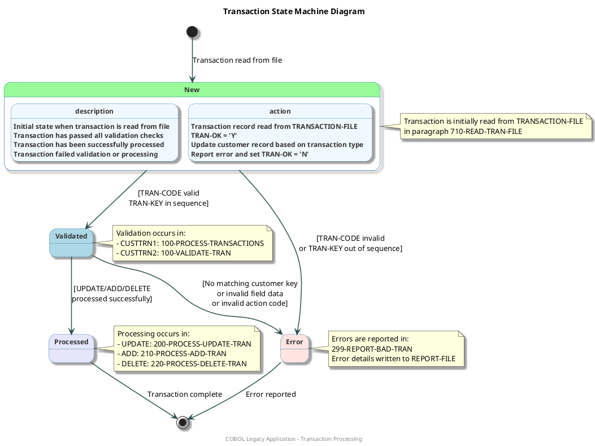

#### 7.4 Diagram Explanation

The state machine diagram illustrates the lifecycle of transactions in the system:

1. **New State**:
  - Transactions begin in this state when read from the transaction file
  - The system checks if the transaction code is valid and if the transaction key is in sequence

2. **Validated State**:
  - Transactions that pass initial validation enter this state
  - The system sets TRAN-OK = 'Y' to indicate successful validation

3. **Processed State**:
  - Validated transactions are processed according to their transaction code (UPDATE, ADD, DELETE)
  - Customer records are updated, added, or deleted as appropriate

4. **Error State**:
  - Transactions enter this state if they fail validation or encounter processing errors
  - The system sets TRAN-OK = 'N' and reports the error details

#### 7.5 Business Benefits

This state machine diagram provides several benefits:

1. **Clear Visualization**: Offers a clear view of how transactions flow through the system
2. **Error Handling Insight**: Shows all possible error conditions and how they're handled
3. **Process Understanding**: Helps developers and analysts understand the transaction lifecycle
4. **Documentation**: Serves as documentation for the transaction processing logic
5. **Maintenance Support**: Assists in maintenance and enhancement of the transaction processing system

#### 7.6 Technical Implementation

The transaction state machine is implemented across two COBOL programs:

1. **CUSTTRN1**: Main program that reads transactions and directs them through the appropriate processing path
2. **CUSTTRN2**: Subroutine called by CUSTTRN1 to validate and process UPDATE transactions

Key variables that control the state transitions:
- **WS-TRAN-OK**: Flag indicating if transaction is valid ('Y' or 'N')
- **WS-TRAN-EOF**: Flag indicating end of transaction file
- **TRAN-CODE**: Type of transaction (UPDATE, ADD, DELETE)
- **TRAN-KEY**: Unique identifier for the transaction

#### 7.7 Prompt 1: Generate Neo4j Cypher Query for Transaction States

```
I need to create a Cypher query for Neo4j to extract data about transaction states in a COBOL application. This query will be used to generate a state machine diagram.

The COBOL application consists of two main programs:
1. CUSTTRN1: The main program that reads transactions and processes them
2. CUSTTRN2: A subroutine called by CUSTTRN1 to validate and process UPDATE transactions

The transaction states I need to identify are:
- New: Initial state when a transaction is read from the transaction file
- Validated: After passing validation checks for transaction code, field name, and action
- Processed: After successful processing based on transaction type (UPDATE, ADD, DELETE)
- Error: If validation fails or processing encounters an error

Key paragraphs in the COBOL programs that handle these states:
- 000-MAIN: Entry point for both programs
- 100-PROCESS-TRANSACTIONS: Main transaction processing loop in CUSTTRN1
- 100-VALIDATE-TRAN: Validation routine in CUSTTRN2
- 200-PROCESS-UPDATE-TRAN, 210-PROCESS-ADD-TRAN, 220-PROCESS-DELETE-TRAN: Process different transaction types
- 299-REPORT-BAD-TRAN: Error handling routine

The Neo4j database contains nodes with these labels:
- COBOLProgram: Represents COBOL programs
- COBOLParagraph: Represents paragraphs within programs
- COBOLVariable: Represents variables used in the programs

And relationships:
- CONTAINS: Links programs to their paragraphs
- PERFORMS: Links paragraphs to other paragraphs they perform
- CALLS: Links paragraphs to other programs they call
- USES: Links paragraphs to variables they use
- HANDLES_ERROR: Links paragraphs to error handling paragraphs

Please create a comprehensive Cypher query that:
1. Identifies the relevant paragraphs in both programs
2. Extracts the transitions between states (based on PERFORMS and CALLS relationships)
3. Identifies error handling paths
4. Returns all the necessary information to understand the transaction state machine

The query should be optimized for Neo4j and include comments explaining each part.
```

#### 7.8 Prompt 2: Generate PlantUML State Machine Diagram

```
I need to create a PlantUML script for a state machine diagram that visualizes transaction states in a COBOL application. I'll provide the data extracted from Neo4j using a Cypher query.

Here's the data from Neo4j:
[PASTE THE OUTPUT FROM THE FIRST PROMPT'S CYPHER QUERY HERE]

The transaction states to be represented are:
1. New: Initial state when a transaction is read from the transaction file
2. Validated: After passing validation checks for transaction code, field name, and action
3. Processed: After successful processing based on transaction type (UPDATE, ADD, DELETE)
4. Error: If validation fails or processing encounters an error

The transitions between states are:
- New → Validated: When transaction code is valid and transaction key is in sequence
- New → Error: When transaction code is invalid or transaction key is out of sequence
- Validated → Processed: When transaction is successfully processed (UPDATE, ADD, DELETE)
- Validated → Error: When there's no matching customer key, invalid field data, or invalid action code
- Processed → [End]: Transaction complete
- Error → [End]: Error reported

Please create a visually appealing PlantUML script that:
1. Uses appropriate colors and styling for each state (use palegreen for New, lightblue for Validated, lavender for Processed, and mistyrose for Error)
2. Includes descriptive notes for each state explaining where in the code it's handled
3. Shows all transitions with clear labels
4. Includes a title and footer
5. Uses appropriate skinparam settings to make the diagram professional and readable
6. Includes detailed state descriptions and actions

The diagram should be detailed enough for developers, executives, tech leads, and stakeholders to understand the transaction lifecycle in the system.

Make sure the PlantUML script is complete and ready to use, with proper syntax and formatting.
```

## Detailed Program Flow Diagrams

### 8. Activity Diagram for Each COBOL Program
- **Purpose**: Visualize the internal logic flow of each COBOL program
- **Target Audience**: Developers
- **Key Elements**:
  - Paragraph (procedure) flows
  - Conditional logic
  - PERFORM statements
  - File I/O operations
- **Benefits**: Provides detailed understanding of program logic

This document provides the Cypher query and PlantUML script for generating Activity Diagrams that visualize the internal logic flow of each COBOL program. The diagrams show paragraph flows, conditional logic, PERFORM statements, and file I/O operations.

#### 8.1 Cypher Query for Neo4j

```cypher
// Clear previous data if needed
MATCH (n) DETACH DELETE n;

// Create COBOL Programs
CREATE (custtrn1:Program {name: "CUSTTRN1", description: "Main transaction processing program"})
CREATE (custtrn2:Program {name: "CUSTTRN2", description: "Transaction update subroutine"})

// Create CUSTTRN1 Paragraphs
CREATE (main1:Paragraph {name: "000-MAIN", program: "CUSTTRN1"})
CREATE (processTrans:Paragraph {name: "100-PROCESS-TRANSACTIONS", program: "CUSTTRN1"})
CREATE (processUpdate:Paragraph {name: "200-PROCESS-UPDATE-TRAN", program: "CUSTTRN1"})
CREATE (processAdd:Paragraph {name: "210-PROCESS-ADD-TRAN", program: "CUSTTRN1"})
CREATE (processDelete:Paragraph {name: "220-PROCESS-DELETE-TRAN", program: "CUSTTRN1"})
CREATE (reportBadTran:Paragraph {name: "299-REPORT-BAD-TRAN", program: "CUSTTRN1"})
CREATE (openFiles:Paragraph {name: "700-OPEN-FILES", program: "CUSTTRN1"})
CREATE (readTranFile:Paragraph {name: "710-READ-TRAN-FILE", program: "CUSTTRN1"})
CREATE (positionCustFile:Paragraph {name: "720-POSITION-CUST-FILE", program: "CUSTTRN1"})
CREATE (copyRecords:Paragraph {name: "721-COPY-RECORDS", program: "CUSTTRN1"})
CREATE (readCustomerFile:Paragraph {name: "730-READ-CUSTOMER-FILE", program: "CUSTTRN1"})
CREATE (writeCustoutFile:Paragraph {name: "740-WRITE-CUSTOUT-FILE", program: "CUSTTRN1"})
CREATE (closeFiles:Paragraph {name: "790-CLOSE-FILES", program: "CUSTTRN1"})
CREATE (initReport:Paragraph {name: "800-INIT-REPORT", program: "CUSTTRN1"})
CREATE (reportTranProcessed:Paragraph {name: "830-REPORT-TRAN-PROCESSED", program: "CUSTTRN1"})
CREATE (reportTranStats:Paragraph {name: "850-REPORT-TRAN-STATS", program: "CUSTTRN1"})

// Create CUSTTRN2 Paragraphs
CREATE (main2:Paragraph {name: "000-MAIN", program: "CUSTTRN2"})
CREATE (validateTran:Paragraph {name: "100-VALIDATE-TRAN", program: "CUSTTRN2"})
CREATE (processTran:Paragraph {name: "200-PROCESS-TRAN", program: "CUSTTRN2"})

// Create File Operations
CREATE (customerFile:File {name: "CUSTOMER-FILE", type: "INPUT"})
CREATE (customerFileOut:File {name: "CUSTOMER-FILE-OUT", type: "OUTPUT"})
CREATE (transactionFile:File {name: "TRANSACTION-FILE", type: "INPUT"})
CREATE (reportFile:File {name: "REPORT-FILE", type: "OUTPUT"})

// Connect CUSTTRN1 Paragraphs
CREATE (main1)-[:PERFORMS]->(openFiles)
CREATE (main1)-[:PERFORMS]->(initReport)
CREATE (main1)-[:PERFORMS]->(readCustomerFile)
CREATE (main1)-[:PERFORMS {condition: "UNTIL WS-TRAN-EOF = 'Y'"}]->(processTrans)
CREATE (main1)-[:PERFORMS]->(reportTranStats)
CREATE (main1)-[:PERFORMS]->(closeFiles)

CREATE (processTrans)-[:PERFORMS]->(readTranFile)
CREATE (processTrans)-[:EVALUATES {condition: "WS-TRAN-EOF NOT = 'Y'"}]->(readTranFile)
CREATE (processTrans)-[:EVALUATES {condition: "TRAN-KEY < WS-PREV-TRAN-KEY"}]->(reportBadTran)
CREATE (processTrans)-[:EVALUATES {condition: "TRAN-CODE = 'UPDATE'"}]->(processUpdate)
CREATE (processTrans)-[:EVALUATES {condition: "TRAN-CODE = 'ADD   '"}]->(processAdd)
CREATE (processTrans)-[:EVALUATES {condition: "TRAN-CODE = 'DELETE'"}]->(processDelete)
CREATE (processTrans)-[:EVALUATES {condition: "TRAN-CODE = OTHER"}]->(reportBadTran)
CREATE (processTrans)-[:EVALUATES {condition: "WS-TRAN-OK = 'Y'"}]->(reportTranProcessed)

CREATE (processUpdate)-[:PERFORMS]->(positionCustFile)
CREATE (processUpdate)-[:EVALUATES {condition: "CUST-KEY NOT = TRAN-KEY OR WS-CUST-FILE-EOF = 'Y'"}]->(reportBadTran)
CREATE (processUpdate)-[:CALLS]->(custtrn2)
CREATE (processUpdate)-[:EVALUATES {condition: "WS-TRAN-OK NOT = 'Y'"}]->(reportBadTran)

CREATE (processAdd)-[:PERFORMS]->(positionCustFile)
CREATE (processAdd)-[:EVALUATES {condition: "CUST-KEY = TRAN-KEY"}]->(reportBadTran)
CREATE (processAdd)-[:PERFORMS]->(writeCustoutFile)

CREATE (processDelete)-[:PERFORMS]->(positionCustFile)
CREATE (processDelete)-[:EVALUATES {condition: "CUST-KEY NOT = TRAN-KEY OR WS-CUST-FILE-EOF = 'Y'"}]->(reportBadTran)
CREATE (processDelete)-[:PERFORMS]->(readCustomerFile)

CREATE (readTranFile)-[:READS]->(transactionFile)
CREATE (readTranFile)-[:EVALUATES {condition: "WS-TRAN-EOF = 'Y'"}]->(copyRecords)
CREATE (readTranFile)-[:EVALUATES {condition: "WS-TRANFILE-STATUS NOT IN ('00', '10')"}]->(reportBadTran)

CREATE (positionCustFile)-[:EVALUATES {condition: "CUST-KEY < TRAN-KEY AND WS-CUST-FILE-EOF NOT = 'Y'"}]->(copyRecords)

CREATE (copyRecords)-[:PERFORMS]->(writeCustoutFile)
CREATE (copyRecords)-[:PERFORMS]->(readCustomerFile)

CREATE (readCustomerFile)-[:READS]->(customerFile)
CREATE (readCustomerFile)-[:EVALUATES {condition: "WS-CUSTFILE-STATUS NOT IN ('00', '04', '10')"}]->(reportBadTran)

CREATE (writeCustoutFile)-[:WRITES]->(customerFileOut)
CREATE (writeCustoutFile)-[:EVALUATES {condition: "WS-CUSTOUT-STATUS NOT = '00'"}]->(reportBadTran)

CREATE (openFiles)-[:OPENS]->(customerFile)
CREATE (openFiles)-[:OPENS]->(customerFileOut)
CREATE (openFiles)-[:OPENS]->(transactionFile)
CREATE (openFiles)-[:OPENS]->(reportFile)
CREATE (openFiles)-[:EVALUATES {condition: "WS-CUSTFILE-STATUS NOT = '00'"}]->(main1)
CREATE (openFiles)-[:EVALUATES {condition: "WS-CUSTOUT-STATUS NOT = '00'"}]->(main1)
CREATE (openFiles)-[:EVALUATES {condition: "WS-TRANFILE-STATUS NOT = '00'"}]->(main1)

CREATE (closeFiles)-[:CLOSES]->(customerFile)
CREATE (closeFiles)-[:CLOSES]->(transactionFile)
CREATE (closeFiles)-[:CLOSES]->(reportFile)

CREATE (initReport)-[:WRITES]->(reportFile)
CREATE (reportBadTran)-[:WRITES]->(reportFile)
CREATE (reportTranProcessed)-[:WRITES]->(reportFile)
CREATE (reportTranStats)-[:WRITES]->(reportFile)

// Connect CUSTTRN2 Paragraphs
CREATE (main2)-[:PERFORMS]->(validateTran)
CREATE (main2)-[:EVALUATES {condition: "TRAN-OK = 'Y'"}]->(processTran)

CREATE (validateTran)-[:EVALUATES {condition: "TRAN-CODE = 'UPDATE '"}]->(validateTran)
CREATE (validateTran)-[:EVALUATES {condition: "TRAN-CODE = OTHER"}]->(main2)
CREATE (validateTran)-[:EVALUATES {condition: "TRAN-FIELD-NAME IN ('BALANCE ', 'ORDERS  ')"}]->(validateTran)
CREATE (validateTran)-[:EVALUATES {condition: "TRAN-UPDATE-NUM NOT NUMERIC"}]->(main2)
CREATE (validateTran)-[:EVALUATES {condition: "TRAN-ACTION IN ('REPLACE ', 'ADD     ')"}]->(validateTran)
CREATE (validateTran)-[:EVALUATES {condition: "TRAN-ACTION = OTHER"}]->(main2)

CREATE (processTran)-[:EVALUATES {condition: "TRAN-FIELD-NAME = 'BALANCE '"}]->(processTran)
CREATE (processTran)-[:EVALUATES {condition: "TRAN-FIELD-NAME = 'ORDERS  '"}]->(processTran)
CREATE (processTran)-[:EVALUATES {condition: "TRAN-ACTION = 'REPLACE '"}]->(processTran)
CREATE (processTran)-[:EVALUATES {condition: "TRAN-ACTION = 'ADD     '"}]->(processTran)

// Connect Programs
CREATE (custtrn1)-[:CALLS]->(custtrn2);
```

#### 8.2 PlantUML Script for CUSTTRN1

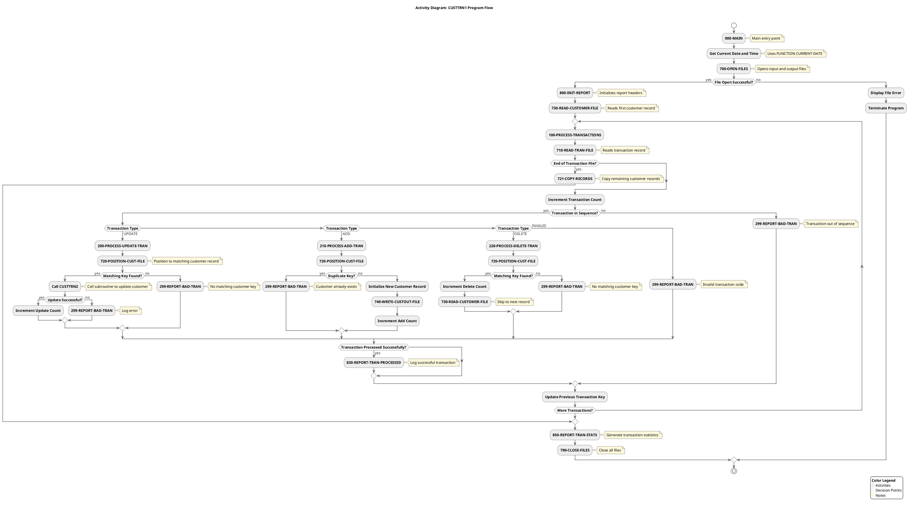

#### 8.3 PlantUML Script for CUSTTRN2

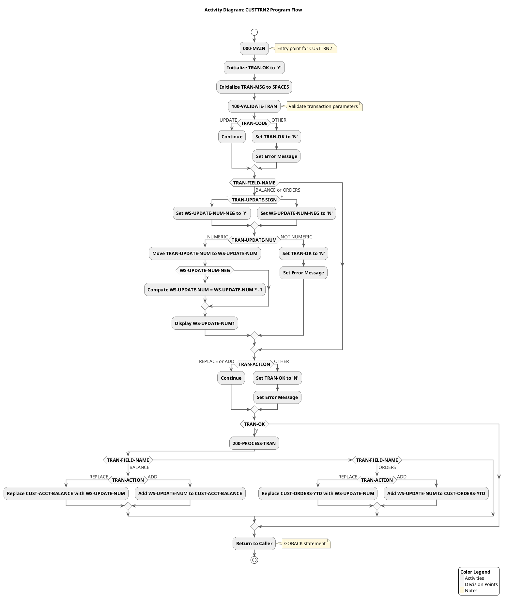

#### 8.4 Diagram Description

The Activity Diagrams for each COBOL program visualize the internal logic flow of the programs, showing:

1. **Paragraph Flows**: The sequence of paragraphs executed in each program, including the main entry points and the flow between paragraphs.

2. **Conditional Logic**: Decision points represented by IF and EVALUATE statements that determine the program's execution path.

3. **PERFORM Statements**: The relationships between paragraphs, showing which paragraphs call (PERFORM) other paragraphs.

4. **File I/O Operations**: File operations such as OPEN, READ, WRITE, and CLOSE, showing how the program interacts with external files.

#### 8.5 CUSTTRN1 Program

CUSTTRN1 is the main transaction processing program that:
- Opens input and output files
- Initializes reports
- Reads customer and transaction records
- Processes different types of transactions (UPDATE, ADD, DELETE)
- Generates transaction statistics
- Closes files

The program handles various error conditions, such as file I/O errors, invalid transactions, and sequence errors.

#### 8.6 CUSTTRN2 Program

CUSTTRN2 is a subroutine called by CUSTTRN1 to process UPDATE transactions:
- Validates transaction parameters
- Processes updates to customer balance or orders
- Handles different update actions (REPLACE, ADD)
- Returns control to CUSTTRN1 with success/failure status

These diagrams provide a detailed understanding of the program logic, making it easier for developers to understand the code and to grasp the business processes implemented in the COBOL programs.

#### 8.7 Prompt 1: Generate Cypher Query for Neo4j

```
You are tasked with creating a Cypher query to extract the main process flow from a Neo4j database containing a COBOL application structure. The query will be used to generate an activity diagram.

The COBOL application consists of two main programs:
1. CUSTTRN1: The main program that handles transaction processing
2. CUSTTRN2: A subroutine called by CUSTTRN1 to process update transactions

The Neo4j database has the following node types:
- COBOLProgram: Represents COBOL programs
- COBOLParagraph: Represents paragraphs in COBOL programs
- COBOLFile: Represents files used by COBOL programs

And the following relationship types:
- CONTAINS: Links programs to their paragraphs
- COBOLPerform: Represents PERFORM statements in COBOL
- COBOLCall: Represents CALL statements in COBOL
- READS/WRITES: Represents file operations

Create a comprehensive Cypher query that extracts:
1. The main process flow starting from CUSTTRN1's main paragraph (000-MAIN)
2. The transaction processing flow (100-PROCESS-TRANSACTIONS)
3. The different paths for processing transactions (UPDATE, ADD, DELETE)
4. Error handling paths (299-REPORT-BAD-TRAN)
5. The interaction between CUSTTRN1 and CUSTTRN2
6. File operations

The query should be structured as a series of MATCH statements combined with UNION to capture all aspects of the process flow. Ensure the query is optimized and focuses on the relationships that are most relevant for understanding the business process.
```

#### 8.8 Prompt 2: Generate PlantUML Activity Diagram

```
You are tasked with creating a PlantUML activity diagram that visualizes the main process flow of a COBOL application based on data extracted from a Neo4j database using the following Cypher query:

[INSERT CYPHER QUERY FROM PROMPT 1]

The COBOL application processes customer transactions with the following main components:

1. CUSTTRN1: Main program that:
   - Opens files (700-OPEN-FILES)
   - Initializes reports (800-INIT-REPORT)
   - Processes transactions (100-PROCESS-TRANSACTIONS)
   - Handles different transaction types:
     - UPDATE (200-PROCESS-UPDATE-TRAN)
     - ADD (210-PROCESS-ADD-TRAN)
     - DELETE (220-PROCESS-DELETE-TRAN)
   - Reports errors (299-REPORT-BAD-TRAN)
   - Generates statistics (850-REPORT-TRAN-STATS)
   - Closes files (790-CLOSE-FILES)

2. CUSTTRN2: Subroutine called by CUSTTRN1 to:
   - Validate transactions (100-VALIDATE-TRAN)
   - Process update transactions (200-PROCESS-TRAN)

Create a detailed activity diagram that:
1. Shows the overall flow from start to end
2. Clearly illustrates decision points and their outcomes
3. Highlights error handling paths
4. Distinguishes between the two programs (CUSTTRN1 and CUSTTRN2)
5. Includes file operations
6. Uses appropriate styling for better readability

The diagram should be visually appealing and easy to understand for both technical and non-technical stakeholders. Use swimlanes to separate the activities of CUSTTRN1 and CUSTTRN2. Include detailed activity descriptions that explain what each step does.

Ensure the PlantUML script is syntactically correct and optimized for rendering a clear, professional diagram.
```

### 9. Flowchart Diagram for Complex Procedures
- **Purpose**: Represent complex business logic within specific procedures
- **Target Audience**: Developers, business analysts
- **Key Elements**:
  - Detailed logic steps
  - Decision points
  - Calculations
  - Validation rules
- **Benefits**: Helps understand complex business rules implemented in the code

#### 9.1 Neo4j Cypher Query

```cypher
// Clear previous data if needed
MATCH (n) DETACH DELETE n;

// Create program node
CREATE (custtrn2:Program {name: "CUSTTRN2", description: "Transaction update subroutine"})

// Create main procedure nodes
CREATE (mainProc:Procedure {name: "000-MAIN", description: "Main entry point for CUSTTRN2"})
CREATE (validateProc:Procedure {name: "100-VALIDATE-TRAN", description: "Validates transaction data"})
CREATE (processProc:Procedure {name: "200-PROCESS-TRAN", description: "Processes valid transactions"})

// Connect program to procedures
CREATE (custtrn2)-[:CONTAINS]->(mainProc)
CREATE (custtrn2)-[:CONTAINS]->(validateProc)
CREATE (custtrn2)-[:CONTAINS]->(processProc)

// Create flowchart nodes for 000-MAIN
CREATE (startMain:Start {name: "Start 000-MAIN"})
CREATE (initTranOk:Process {name: "Initialize TRAN-OK to 'Y'"})
CREATE (initTranMsg:Process {name: "Initialize TRAN-MSG to SPACES"})
CREATE (performValidate:Process {name: "PERFORM 100-VALIDATE-TRAN"})
CREATE (checkTranOk:Decision {name: "TRAN-OK = 'Y'?"})
CREATE (performProcess:Process {name: "PERFORM 200-PROCESS-TRAN"})
CREATE (endMain:End {name: "End 000-MAIN"})

// Connect 000-MAIN flowchart nodes
CREATE (mainProc)-[:STARTS_WITH]->(startMain)
CREATE (startMain)-[:NEXT]->(initTranOk)
CREATE (initTranOk)-[:NEXT]->(initTranMsg)
CREATE (initTranMsg)-[:NEXT]->(performValidate)
CREATE (performValidate)-[:NEXT]->(checkTranOk)
CREATE (checkTranOk)-[:YES]->(performProcess)
CREATE (checkTranOk)-[:NO]->(endMain)
CREATE (performProcess)-[:NEXT]->(endMain)

// Create flowchart nodes for 100-VALIDATE-TRAN
CREATE (startValidate:Start {name: "Start 100-VALIDATE-TRAN"})
CREATE (checkTranCode:Decision {name: "TRAN-CODE = 'UPDATE '?"})
CREATE (invalidTranCode:Process {name: "Set TRAN-OK to 'N'"})
CREATE (invalidTranCodeMsg:Process {name: "Set TRAN-MSG to 'REQUEST TYPE IS INVALID'"})
CREATE (checkTranField:Decision {name: "TRAN-FIELD-NAME?"})
CREATE (initUpdateNumNeg:Process {name: "Set WS-UPDATE-NUM-NEG to 'N'"})
CREATE (checkUpdateSign:Decision {name: "TRAN-UPDATE-SIGN = '-'?"})
CREATE (setUpdateNumNeg:Process {name: "Set WS-UPDATE-NUM-NEG to 'Y'"})
CREATE (checkNumeric:Decision {name: "TRAN-UPDATE-NUM NUMERIC?"})
CREATE (invalidNumeric:Process {name: "Set TRAN-OK to 'N'"})
CREATE (invalidNumericMsg:Process {name: "Set TRAN-MSG to 'DATA IS NOT NUMERIC'"})
CREATE (moveUpdateNum:Process {name: "Move TRAN-UPDATE-NUM to WS-UPDATE-NUM"})
CREATE (checkNegative:Decision {name: "WS-UPDATE-NUM-NEG = 'Y'?"})
CREATE (computeNegative:Process {name: "Compute WS-UPDATE-NUM = WS-UPDATE-NUM * -1"})
CREATE (displayUpdateNum:Process {name: "Display 'WS-UPDATE-NUM1:' WS-UPDATE-NUM"})
CREATE (checkTranAction:Decision {name: "TRAN-ACTION = 'REPLACE ' or 'ADD     '?"})
CREATE (invalidAction:Process {name: "Set TRAN-OK to 'N'"})
CREATE (invalidActionMsg:Process {name: "Set TRAN-MSG to 'INVALID ACTION CODE   '"})
CREATE (endValidate:End {name: "End 100-VALIDATE-TRAN"})

// Connect 100-VALIDATE-TRAN flowchart nodes
CREATE (validateProc)-[:STARTS_WITH]->(startValidate)
CREATE (startValidate)-[:NEXT]->(checkTranCode)
CREATE (checkTranCode)-[:YES]->(checkTranField)
CREATE (checkTranCode)-[:NO]->(invalidTranCode)
CREATE (invalidTranCode)-[:NEXT]->(invalidTranCodeMsg)
CREATE (invalidTranCodeMsg)-[:NEXT]->(checkTranField)
CREATE (checkTranField)-[:BALANCE_OR_ORDERS]->(initUpdateNumNeg)
CREATE (checkTranField)-[:OTHER]->(checkTranAction)
CREATE (initUpdateNumNeg)-[:NEXT]->(checkUpdateSign)
CREATE (checkUpdateSign)-[:YES]->(setUpdateNumNeg)
CREATE (checkUpdateSign)-[:NO]->(checkNumeric)
CREATE (setUpdateNumNeg)-[:NEXT]->(checkNumeric)
CREATE (checkNumeric)-[:YES]->(moveUpdateNum)
CREATE (checkNumeric)-[:NO]->(invalidNumeric)
CREATE (invalidNumeric)-[:NEXT]->(invalidNumericMsg)
CREATE (invalidNumericMsg)-[:NEXT]->(checkTranAction)
CREATE (moveUpdateNum)-[:NEXT]->(checkNegative)
CREATE (checkNegative)-[:YES]->(computeNegative)
CREATE (checkNegative)-[:NO]->(displayUpdateNum)
CREATE (computeNegative)-[:NEXT]->(displayUpdateNum)
CREATE (displayUpdateNum)-[:NEXT]->(checkTranAction)
CREATE (checkTranAction)-[:YES]->(endValidate)
CREATE (checkTranAction)-[:NO]->(invalidAction)
CREATE (invalidAction)-[:NEXT]->(invalidActionMsg)
CREATE (invalidActionMsg)-[:NEXT]->(endValidate)

// Create flowchart nodes for 200-PROCESS-TRAN
CREATE (startProcess:Start {name: "Start 200-PROCESS-TRAN"})
CREATE (checkFieldName:Decision {name: "TRAN-FIELD-NAME?"})
CREATE (checkBalanceAction:Decision {name: "TRAN-ACTION?"})
CREATE (replaceBalance:Process {name: "Replace CUST-ACCT-BALANCE with WS-UPDATE-NUM"})
CREATE (addToBalance:Process {name: "Add WS-UPDATE-NUM to CUST-ACCT-BALANCE"})
CREATE (checkOrdersAction:Decision {name: "TRAN-ACTION?"})
CREATE (replaceOrders:Process {name: "Replace CUST-ORDERS-YTD with WS-UPDATE-NUM"})
CREATE (addToOrders:Process {name: "Add WS-UPDATE-NUM to CUST-ORDERS-YTD"})
CREATE (invalidField:Process {name: "Set TRAN-OK to 'N'"})
CREATE (invalidFieldMsg:Process {name: "Set TRAN-MSG to 'INVALID FIELD NAME'"})
CREATE (endProcess:End {name: "End 200-PROCESS-TRAN"})

// Connect 200-PROCESS-TRAN flowchart nodes
CREATE (processProc)-[:STARTS_WITH]->(startProcess)
CREATE (startProcess)-[:NEXT]->(checkFieldName)
CREATE (checkFieldName)-[:BALANCE]->(checkBalanceAction)
CREATE (checkFieldName)-[:ORDERS]->(checkOrdersAction)
CREATE (checkFieldName)-[:OTHER]->(invalidField)
CREATE (checkBalanceAction)-[:REPLACE]->(replaceBalance)
CREATE (checkBalanceAction)-[:ADD]->(addToBalance)
CREATE (replaceBalance)-[:NEXT]->(endProcess)
CREATE (addToBalance)-[:NEXT]->(endProcess)
CREATE (checkOrdersAction)-[:REPLACE]->(replaceOrders)
CREATE (checkOrdersAction)-[:ADD]->(addToOrders)
CREATE (replaceOrders)-[:NEXT]->(endProcess)
CREATE (addToOrders)-[:NEXT]->(endProcess)
CREATE (invalidField)-[:NEXT]->(invalidFieldMsg)
CREATE (invalidFieldMsg)-[:NEXT]->(endProcess)

// Create relationships between procedures
CREATE (performValidate)-[:CALLS]->(validateProc)
CREATE (performProcess)-[:CALLS]->(processProc)
```

#### 9.2 PlantUML Script

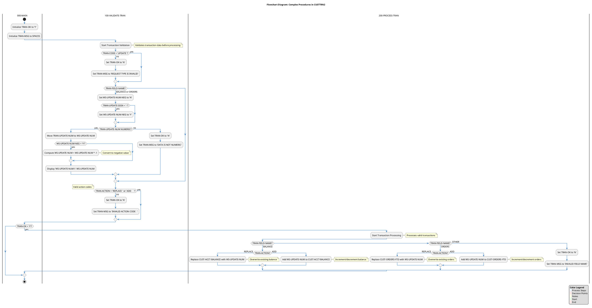

#### 9.3 Diagram Description

The Flowchart Diagram for Complex Procedures visualizes the detailed business logic implemented in the CUSTTRN2 program, focusing on:

1. **Transaction Validation Logic (100-VALIDATE-TRAN)**:
  - Validation of transaction codes (must be 'UPDATE')
  - Validation of field names (must be 'BALANCE' or 'ORDERS')
  - Numeric data validation with sign handling
  - Action code validation (must be 'REPLACE' or 'ADD')

2. **Transaction Processing Logic (200-PROCESS-TRAN)**:
  - Field-specific processing for BALANCE and ORDERS
  - Different handling for REPLACE and ADD actions
  - Calculation logic for updating customer data
  - Error handling for invalid fields

3. **Decision Points**:
  - Key decision points that determine the flow of execution
  - Validation checks that ensure data integrity
  - Business rule enforcement through conditional logic

4. **Error Handling**:
  - Setting error flags and messages for invalid data
  - Preventing processing of invalid transactions

This diagram provides a detailed view of the complex business rules implemented in the code, making it valuable for both technical and business understand the system's behavior and validation requirements.

#### 9.4 Implementation Notes

#### 9.4.1 For Developers
- The validation logic ensures that only properly formatted transactions are processed
- Negative values are handled by setting a flag and applying a multiplication
- Error messages are specific to the type of validation failure

#### 9.4.2 For Business Analysts
- The diagram shows how business rules are enforced in the code
- Transaction validation ensures data integrity
- The processing logic implements the business operations for updating customer data

#### 9.5 Prompt 1: Generate Neo4j Cypher Query for Flowchart Diagram

```
You are tasked with creating a Neo4j Cypher query to extract data for a Flowchart Diagram that visualizes complex business logic within COBOL procedures. This query will be used as input for a subsequent prompt that will generate a PlantUML diagram.

## Input Files
You will be working with the following files:
1. legacy_code_final.json - Contains the COBOL program code with procedures, paragraphs, and business logic
2. callgraph.txt - Contains relationships between program elements

## Requirements
Create a Cypher query that:
1. Identifies the main procedures in the CUSTTRN2 program (000-MAIN, 100-VALIDATE-TRAN, 200-PROCESS-TRAN)
2. Maps the detailed control flow within each procedure, including:
   - Process steps (assignments, calculations)
   - Decision points (IF statements, EVALUATE statements)
   - Procedure calls (PERFORM statements)
   - Error handling logic
3. Captures the relationships between procedures
4. Represents the business logic accurately, especially:
   - Transaction validation rules
   - Field-specific processing (BALANCE, ORDERS)
   - Action-specific processing (REPLACE, ADD)
   - Error handling and messaging

## Output Format
The Cypher query should:
1. Create nodes for programs, procedures, and flowchart elements (start, process, decision, end)
2. Establish relationships between nodes to represent the flow of execution
3. Include descriptive properties for nodes (name, description)
4. Be structured to create a complete graph that can be visualized

## Important Considerations
- Ensure the query captures all decision points in the validation and processing logic
- Represent the nested conditional logic accurately
- Include error handling paths
- Make the query reusable by first clearing any existing data

The resulting Cypher query will be used to populate a Neo4j database, which will then serve as the data source for generating a PlantUML flowchart diagram.
```

#### 9.6 Prompt 2: Generate PlantUML Flowchart Diagram from Neo4j Data

```
You are tasked with creating a PlantUML script to generate a Flowchart Diagram that visualizes complex business logic within COBOL procedures. This script will use the data structure created by a Neo4j Cypher query.

## Input
The Neo4j database contains a graph representation of the CUSTTRN2 program's procedures, with nodes and relationships representing:
1. Programs (CUSTTRN2)
2. Procedures (000-MAIN, 100-VALIDATE-TRAN, 200-PROCESS-TRAN)
3. Flowchart elements:
   - Start/End points
   - Process steps
   - Decision points
   - Relationships between elements

## Requirements
Create a PlantUML script that:
1. Visualizes the complex business logic as a flowchart diagram
2. Organizes the diagram using swimlanes for different procedures
3. Clearly represents:
   - Process steps (assignments, calculations)
   - Decision points with conditional branches
   - Procedure calls
   - Error handling paths
4. Includes explanatory notes for key business rules
5. Uses appropriate styling for better readability and visual appeal

## Output Format
The PlantUML script should:
1. Include appropriate styling directives for colors, fonts, and shapes
2. Use swimlanes to separate different procedures
3. Represent the complete flow from start to end
4. Include a title, legend, and any necessary annotations
5. Be optimized for readability by both technical and business stakeholders

## Important Considerations
- The diagram should be business-elegant and professional
- Use color coding to distinguish different types of elements (processes, decisions, etc.)
- Include explanatory notes for complex business rules
- Ensure the diagram flows logically from top to bottom
- Make the diagram accessible to both technical and non-technical stakeholders
- Optimize the layout for clarity, even with complex nested conditions

The resulting PlantUML script will generate a comprehensive flowchart diagram that helps stakeholders understand the complex business logic implemented in the COBOL application.
```

## Data Flow Diagrams

### 10. Data Flow Diagram (DFD)
- **Purpose**: Show how data moves through the system
- **Key Elements**:
  - Data sources and destinations
  - Data transformations
  - Data stores
  - Process boundaries
- **Benefits**: Illustrates how information flows through the application

#### 10.1 Data Flow Diagram (DFD) for COBOL Customer Transaction System

This document provides the necessary scripts to generate a Data Flow Diagram (DFD) for the COBOL Customer Transaction System. The diagram illustrates how data moves through the system, showing data sources, transformations, stores, and process boundaries.

The Data Flow Diagram (DFD) visualizes:
- How data flows through the Customer Transaction System
- The relationships between different system components
- The transformation of data as it moves through processes
- The storage and retrieval of data

#### 10.2 Neo4j Cypher Query

The following Cypher query can be used in Neo4j to visualize the data flow relationships in the Customer Transaction System:

```cypher
// Create External Entities (Data Sources/Destinations)
CREATE (user:ExternalEntity {name: "User/Batch Job", description: "Initiates transaction processing"})
CREATE (jcl:ExternalEntity {name: "JCL Job", description: "TESTJCL that executes the CUSTTRN1 program"})

// Create Processes
CREATE (custtrn1:Process {name: "CUSTTRN1", description: "Main transaction processing program"})
CREATE (validate:Process {name: "Validate Transaction", description: "Validates transaction format and content"})
CREATE (processUpdate:Process {name: "Process Update", description: "Handles update transactions"})
CREATE (processAdd:Process {name: "Process Add", description: "Handles add transactions"})
CREATE (processDelete:Process {name: "Process Delete", description: "Handles delete transactions"})
CREATE (custtrn2:Process {name: "CUSTTRN2", description: "Subroutine for processing customer updates"})
CREATE (reportGen:Process {name: "Report Generation", description: "Generates transaction reports and statistics"})

// Create Data Stores
CREATE (tranFile:DataStore {name: "TRANSACTION-FILE", description: "Contains transaction records"})
CREATE (custFile:DataStore {name: "CUSTOMER-FILE", description: "Contains customer records"})
CREATE (custOutFile:DataStore {name: "CUSTOMER-FILE-OUT", description: "Output file with updated customer records"})
CREATE (reportFile:DataStore {name: "REPORT-FILE", description: "Output file for transaction reports"})

// Create Data Flow Relationships
// External Entity to Process
CREATE (user)-[:INITIATES {data: "Transaction Request"}]->(custtrn1)
CREATE (jcl)-[:EXECUTES {data: "Program Execution"}]->(custtrn1)

// Process to Data Store (Read)
CREATE (custtrn1)-[:READS {data: "Transaction Records"}]->(tranFile)
CREATE (custtrn1)-[:READS {data: "Customer Records"}]->(custFile)

// Process to Process
CREATE (custtrn1)-[:CALLS {data: "Transaction Data"}]->(validate)
CREATE (custtrn1)-[:CALLS {data: "Valid Transaction"}]->(processUpdate)
CREATE (custtrn1)-[:CALLS {data: "Valid Transaction"}]->(processAdd)
CREATE (custtrn1)-[:CALLS {data: "Valid Transaction"}]->(processDelete)
CREATE (processUpdate)-[:CALLS {data: "Customer & Transaction Data"}]->(custtrn2)
CREATE (custtrn1)-[:CALLS {data: "Transaction Statistics"}]->(reportGen)

// Process to Data Store (Write)
CREATE (processUpdate)-[:WRITES {data: "Updated Customer Record"}]->(custOutFile)
CREATE (processAdd)-[:WRITES {data: "New Customer Record"}]->(custOutFile)
CREATE (processDelete)-[:WRITES {data: "Remaining Customer Records"}]->(custOutFile)
CREATE (reportGen)-[:WRITES {data: "Transaction Reports"}]->(reportFile)
CREATE (custtrn1)-[:WRITES {data: "Error Messages"}]->(reportFile)

// Return all nodes and relationships for visualization
MATCH (n)
OPTIONAL MATCH (n)-[r]->(m)
RETURN n, r, m;
```

#### 10.3 PlantUML Script

The following PlantUML script generates a comprehensive Data Flow Diagram for the Customer Transaction System:

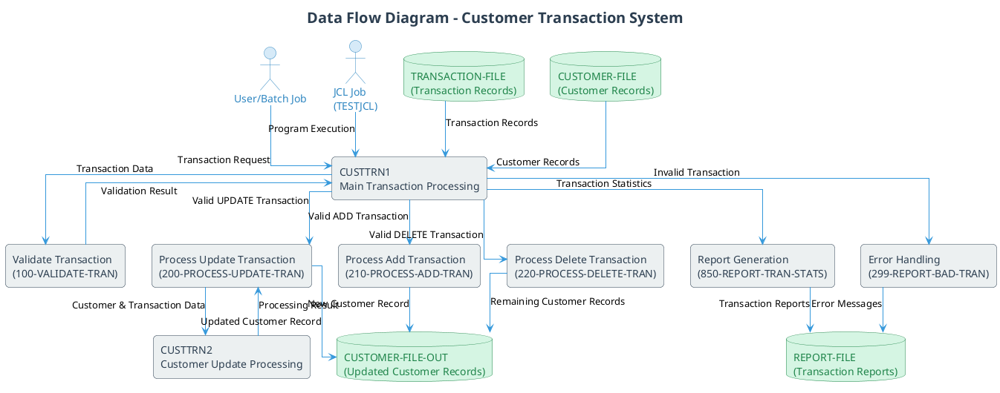

#### 10.4 Diagram Explanation

The Data Flow Diagram illustrates:

1. **External Entities**:
  - User/Batch Job: Initiates the transaction processing
  - JCL Job (TESTJCL): Executes the CUSTTRN1 program

2. **Processes**:
  - CUSTTRN1: Main program that orchestrates the transaction processing
  - Validate Transaction: Validates the format and content of transactions
  - Process Update/Add/Delete: Handles different types of transactions
  - CUSTTRN2: Subroutine specifically for processing customer updates
  - Report Generation: Creates transaction reports and statistics
  - Error Handling: Processes and reports transaction errors

3. **Data Stores**:
  - TRANSACTION-FILE: Contains the transaction records to be processed
  - CUSTOMER-FILE: Contains the existing customer records
  - CUSTOMER-FILE-OUT: Stores the updated customer records
  - REPORT-FILE: Stores transaction reports and error messages

4. **Data Flows**:
  - The diagram shows how data moves between external entities, processes, and data stores
  - It illustrates the transformation of data as it passes through different processes
  - It highlights the validation and error handling paths

This diagram provides a comprehensive view of the Customer Transaction System's data flow, making it easier understand how the system processes data.

### 11. Entity-Relationship Diagram (ERD)
- **Purpose**: Model the data entities and their relationships
- **Target Audience**: Data architects, developers
- **Key Elements**:
  - Customer entity
  - Transaction entity
  - Relationships between entities
  - Cardinality
- **Benefits**: Provides a conceptual view of the data model

#### 11.1 Overview

This document provides the necessary scripts to generate an Entity-Relationship Diagram (ERD) for the legacy COBOL banking application. The diagram visualizes the data model, focusing on the Customer and Transaction entities and their relationships.
- **Visualization**: Provide a clear visual representation of the data model
- **Documentation**: Serve as reference for data architects and developers
- **Migration Planning**: Aid in planning data migration strategies

#### 11.2 Customer Entity
The Customer entity represents bank customers with their personal and account information.

**Attributes:**
- Customer ID (Primary Key)
- Customer Name
- Account Balance
- Orders Year-to-Date
- Address
- City
- State
- Country

#### 11.3 Transaction Entity
The Transaction entity represents financial transactions performed on customer accounts.

**Attributes:**
- Transaction Code
- Transaction Key (Foreign Key to Customer)
- Transaction Action (ADD, UPDATE, DELETE)
- Field Name
- Update Data
- Update Sign
- Update Number

#### 11.4 Relationship
- One Customer can have many Transactions (One-to-Many)
- Transactions are processed against Customer records
- Operations include ADD, UPDATE, DELETE transactions

#### 11.5 Neo4j Cypher Query

The following Cypher query can be used to create the ERD model in Neo4j:

```cypher
// Create Customer entity
CREATE (customer:Entity {name: 'Customer'})

// Create Customer attributes
CREATE (custId:Attribute {name: 'Customer ID', type: 'String(5)', isPrimaryKey: true})
CREATE (custName:Attribute {name: 'Customer Name', type: 'String(17)'})
CREATE (custBalance:Attribute {name: 'Account Balance', type: 'Decimal(7,2)'})
CREATE (custOrders:Attribute {name: 'Orders YTD', type: 'Number(5)'})
CREATE (custAddr:Attribute {name: 'Address', type: 'String(20)'})
CREATE (custCity:Attribute {name: 'City', type: 'String(14)'})
CREATE (custState:Attribute {name: 'State', type: 'String(2)'})
CREATE (custCountry:Attribute {name: 'Country', type: 'String(11)'})

// Connect Customer to its attributes
CREATE (customer)-[:HAS_ATTRIBUTE]->(custId)
CREATE (customer)-[:HAS_ATTRIBUTE]->(custName)
CREATE (customer)-[:HAS_ATTRIBUTE]->(custBalance)
CREATE (customer)-[:HAS_ATTRIBUTE]->(custOrders)
CREATE (customer)-[:HAS_ATTRIBUTE]->(custAddr)
CREATE (customer)-[:HAS_ATTRIBUTE]->(custCity)
CREATE (customer)-[:HAS_ATTRIBUTE]->(custState)
CREATE (customer)-[:HAS_ATTRIBUTE]->(custCountry)

// Create Transaction entity
CREATE (transaction:Entity {name: 'Transaction'})

// Create Transaction attributes
CREATE (tranCode:Attribute {name: 'Transaction Code', type: 'String(6)'})
CREATE (tranKey:Attribute {name: 'Transaction Key', type: 'String(6)', isForeignKey: true})
CREATE (tranAction:Attribute {name: 'Transaction Action', type: 'String(8)'})
CREATE (tranFieldName:Attribute {name: 'Field Name', type: 'String(10)'})
CREATE (tranUpdateData:Attribute {name: 'Update Data', type: 'String(46)'})
CREATE (tranUpdateSign:Attribute {name: 'Update Sign', type: 'String(1)'})
CREATE (tranUpdateNum:Attribute {name: 'Update Number', type: 'Decimal(7,2)'})

// Connect Transaction to its attributes
CREATE (transaction)-[:HAS_ATTRIBUTE]->(tranCode)
CREATE (transaction)-[:HAS_ATTRIBUTE]->(tranKey)
CREATE (transaction)-[:HAS_ATTRIBUTE]->(tranAction)
CREATE (transaction)-[:HAS_ATTRIBUTE]->(tranFieldName)
CREATE (transaction)-[:HAS_ATTRIBUTE]->(tranUpdateData)
CREATE (transaction)-[:HAS_ATTRIBUTE]->(tranUpdateSign)
CREATE (transaction)-[:HAS_ATTRIBUTE]->(tranUpdateNum)

// Create relationship between Customer and Transaction
CREATE (customer)-[:HAS_MANY {description: 'One customer can have many transactions'}]->(transaction)
CREATE (tranKey)-[:REFERENCES]->(custId)
```

#### 11.6 PlantUML Script

The following PlantUML script can be used to generate the ERD:

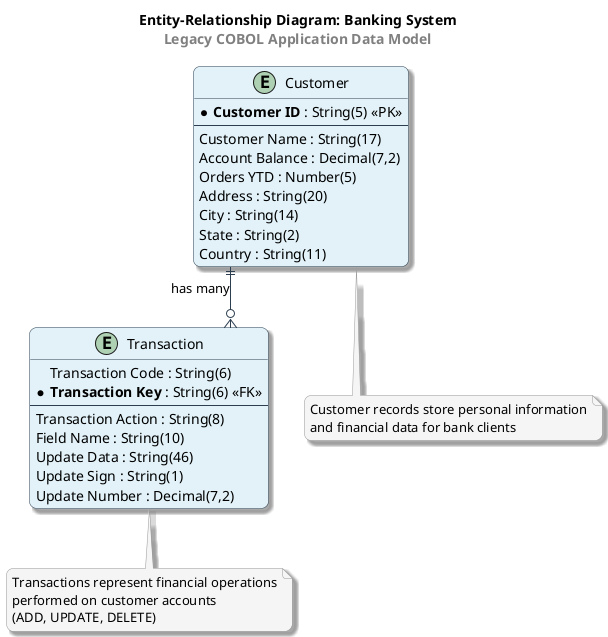

#### 11.7 Diagram Explanation

The ERD illustrates the following key aspects of the data model:

1. **Customer Entity**: Central entity storing all customer information
2. **Transaction Entity**: Represents operations performed on customer accounts
3. **One-to-Many Relationship**: A customer can have multiple transactions
4. **Primary and Foreign Keys**: Customer ID is the primary key, Transaction Key references Customer ID
5. **Data Types**: Appropriate data types for each attribute based on the COBOL definitions

#### 11.8 Prompt 1: Generate Cypher Query for Neo4j

Use this prompt with GPT-4o to generate a Cypher query that extracts the necessary data from Neo4j:

```
I need to create a Cypher query for Neo4j to extract data for an Entity-Relationship Diagram (ERD) from a COBOL application. The application has two main entities:

1. Customer (CUST-REC) - Contains fields like CUST-ID, CUST-NAME, CUST-ACCT-BALANCE, CUST-ORDERS-YTD, CUST-ADDR, CUST-CITY, CUST-STATE, CUST-COUNTRY
2. Transaction (TRANSACTION-RECORD) - Contains fields like TRAN-CODE, TRAN-KEY, TRAN-ACTION, TRAN-FIELD-NAME, TRAN-UPDATE-DATA

In the Neo4j database, these entities are represented as nodes with the label "COBOLStorage". The Customer entity has a name property of "CUST-REC" and the Transaction entity has a name property of "TRANSACTION-RECORD". The fields of each entity are connected to their parent entity via a "BELONGS_TO" relationship.

The relationship between Customer and Transaction is established through program paragraphs that process transactions against customer records. These paragraphs are named "200-PROCESS-UPDATE-TRAN", "210-PROCESS-ADD-TRAN", and "220-PROCESS-DELETE-TRAN".

Please create a comprehensive Cypher query that:
1. Extracts the Customer and Transaction entities with all their fields
2. Identifies the relationship between these entities
3. Returns the data in a format suitable for creating an ERD

The query should be well-commented and optimized for performance.

Use the following information from the legacy_code_final.json file to understand the structure:
- Customer entity (CUST-REC) has fields like CUST-KEY, CUST-NAME, CUST-ACCT-BALANCE, CUST-ORDERS-YTD, CUST-ADDR, CUST-CITY, CUST-STATE, CUST-COUNTRY
- Transaction entity (TRANSACTION-RECORD) has fields like TRAN-CODE, TRAN-KEY, TRAN-ACTION, TRAN-FIELD-NAME, TRAN-UPDATE-DATA
- The relationship is established in paragraphs like 200-PROCESS-UPDATE-TRAN where CUSTTRN2 is called using CUST-REC and TRANSACTION-RECORD

Make sure the query handles the hierarchical nature of COBOL data structures correctly, where fields can be nested within other fields.
```

#### 11.9 Prompt 2: Generate PlantUML Script for ERD

Use this prompt with GPT-4o to generate a PlantUML script for the ERD, using the output from the Cypher query:

```
Using the data extracted from the following Cypher query, please create a detailed PlantUML script for an Entity-Relationship Diagram (ERD) that visualizes the Customer and Transaction entities and their relationships in a COBOL application:

[INSERT CYPHER QUERY RESULT HERE]

The ERD should:

1. Show the Customer entity with the following attributes:
   - CUST-ID (primary key)
   - CUST-REC-TYPE
   - CUST-NAME
   - CUST-ACCT-BALANCE
   - CUST-ORDERS-YTD
   - CUST-ADDR
   - CUST-CITY
   - CUST-STATE
   - CUST-COUNTRY

2. Show the Transaction entity with the following attributes:
   - TRAN-KEY (primary key)
   - TRAN-CODE
   - TRAN-ACTION
   - TRAN-FIELD-NAME
   - TRAN-UPDATE-DATA
   - TRAN-UPDATE-SIGN
   - TRAN-UPDATE-NUM

3. Illustrate the one-to-many (1:N) relationship between Customer and Transaction entities, where one customer can have multiple transactions.

4. Include descriptive notes explaining the entities and their relationship.

5. Use professional styling with appropriate colors, fonts, and layout for a business presentation to executives, developers, and stakeholders.

The PlantUML script should be well-structured, visually appealing, and provide a clear understanding of the data model for both technical and non-technical audiences.

Important considerations:
- Use COBOL data types in the attribute definitions (e.g., PIC X(5), PIC 9(7)V99)
- Add appropriate cardinality notation (1 to many)
- Include notes that explain the business purpose of each entity
- Use colors and styling that make the diagram professional and easy to understand
- Make sure the diagram is suitable for presentation to both technical and business stakeholders
```

## Business Process Diagrams

### 12. Business Process Model and Notation (BPMN) Diagram
- **Purpose**: Model the business processes from an end-to-end perspective
- **Key Elements**:
  - Business activities
  - Events
  - Gateways
  - Swim lanes for different actors
- **Benefits**: Connects technical implementation to business processes

#### 12.1 Business Process Model and Notation (BPMN) Diagram

#### 12.2 Business Process Description
The COBOL application consists of two main programs:
1. **CUSTTRN1**: The main program that handles customer transaction processing, including file operations, transaction validation, and reporting.
2. **CUSTTRN2**: A subroutine called by CUSTTRN1 specifically to handle update transactions.

The application processes three types of transactions:
- **ADD**: Add a new customer record
- **UPDATE**: Update an existing customer record
- **DELETE**: Delete an existing customer record

#### 12.3 Cypher Query for Neo4j
The following Cypher query can be used to extract the business process flow from the Neo4j database:

```cypher
// Match all COBOL programs in the application
MATCH (program:CobolProgram)
WHERE program.name IN ['CUSTTRN1', 'CUSTTRN2']

// Match paragraphs within these programs
OPTIONAL MATCH (program)-[:CONTAINS]->(paragraph:Paragraph)

// Match calls between paragraphs
OPTIONAL MATCH (caller:Paragraph)-[:CALLS]->(callee:Paragraph)

// Match file operations
OPTIONAL MATCH (paragraph)-[:USES]->(file:File)

// Return the program structure and relationships
RETURN program.name AS Program,
       paragraph.name AS Paragraph,
       caller.name AS Caller,
       callee.name AS Callee,
       file.name AS File,
       file.operation AS Operation
ORDER BY Program, Paragraph;

// Alternative query to focus on the business process flow
MATCH path = (start:Paragraph {name: '000-MAIN'})-[:CALLS*]->(end:Paragraph)
WHERE start.program IN ['CUSTTRN1', 'CUSTTRN2']
RETURN path;
```

#### 12.4 PlantUML BPMN Diagram Script
The following PlantUML script generates a BPMN diagram of the customer transaction processing system:

```plantuml
@startuml Customer Transaction Processing System
!define BPMN https://raw.githubusercontent.com/plantuml-stdlib/C4-PlantUML/master/bpmn
!include BPMN/bpmn.puml

'Define colors for better visualization
!define TRANSACTION_COLOR #FFDDAA
!define PROCESS_COLOR #AAFFAA
!define ERROR_COLOR #FFAAAA
!define FILE_COLOR #AAAAFF
!define DECISION_COLOR #FFFFAA

'Define BPMN artifacts
title Customer Transaction Processing System - BPMN Diagram

'Pools and lanes
pool "Customer Transaction Processing System" {
  lane "Batch Job (JCL)" {
    :Start Job|
    :Execute CUSTTRN1|
  }
  
  lane "CUSTTRN1 (Main Program)" {
    start
    :Initialize System;
    note right: Get current date and time
    
    :Open Files;
    note right
      - Transaction File (Input)
      - Customer File (Input)
      - Customer File (Output)
      - Report File (Output)
    end note
    
    :Initialize Report;
    
    :Read First Customer Record;
    
    #PROCESS_COLOR:Process Transactions|
    
    while (More Transactions?) is (Yes)
      :Read Transaction Record;
      
      if (Transaction Valid?) then (No)
        #ERROR_COLOR:Report Bad Transaction;
      else (Yes)
        if (Transaction in Sequence?) then (Yes)
          #DECISION_COLOR:Evaluate Transaction Type;
          
          fork
            :UPDATE;
            #TRANSACTION_COLOR:Process Update Transaction;
            note right: Position customer file,\nvalidate customer exists
            
            if (Customer Found?) then (Yes)
              :Call CUSTTRN2;
              
              if (Update Successful?) then (Yes)
                :Increment Update Counter;
              else (No)
                #ERROR_COLOR:Report Error;
              endif
            else (No)
              #ERROR_COLOR:Report No Matching Key;
            endif
          fork again
            :ADD;
            #TRANSACTION_COLOR:Process Add Transaction;
            note right: Position customer file,\nvalidate customer doesn't exist
            
            if (Customer Already Exists?) then (Yes)
              #ERROR_COLOR:Report Duplicate Key;
            else (No)
              :Initialize New Customer Record;
              :Write Customer Record;
              :Increment Add Counter;
            endif
          fork again
            :DELETE;
            #TRANSACTION_COLOR:Process Delete Transaction;
            note right: Position customer file,\nvalidate customer exists
            
            if (Customer Found?) then (Yes)
              :Increment Delete Counter;
              :Skip Customer Record;
            else (No)
              #ERROR_COLOR:Report No Matching Key;
            endif
          fork again
            :OTHER;
            #ERROR_COLOR:Report Invalid Transaction Code;
          end fork
          
          if (Transaction Processed Successfully?) then (Yes)
            :Report Transaction Processed;
          endif
        else (No)
          #ERROR_COLOR:Report Out of Sequence;
        endif
      endif
    end while (No)
    
    :Generate Transaction Statistics Report;
    :Close Files;
    
    stop
  }
  
  lane "CUSTTRN2 (Update Subroutine)" {
    start
    :Validate Transaction;
    
    if (Transaction Valid?) then (Yes)
      :Process Transaction;
      note right
        - Validate transaction code (UPDATE)
        - Validate field name (BALANCE, ORDERS)
        - Validate action code (REPLACE, ADD)
        - Process numeric updates with sign
      end note
      
      if (Field Name?) then (BALANCE)
        if (Action?) then (REPLACE)
          :Replace Account Balance;
        else (ADD)
          :Add to Account Balance;
        endif
      else (ORDERS)
        if (Action?) then (REPLACE)
          :Replace Orders YTD;
        else (ADD)
          :Add to Orders YTD;
        endif
      endif
      
      :Return Success;
    else (No)
      :Set Error Message;
      :Return Error;
    endif
    
    stop
  }
}

'Data objects
artifact "Transaction File" as TransFile #FILE_COLOR
artifact "Customer File" as CustFile #FILE_COLOR
artifact "Customer Output File" as CustOutFile #FILE_COLOR
artifact "Report File" as ReportFile #FILE_COLOR

'Associations
"Open Files" --> TransFile
"Open Files" --> CustFile
"Open Files" --> CustOutFile
"Open Files" --> ReportFile
"Read Transaction Record" --> TransFile
"Read First Customer Record" --> CustFile
"Write Customer Record" --> CustOutFile
"Report Transaction Processed" --> ReportFile
"Report Bad Transaction" --> ReportFile
"Generate Transaction Statistics Report" --> ReportFile

@enduml
```

#### 12.5 Diagram Explanation

#### 12.5.1 Actors (Swim Lanes)
1. **Batch Job (JCL)**: Initiates the transaction processing system
2. **CUSTTRN1 (Main Program)**: Handles the main transaction processing flow
3. **CUSTTRN2 (Update Subroutine)**: Processes update transactions

#### 12.5.2 Business Activities
1. **File Operations**: Opening files, reading records, writing records
2. **Transaction Processing**: Processing different types of transactions (ADD, UPDATE, DELETE)
3. **Validation**: Validating transaction data and customer records
4. **Reporting**: Generating reports for processed transactions and errors

#### 12.5.3 Events
1. **Start Event**: Job initiation
2. **End Event**: Job completion
3. **Intermediate Events**: File operations, transaction processing

#### 12.5.4 Gateways
1. **Transaction Type Gateway**: Determines the type of transaction to process
2. **Validation Gateways**: Check if transactions are valid, in sequence, etc.
3. **Customer Existence Gateways**: Check if customer records exist or not

#### 12.5.5 Data Objects
1. **Transaction File**: Input file containing transaction records
2. **Customer File**: Input file containing customer records
3. **Customer Output File**: Output file for updated customer records
4. **Report File**: Output file for transaction processing reports

#### 12.5.6 Visual Enhancements
The diagram uses color coding to improve readability:
- **Transaction Processing**: Orange (#FFDDAA)
- **General Processing**: Green (#AAFFAA)
- **Error Handling**: Red (#FFAAAA)
- **File Operations**: Blue (#AAAAFF)
- **Decision Points**: Yellow (#FFFFAA)

Notes are added to provide additional context for complex operations, making the diagram more informative.

#### 12.6 Prompt 1: Cypher Query Generation

```
You are a Neo4j and COBOL expert tasked with creating a Cypher query to extract business process flow data for a BPMN diagram. The data will be used to visualize the business processes in a legacy COBOL application.

## Input Files
You have access to the following files:
1. legacy_code_final.json - Contains the COBOL program definitions with paragraphs, variables, and file operations
2. callgraph.txt - Shows the relationships between programs, paragraphs, and variables
3. neo4j-database-data-final.json - Contains the Neo4j database structure

## Task
Create a comprehensive Cypher query that extracts the following information from the Neo4j database:

1. The main COBOL programs (CUSTTRN1 and CUSTTRN2) and their key paragraphs
2. The relationships between paragraphs (especially the flow of execution)
3. The program calls (CUSTTRN1 calling CUSTTRN2)
4. File operations (reading and writing to files)
5. Any error handling or decision points in the process flow

## Requirements
- The query should focus on the business process flow, not the technical details
- Use MATCH and UNION clauses to combine different aspects of the process
- Include WHERE clauses to filter for the most relevant paragraphs
- The query should return nodes and relationships that can be used to construct a BPMN diagram
- Ensure the query captures the end-to-end process flow from initialization to completion

## Neo4j Database Structure
The Neo4j database contains the following node types:
- COBOLProgram: Represents a COBOL program
- COBOLParagraph: Represents a paragraph in a COBOL program
- COBOLFile: Represents a file used by a COBOL program
- COBOLFileOperation: Represents a file operation (read/write)

And the following relationship types:
- CONTAINS: Links a program to its paragraphs or a paragraph to its operations
- BELONGS: Links elements to their parent structures
- DEPENDS_ON: Shows dependencies between components

## Expected Output
Provide a complete, executable Cypher query that can be run against the Neo4j database to extract the business process flow data. Include comments to explain the purpose of each part of the query.
```

#### 12.7 Prompt 2: PlantUML BPMN Script Generation

```
You are a business process modeling expert tasked with creating a PlantUML script for a BPMN diagram. The diagram will visualize the business processes in a legacy COBOL application based on data extracted from Neo4j.

## Input
You will receive the output of a Cypher query that extracted business process flow data from Neo4j. The data includes:
1. COBOL programs (CUSTTRN1 and CUSTTRN2) and their key paragraphs
2. Relationships between paragraphs
3. Program calls
4. File operations
5. Error handling and decision points

## Task
Create a comprehensive PlantUML script that generates a BPMN diagram showing the end-to-end business process flow of the customer transaction processing system.

## Requirements
1. Use proper BPMN notation with:
   - Activities (tasks and sub-processes)
   - Events (start, end, intermediate)
   - Gateways (exclusive, parallel, inclusive)
   - Swim lanes for different actors or components
   - Connections between elements

2. Include the following business processes:
   - System initialization (opening files, preparing for processing)
   - Transaction processing loop
   - Different transaction types (UPDATE, ADD, DELETE)
   - Error handling paths
   - Reporting and statistics generation
   - System shutdown

3. Add detailed notes and explanations to make the diagram understandable to:
   - Business stakeholders
   - Analysts
   - Developers
   - Executives
   - Tech leads

4. Apply professional styling with:
   - Consistent color scheme
   - Clear fonts
   - Proper spacing
   - Logical layout
   - Visual hierarchy

## COBOL Application Overview
The application processes customer transactions with these main components:
1. CUSTTRN1: Main program that reads transactions and processes them based on type
2. CUSTTRN2: Subroutine called by CUSTTRN1 to validate and process UPDATE transactions
3. Transaction types: UPDATE, ADD, DELETE
4. Files: Transaction file, Customer file, Customer output file, Report file
5. Error handling for invalid transactions, file errors, and data validation

## Expected Output
Provide a complete, executable PlantUML script that generates a professional BPMN diagram. Include comments to explain the purpose of each section of the script. The diagram should be visually appealing and provide a clear understanding of the business process flow.
```

### 13. Use Case Diagram
- **Purpose**: Identify the main functions of the system from a user perspective
- **Key Elements**:
  - System boundary
  - Actors (users, external systems)
  - Use cases (Add Customer, Update Customer, etc.)
- **Benefits**: Provides a functional view of the system capabilities

#### 13.1 Use Case Diagram - Customer Transaction Processing System

This document provides the Cypher query and PlantUML script for generating a Use Case Diagram of the COBOL Customer Transaction Processing System.

#### 13.2 Key Elements

- System boundary
- Actors (users, external systems)
- Use cases (Add Customer, Update Customer, etc.)

#### 13.3 Neo4j Cypher Query

The following Cypher query can be used to extract the use case information from the COBOL application:

```cypher
// Define the system boundary
MATCH (p:Program)
WHERE p.name IN ['CUSTTRN1', 'CUSTTRN2']

// Find main paragraphs that represent use cases
OPTIONAL MATCH (p)-[:CONTAINS]->(pd:ProcedureDivision)-[:CONTAINS]->(para:Paragraph)
WHERE para.name IN [
  '100-PROCESS-TRANSACTIONS',
  '200-PROCESS-UPDATE-TRAN',
  '210-PROCESS-ADD-TRAN',
  '220-PROCESS-DELETE-TRAN',
  '299-REPORT-BAD-TRAN',
  '830-REPORT-TRAN-PROCESSED',
  '850-REPORT-TRAN-STATS'
]

// Find file interactions to identify external systems
OPTIONAL MATCH (p)-[:CONTAINS]->(fs:FileSection)-[:CONTAINS]->(f:File)

// Return the results
RETURN p.name as Program,
       collect(distinct para.name) as UseCases,
       collect(distinct f.name) as ExternalSystems
```

#### 13.4 PlantUML Script

The following PlantUML script creates a comprehensive Use Case Diagram for the Customer Transaction Processing System:

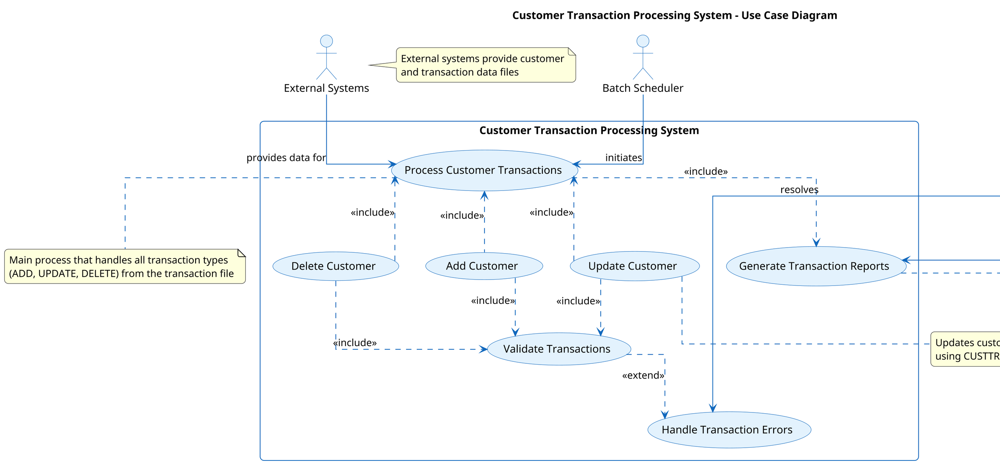

#### 13.5 Diagram Explanation

The Use Case Diagram illustrates:

1. **System Boundary**: The "Customer Transaction Processing System" rectangle represents the system boundary, containing all use cases.

2. **Actors**:
  - **Batch Scheduler**: Initiates the batch processing job
  - **Operations Team**: Reviews reports and resolves errors
  - **External Systems**: Provides customer and transaction data files

3. **Primary Use Cases**:
  - **Process Customer Transactions**: The main function that processes all transaction types
  - **Add Customer**: Creates new customer records
  - **Update Customer**: Modifies existing customer records (balance, orders)
  - **Delete Customer**: Removes customer records
  - **Validate Transactions**: Ensures transaction data is valid
  - **Generate Transaction Reports**: Creates reports on processing results
  - **Handle Transaction Errors**: Manages and reports transaction errors

4. **Relationships**:
  - **Include**: Indicates that one use case includes the functionality of another
  - **Extend**: Indicates optional behavior that may be triggered under certain conditions

#### 13.6 Benefits

This Use Case Diagram provides:

1. A clear functional view of the system capabilities
2. Visibility into how external actors interact with the system
3. Understanding of the main business processes supported by the application
4. A foundation for modernization planning and knowledge transfer

The diagram serves as an essential tool to understand the system's functionality without needing to delve into the technical implementation details.

#### 13.7 Prompt 1: Neo4j Cypher Query Generation

```
You are a COBOL and Neo4j expert tasked with creating a Cypher query to extract data for a Use Case Diagram from a Neo4j database containing COBOL application information.

## Context
The database contains information about a legacy COBOL application called "Customer Transaction Processing System" with two main programs:
1. CUSTTRN1 - Main program that processes customer transactions
2. CUSTTRN2 - Subroutine called by CUSTTRN1 to validate and process update transactions

## Requirements
Create a Cypher query that will:
1. Identify the main COBOL programs (CUSTTRN1, CUSTTRN2)
2. Extract paragraphs that represent use cases (especially those handling transaction processing)
3. Identify file interactions to determine external systems
4. Capture program calls to understand interactions between components

## Important Neo4j Structure Information
- COBOL programs are represented as nodes with the label `:COBOLProgram`
- Paragraphs are represented as nodes with the label `:COBOLParagraph`
- Files are represented as nodes with the label `:COBOLFile`
- Relationships include:
  - `[:CONTAINS]` - Program contains a paragraph
  - `[:CALLS]` - Program calls another program
  - `[:READS]` - Program reads from a file
  - `[:WRITES]` - Program writes to a file

## Expected Output
Provide a well-commented Cypher query that returns:
1. Program names
2. Use case paragraphs associated with each program
3. External systems (files) that interact with the programs
4. Program call relationships

The query should be optimized for Neo4j and include clear comments explaining each section.
```

#### 13.8 Prompt 2: PlantUML Use Case Diagram Generation

```
You are a UML and software architecture expert tasked with creating a PlantUML script for a Use Case Diagram based on data extracted from a Neo4j database.

## Context
The data represents a legacy COBOL application called "Customer Transaction Processing System" with two main programs:
1. CUSTTRN1 - Main program that processes customer transactions
2. CUSTTRN2 - Subroutine called by CUSTTRN1 to validate and process update transactions

## Neo4j Query Results
The following data was extracted from Neo4j (replace this with the actual results from Prompt 1):

```json
{
  "Program": "CUSTTRN1",
  "UseCases": [
    "100-PROCESS-TRANSACTIONS",
    "200-PROCESS-UPDATE-TRAN",
    "210-PROCESS-ADD-TRAN",
    "220-PROCESS-DELETE-TRAN",
    "299-REPORT-BAD-TRAN",
    "830-REPORT-TRAN-PROCESSED",
    "850-REPORT-TRAN-STATS"
  ],
  "ExternalSystems": [
    "CUSTOMER-FILE",
    "TRANSACTION-FILE",
    "CUSTOMER-FILE-OUT",
    "REPORT-FILE"
  ],
  "CalledPrograms": [
    "CUSTTRN2"
  ]
}
```

## Integration and Interface Diagrams

### 14. Interface Diagram
- **Purpose**: Document the interfaces between the COBOL application and external systems
- **Target Audience**: Integration specialists, developers
- **Key Elements**:
  - File interfaces
  - API interfaces (if any)
  - Data formats
  - Integration points
- **Benefits**: Helps understand how the system interacts with its environment

#### 14.1 Interface Diagram for COBOL Application

This document provides the Cypher query and PlantUML script for generating an Interface Diagram that documents the interfaces between the COBOL application and external systems.
The Interface Diagram visualizes how the COBOL application interacts with its environment, including:
- File interfaces
- Program interfaces
- Data formats
- Integration points


#### 14.2 Cypher Query for Neo4j

```cypher
// Clear previous data if needed
MATCH (n) DETACH DELETE n;

// Create JCL Job
CREATE (jcl:Job {name: "TESTJCL", description: "JCL job that executes the CUSTTRN1 program"})

// Create COBOL Programs
CREATE (custtrn1:Program {name: "CUSTTRN1", description: "Main program that processes customer transactions"})
CREATE (custtrn2:Program {name: "CUSTTRN2", description: "Subroutine that validates and processes update transactions"})

// Create External Files
CREATE (custFile:File {name: "CUSTOMER-FILE", description: "Input customer records", dataset: "APPD.TEST.CUSTFILE", recordLength: 84})
CREATE (tranFile:File {name: "TRANSACTION-FILE", description: "Input transaction records", dataset: "APPD.TEST.TRANFILE"})
CREATE (custOutFile:File {name: "CUSTOMER-FILE-OUT", description: "Output updated customer records", dataset: "APPD.TEST.TRANFL.OUT", recordLength: 84})
CREATE (reportFile:File {name: "REPORT-FILE", description: "Output report file", dataset: "APPD.TEST.CUSTRPT.OUT", recordLength: 133})

// Create Data Structures
CREATE (custRec:DataStructure {name: "CUST-REC", description: "Customer record structure"})
CREATE (tranRec:DataStructure {name: "TRANSACTION-RECORD", description: "Transaction record structure"})
CREATE (reportRec:DataStructure {name: "REPORT-RECORD", description: "Report record structure"})

// Create External Systems
CREATE (loadLib:ExternalSystem {name: "LOAD LIBRARY", description: "Program load library", dataset: "APPD.LOAD.LIB"})
CREATE (sysOut:ExternalSystem {name: "SYSTEM OUTPUT", description: "System output for logs and messages"})

// Create relationships between JCL and Programs
CREATE (jcl)-[:EXECUTES]->(custtrn1)
CREATE (jcl)-[:REFERENCES]->(loadLib)

// Create relationships between Programs
CREATE (custtrn1)-[:CALLS]->(custtrn2)

// Create relationships between Programs and Files
CREATE (custtrn1)-[:READS]->(custFile)
CREATE (custtrn1)-[:READS]->(tranFile)
CREATE (custtrn1)-[:WRITES]->(custOutFile)
CREATE (custtrn1)-[:WRITES]->(reportFile)
CREATE (custtrn1)-[:WRITES]->(sysOut)

// Create relationships between Programs and Data Structures
CREATE (custtrn1)-[:USES]->(custRec)
CREATE (custtrn1)-[:USES]->(tranRec)
CREATE (custtrn1)-[:USES]->(reportRec)
CREATE (custtrn2)-[:USES]->(custRec)
CREATE (custtrn2)-[:USES]->(tranRec)

// Create relationships between Files and Data Structures
CREATE (custFile)-[:CONTAINS]->(custRec)
CREATE (tranFile)-[:CONTAINS]->(tranRec)
CREATE (custOutFile)-[:CONTAINS]->(custRec)
CREATE (reportFile)-[:CONTAINS]->(reportRec)

// Return all nodes and relationships
MATCH (n) RETURN n;
```

#### 14.3 PlantUML Script

```plantuml
@startuml Interface_Diagram

!define ICONURL https://raw.githubusercontent.com/tupadr3/plantuml-icon-font-sprites/master/devicons
!includeurl ICONURL/mainframe.puml

' Use modern, visually appealing styling
skinparam backgroundColor white
skinparam handwritten false
skinparam DefaultFontName Arial
skinparam DefaultFontSize 12
skinparam roundCorner 10
skinparam shadowing false
skinparam ArrowColor #5D6D7E
skinparam linetype ortho

' Color scheme for better visual distinction
skinparam component {
  BackgroundColor #E3F2FD
  BorderColor #1565C0
  FontColor #0D47A1
}

skinparam interface {
  BackgroundColor #E8F5E9
  BorderColor #2E7D32
  FontColor #1B5E20
}

skinparam database {
  BackgroundColor #FFF3E0
  BorderColor #E65100
  FontColor #BF360C
}

skinparam note {
  BackgroundColor #FFF9C4
  BorderColor #FBC02D
  FontColor #3E2723
}

' Title and legend
title <b>Interface Diagram: COBOL Customer Transaction Processing System</b>

legend right
  <b>Interface Diagram</b>
  --
  This diagram shows the interfaces between the COBOL application
  and external systems, including file interfaces, program interfaces,
  data formats, and integration points.
endlegend

' External Systems
package "External Systems" as ExternalSystems {
  [JCL Job\nTESTJCL] as jcl <<Job>> #E8EAF6
  [Load Library\nAPPD.LOAD.LIB] as loadLib <<Library>> #E8EAF6
  [System Output] as sysOut <<System>> #E8EAF6
}

' COBOL Programs
package "COBOL Programs" as CobolPrograms {
  [CUSTTRN1] as custtrn1 <<Program>> #BBDEFB
  [CUSTTRN2] as custtrn2 <<Program>> #BBDEFB
}

' Data Files
package "Data Files" as DataFiles {
  database "Customer File\nAPPD.TEST.CUSTFILE" as custFile #FFF3E0
  database "Transaction File\nAPPD.TEST.TRANFILE" as tranFile #FFF3E0
  database "Customer Output File\nAPPD.TEST.TRANFL.OUT" as custOutFile #FFF3E0
  database "Report File\nAPPD.TEST.CUSTRPT.OUT" as reportFile #FFF3E0
}

' Data Structures
package "Data Structures" as DataStructures {
  class "CUST-REC" as custRec #E0F7FA {
    + CUST-KEY
    + CUST-NAME
    + CUST-ACCT-BALANCE
    + CUST-ORDERS-YTD
    + CUST-ADDR
    + CUST-CITY
    + CUST-STATE
    + CUST-COUNTRY
  }
  
  class "TRANSACTION-RECORD" as tranRec #E0F7FA {
    + TRAN-CODE
    + TRAN-KEY
    + TRAN-ACTION
    + TRAN-FIELD-NAME
    + TRAN-UPDATE-DATA
  }
  
  class "REPORT-RECORD" as reportRec #E0F7FA {
    + (Various report formats)
  }
}

' Relationships
jcl --> custtrn1 : executes
jcl ..> loadLib : references

custtrn1 --> custtrn2 : calls
custtrn1 --> sysOut : writes logs

custtrn1 --> custFile : reads
custtrn1 --> tranFile : reads
custtrn1 --> custOutFile : writes
custtrn1 --> reportFile : writes

custFile ..> custRec : contains
tranFile ..> tranRec : contains
custOutFile ..> custRec : contains
reportFile ..> reportRec : contains

custtrn1 ..> custRec : uses
custtrn1 ..> tranRec : uses
custtrn1 ..> reportRec : uses
custtrn2 ..> custRec : uses
custtrn2 ..> tranRec : uses

' Notes for additional context
note bottom of custtrn1
  Main program that processes customer transactions:
  - Reads customer and transaction records
  - Processes ADD, UPDATE, DELETE transactions
  - Generates reports
  - Writes updated customer records
endnote

note bottom of custtrn2
  Subroutine that validates and processes
  customer record updates
endnote

note bottom of custRec
  Record length: 84 bytes
  Fixed block format
endnote

note bottom of reportRec
  Record length: 133 bytes
  Fixed block format
endnote

@enduml
```

#### 14.4 File Interfaces
- **CUSTOMER-FILE**: Input file containing customer records (APPD.TEST.CUSTFILE)
- **TRANSACTION-FILE**: Input file containing transaction records (APPD.TEST.TRANFILE)
- **CUSTOMER-FILE-OUT**: Output file for updated customer records (APPD.TEST.TRANFL.OUT)
- **REPORT-FILE**: Output file for transaction reports (APPD.TEST.CUSTRPT.OUT)

#### 14.5 Program Interfaces
- **CUSTTRN1**: Main program that processes customer transactions
- **CUSTTRN2**: Subroutine called by CUSTTRN1 to process update transactions

#### 14.6 Data Formats
- **CUST-REC**: Customer record format (84 bytes, fixed block)
- **TRANSACTION-RECORD**: Transaction record format
- **REPORT-RECORD**: Report record format (133 bytes, fixed block)

#### 14.7 Integration Points
- **JCL Job (TESTJCL)**: Executes the CUSTTRN1 program
- **Load Library (APPD.LOAD.LIB)**: Contains the compiled COBOL programs
- **System Output**: For logs and messages

#### 14.8 Benefits

This Interface Diagram provides several benefits:

1. **Comprehensive View**: Shows all interfaces between the COBOL application and external systems
2. **Clear Data Flow**: Illustrates how data moves through the system
3. **Integration Understanding**: Helps identify integration points for modernization efforts
4. **Documentation**: Serves as reference documentation for developers and integration specialists

#### 14.9 Prompt 1: Generate Cypher Query for Interface Diagram

```
You are tasked with creating a Cypher query for Neo4j to extract interface information from a COBOL application. This query will be used to generate an Interface Diagram that documents how the COBOL application interacts with external systems.

The COBOL application consists of two programs:
1. CUSTTRN1 - Main program that processes customer transactions
2. CUSTTRN2 - Subroutine called by CUSTTRN1 to validate and process update transactions

The application interfaces with the following external files:
- CUSTOMER-FILE (input)
- TRANSACTION-FILE (input)
- CUSTOMER-FILE-OUT (output)
- REPORT-FILE (output)

In the Neo4j database, you'll find the following node types:
- COBOLProgram: Represents COBOL programs
- COBOLParagraph: Represents paragraphs within COBOL programs
- COBOLFile: Represents files used by COBOL programs
- JCLJob: Represents JCL jobs that execute COBOL programs

And the following relationship types:
- CONTAINS: Links programs to paragraphs, sections to data entries
- READS: Links paragraphs to files they read from
- WRITES: Links paragraphs to files they write to
- CALLS: Links paragraphs to programs they call
- EXECUTES: Links JCL jobs to programs they execute

Create a Cypher query that extracts:
1. All COBOL programs in the application
2. File interfaces (which programs read/write which files)
3. Program interfaces (which programs call other programs)
4. JCL jobs that execute the programs
5. Data structures used in interfaces

The query should be comprehensive and provide all necessary information for creating a detailed Interface Diagram.
```

#### 14.10 Prompt 2: Generate PlantUML Script for Interface Diagram

```
Using the results from the following Cypher query, create a PlantUML script to visualize an Interface Diagram for a COBOL application. The diagram should document the interfaces between the COBOL application and external systems.

[INSERT CYPHER QUERY RESULTS HERE]

The Interface Diagram should:

1. Show all file interfaces:
   - CUSTOMER-FILE (input to CUSTTRN1)
   - TRANSACTION-FILE (input to CUSTTRN1)
   - CUSTOMER-FILE-OUT (output from CUSTTRN1)
   - REPORT-FILE (output from CUSTTRN1)

2. Show program interfaces:
   - CUSTTRN1 calls CUSTTRN2

3. Show JCL job execution:
   - TESTJCL executes CUSTTRN1

4. Include data formats for key interfaces:
   - Customer record structure
   - Transaction record structure

5. Highlight integration points:
   - File I/O operations
   - Program calls

Design the diagram with these considerations:
- Target audience includes integration specialists, developers, tech leads, executives, and stakeholders
- Use a professional, business-elegant visual style
- Include a title, legend, and explanatory notes
- Group related elements using packages
- Use different shapes and colors to distinguish between different types of components
- Show data flow directions clearly with labeled arrows

The PlantUML script should be well-structured, visually appealing, and provide a comprehensive view of how the COBOL application interacts with its environment.
```

### 15. Batch Process Diagram
- **Purpose**: Visualize the batch processing workflow
- **Target Audience**: Operations team, developers
- **Key Elements**:
  - JCL job flow
  - Dependencies between jobs
  - Scheduling information
  - File dependencies
- **Benefits**: Provides understanding of operational aspects of the system

#### 15.1 Batch Process Diagram

This diagram visualizes the batch processing workflow of the COBOL application, focusing on the JCL job flow, dependencies between jobs, scheduling information, and file dependencies.

- Provides understanding of operational aspects of the system
- Visualizes data flow between components
- Helps identify dependencies and potential bottlenecks
- Facilitates system maintenance and troubleshooting

#### 15.2 Neo4j Cypher Query

```cypher
// Clear existing data if needed
MATCH (n) DETACH DELETE n;

// Create JCL Job
CREATE (job:JCLJob {name: 'TESTJCL', region: '4M', class: 'A', time: '1', msgclass: 'H'})

// Create Step
CREATE (step:JCLStep {name: 'RUNJCL', program: 'CUSTTRN1', region: '4M'})

// Create Programs
CREATE (prog1:COBOLProgram {name: 'CUSTTRN1', type: 'Main'})
CREATE (prog2:COBOLProgram {name: 'CUSTTRN2', type: 'Subroutine'})

// Create Files
CREATE (custIn:File {name: 'CUSTFILE', dsn: 'APPD.TEST.CUSTFILE', type: 'Input', recordFormat: 'Fixed'})
CREATE (tranIn:File {name: 'TRANFILE', dsn: 'APPD.TEST.TRANFILE', type: 'Input', recordFormat: 'Fixed'})
CREATE (custOut:File {name: 'CUSTOUT', dsn: 'APPD.TEST.TRANFL.OUT', type: 'Output', recordFormat: 'Fixed', recordLength: '84'})
CREATE (rptOut:File {name: 'CUSTRPT', dsn: 'APPD.TEST.CUSTRPT.OUT', type: 'Output', recordFormat: 'Fixed', recordLength: '133'})
CREATE (sysprint:File {name: 'SYSPRINT', type: 'Output', sysout: '*'})
CREATE (sysout:File {name: 'SYSOUT', type: 'Output', sysout: '*'})

// Create Libraries
CREATE (lib:Library {name: 'STEPLIB', dsn: 'APPD.LOAD.LIB'})

// Create Relationships
CREATE (job)-[:EXECUTES]->(step)
CREATE (step)-[:RUNS]->(prog1)
CREATE (prog1)-[:CALLS]->(prog2)
CREATE (step)-[:USES]->(lib)
CREATE (step)-[:READS]->(custIn)
CREATE (step)-[:READS]->(tranIn)
CREATE (step)-[:WRITES]->(custOut)
CREATE (step)-[:WRITES]->(rptOut)
CREATE (step)-[:WRITES]->(sysprint)
CREATE (step)-[:WRITES]->(sysout)

// Create Transaction Types
CREATE (addTran:TransactionType {name: 'ADD', description: 'Add new customer record'})
CREATE (updateTran:TransactionType {name: 'UPDATE', description: 'Update existing customer record'})
CREATE (deleteTran:TransactionType {name: 'DELETE', description: 'Delete customer record'})

// Create Relationships between Program and Transaction Types
CREATE (prog1)-[:PROCESSES]->(addTran)
CREATE (prog1)-[:PROCESSES]->(updateTran)
CREATE (prog1)-[:PROCESSES]->(deleteTran)
CREATE (prog2)-[:PROCESSES]->(updateTran)

// Create Process Steps
CREATE (openFiles:ProcessStep {name: '700-OPEN-FILES', description: 'Open input and output files'})
CREATE (initReport:ProcessStep {name: '800-INIT-REPORT', description: 'Initialize report headers'})
CREATE (readCust:ProcessStep {name: '730-READ-CUSTOMER-FILE', description: 'Read customer record'})
CREATE (processTrans:ProcessStep {name: '100-PROCESS-TRANSACTIONS', description: 'Process transaction records'})
CREATE (reportStats:ProcessStep {name: '850-REPORT-TRAN-STATS', description: 'Generate transaction statistics report'})
CREATE (closeFiles:ProcessStep {name: '790-CLOSE-FILES', description: 'Close all files'})

// Create Relationships between Program and Process Steps
CREATE (prog1)-[:EXECUTES {sequence: 1}]->(openFiles)
CREATE (prog1)-[:EXECUTES {sequence: 2}]->(initReport)
CREATE (prog1)-[:EXECUTES {sequence: 3}]->(readCust)
CREATE (prog1)-[:EXECUTES {sequence: 4}]->(processTrans)
CREATE (prog1)-[:EXECUTES {sequence: 5}]->(reportStats)
CREATE (prog1)-[:EXECUTES {sequence: 6}]->(closeFiles)

// Return all nodes and relationships
MATCH (n) RETURN n;
```

#### 15.3 PlantUML Diagram

```plantuml
@startuml Batch Process Diagram

!define ICONURL https://raw.githubusercontent.com/tupadr3/plantuml-icon-font-sprites/master/devicons
!includeurl ICONURL/mainframe.puml

skinparam backgroundColor white
skinparam handwritten false
skinparam DefaultFontName Arial
skinparam DefaultFontSize 12
skinparam ArrowColor #0066CC
skinparam roundCorner 10
skinparam dpi 300
skinparam shadowing false

skinparam component {
  BackgroundColor #F8F8F8
  BorderColor #999999
  FontColor #333333
}

skinparam database {
  BackgroundColor #E6F5F7
  BorderColor #0099CC
  FontColor #333333
}

skinparam note {
  BackgroundColor #FFFFCC
  BorderColor #999999
  FontColor #333333
}

skinparam sequence {
  ArrowColor #0066CC
  LifeLineBorderColor #999999
  LifeLineBackgroundColor #F8F8F8
  ParticipantBorderColor #999999
  ParticipantBackgroundColor #F8F8F8
  ParticipantFontColor #333333
  ActorBorderColor #999999
  ActorBackgroundColor #F8F8F8
  ActorFontColor #333333
}

' Define custom sprites for better visualization
sprite $job [48x48/16] {
  FFFFFFFFFFFFFFFFFFFFFFFFFFFFFFFFFFFFFFFFFFFFFFFF
  FFFFFFFFFFFFFFFFFFFFFFFFFFFFFFFFFFFFFFFFFFFFFFFF
  FFFFFFFFFFFFFFFFFFFFFFFFFFFFFFFFFFFFFFFFFFFFFFFF
  FFFFFFFFFFFFFFFFFFFFFFFFFFFFFFFFFFFFFFFFFFFFFFFF
  FFFFFFFFFFFFFFFF0000000000FFFFFFFFFFFFFFFFFFFFF
  FFFFFFFFFFFFFF00000000000000FFFFFFFFFFFFFFFFFFF
  FFFFFFFFFFFF0000000000000000FFFFFFFFFFFFFFFFFFF
  FFFFFFFFFFF000000000000000000FFFFFFFFFFFFFFFFFF
  FFFFFFFFFF00000000000000000000FFFFFFFFFFFFFFFFF
  FFFFFFFFFF00000000000000000000FFFFFFFFFFFFFFFFF
  FFFFFFFFFF00000000000000000000FFFFFFFFFFFFFFFFF
  FFFFFFFFFF00000000000000000000FFFFFFFFFFFFFFFFF
  FFFFFFFFFF00000000000000000000FFFFFFFFFFFFFFFFF
  FFFFFFFFFF00000000000000000000FFFFFFFFFFFFFFFFF
  FFFFFFFFFF00000000000000000000FFFFFFFFFFFFFFFFF
  FFFFFFFFFF00000000000000000000FFFFFFFFFFFFFFFFF
  FFFFFFFFFF00000000000000000000FFFFFFFFFFFFFFFFF
  FFFFFFFFFF00000000000000000000FFFFFFFFFFFFFFFFF
  FFFFFFFFFF00000000000000000000FFFFFFFFFFFFFFFFF
  FFFFFFFFFF00000000000000000000FFFFFFFFFFFFFFFFF
  FFFFFFFFFF00000000000000000000FFFFFFFFFFFFFFFFF
  FFFFFFFFFF00000000000000000000FFFFFFFFFFFFFFFFF
  FFFFFFFFFF00000000000000000000FFFFFFFFFFFFFFFFF
  FFFFFFFFFF00000000000000000000FFFFFFFFFFFFFFFFF
  FFFFFFFFFF00000000000000000000FFFFFFFFFFFFFFFFF
  FFFFFFFFFF00000000000000000000FFFFFFFFFFFFFFFFF
  FFFFFFFFFF00000000000000000000FFFFFFFFFFFFFFFFF
  FFFFFFFFFF00000000000000000000FFFFFFFFFFFFFFFFF
  FFFFFFFFFF00000000000000000000FFFFFFFFFFFFFFFFF
  FFFFFFFFFF00000000000000000000FFFFFFFFFFFFFFFFF
  FFFFFFFFFF00000000000000000000FFFFFFFFFFFFFFFFF
  FFFFFFFFFF00000000000000000000FFFFFFFFFFFFFFFFF
  FFFFFFFFFF00000000000000000000FFFFFFFFFFFFFFFFF
  FFFFFFFFFF00000000000000000000FFFFFFFFFFFFFFFFF
  FFFFFFFFFF00000000000000000000FFFFFFFFFFFFFFFFF
  FFFFFFFFFF00000000000000000000FFFFFFFFFFFFFFFFF
  FFFFFFFFFF00000000000000000000FFFFFFFFFFFFFFFFF
  FFFFFFFFFF00000000000000000000FFFFFFFFFFFFFFFFF
  FFFFFFFFFF00000000000000000000FFFFFFFFFFFFFFFFF
  FFFFFFFFFF00000000000000000000FFFFFFFFFFFFFFFFF
  FFFFFFFFFF00000000000000000000FFFFFFFFFFFFFFFFF
  FFFFFFFFFF00000000000000000000FFFFFFFFFFFFFFFFF
  FFFFFFFFFF00000000000000000000FFFFFFFFFFFFFFFFF
  FFFFFFFFFF00000000000000000000FFFFFFFFFFFFFFFFF
  FFFFFFFFFF00000000000000000000FFFFFFFFFFFFFFFFF
  FFFFFFFFFF00000000000000000000FFFFFFFFFFFFFFFFF
  FFFFFFFFFF00000000000000000000FFFFFFFFFFFFFFFFF
  FFFFFFFFFF00000000000000000000FFFFFFFFFFFFFFFFF
}

sprite $file [48x48/16] {
  FFFFFFFFFFFFFFFFFFFFFFFFFFFFFFFFFFFFFFFFFFFFFFFF
  FFFFFFFFFFFFFFFFFFFFFFFFFFFFFFFFFFFFFFFFFFFFFFFF
  FFFFFFFFFFFFFFFFFFFFFFFFFFFFFFFFFFFFFFFFFFFFFFFF
  FFFFFFFFFFFFFFFFFFFFFFFFFFFFFFFFFFFFFFFFFFFFFFFF
  FFFFFFFFFFFFFFFFFF0000000000FFFFFFFFFFFFFFFFFF
  FFFFFFFFFFFFFFFFFF0000000000FFFFFFFFFFFFFFFFFF
  FFFFFFFFFFFFFFFFFF0000000000FFFFFFFFFFFFFFFFFF
  FFFFFFFFFFFFFFFFFF0000000000FFFFFFFFFFFFFFFFFF
  FFFFFFFFFFFFFFFFFF0000000000FFFFFFFFFFFFFFFFFF
  FFFFFFFFFFFFFFFFFF0000000000FFFFFFFFFFFFFFFFFF
  FFFFFFFFFFFFFFFFFF0000000000FFFFFFFFFFFFFFFFFF
  FFFFFFFFFFFFFFFFFF0000000000FFFFFFFFFFFFFFFFFF
  FFFFFFFFFFFFFFFFFF0000000000FFFFFFFFFFFFFFFFFF
  FFFFFFFFFFFFFFFFFF0000000000FFFFFFFFFFFFFFFFFF
  FFFFFFFFFFFFFFFFFF0000000000FFFFFFFFFFFFFFFFFF
  FFFFFFFFFFFFFFFFFF0000000000FFFFFFFFFFFFFFFFFF
  FFFFFFFFFFFFFFFFFF0000000000FFFFFFFFFFFFFFFFFF
  FFFFFFFFFFFFFFFFFF0000000000FFFFFFFFFFFFFFFFFF
  FFFFFFFFFFFFFFFFFF0000000000FFFFFFFFFFFFFFFFFF
  FFFFFFFFFFFFFFFFFF0000000000FFFFFFFFFFFFFFFFFF
  FFFFFFFFFFFFFFFFFF0000000000FFFFFFFFFFFFFFFFFF
  FFFFFFFFFFFFFFFFFF0000000000FFFFFFFFFFFFFFFFFF
  FFFFFFFFFFFFFFFFFF0000000000FFFFFFFFFFFFFFFFFF
  FFFFFFFFFFFFFFFFFF0000000000FFFFFFFFFFFFFFFFFF
  FFFFFFFFFFFFFFFFFF0000000000FFFFFFFFFFFFFFFFFF
  FFFFFFFFFFFFFFFFFF0000000000FFFFFFFFFFFFFFFFFF
  FFFFFFFFFFFFFFFFFF0000000000FFFFFFFFFFFFFFFFFF
  FFFFFFFFFFFFFFFFFF0000000000FFFFFFFFFFFFFFFFFF
  FFFFFFFFFFFFFFFFFF0000000000FFFFFFFFFFFFFFFFFF
  FFFFFFFFFFFFFFFFFF0000000000FFFFFFFFFFFFFFFFFF
  FFFFFFFFFFFFFFFFFF0000000000FFFFFFFFFFFFFFFFFF
  FFFFFFFFFFFFFFFFFF0000000000FFFFFFFFFFFFFFFFFF
  FFFFFFFFFFFFFFFFFF0000000000FFFFFFFFFFFFFFFFFF
  FFFFFFFFFFFFFFFFFF0000000000FFFFFFFFFFFFFFFFFF
  FFFFFFFFFFFFFFFFFF0000000000FFFFFFFFFFFFFFFFFF
  FFFFFFFFFFFFFFFFFF0000000000FFFFFFFFFFFFFFFFFF
  FFFFFFFFFFFFFFFFFF0000000000FFFFFFFFFFFFFFFFFF
  FFFFFFFFFFFFFFFFFF0000000000FFFFFFFFFFFFFFFFFF
  FFFFFFFFFFFFFFFFFF0000000000FFFFFFFFFFFFFFFFFF
  FFFFFFFFFFFFFFFFFF0000000000FFFFFFFFFFFFFFFFFF
  FFFFFFFFFFFFFFFFFF0000000000FFFFFFFFFFFFFFFFFF
  FFFFFFFFFFFFFFFFFF0000000000FFFFFFFFFFFFFFFFFF
  FFFFFFFFFFFFFFFFFF0000000000FFFFFFFFFFFFFFFFFF
  FFFFFFFFFFFFFFFFFF0000000000FFFFFFFFFFFFFFFFFF
  FFFFFFFFFFFFFFFFFF0000000000FFFFFFFFFFFFFFFFFF
  FFFFFFFFFFFFFFFFFF0000000000FFFFFFFFFFFFFFFFFF
  FFFFFFFFFFFFFFFFFF0000000000FFFFFFFFFFFFFFFFFF
  FFFFFFFFFFFFFFFFFF0000000000FFFFFFFFFFFFFFFFFF
}

' Title and header
title <b>Batch Process Diagram - Customer Transaction Processing</b>
header
<font color=gray>Created: %date("yyyy-MM-dd")
endheader

' Legend
legend right
  <b>Legend</b>
  |= Symbol |= Description |
  | <$mainframe> | JCL Job/Step |
  | <$job> | COBOL Program |
  | <$file> | Data File |
  | --> | Data Flow |
  | ..> | Program Call |
endlegend

' Define components
rectangle "<$mainframe>\nTESTJCL\nJOB" as job #LightBlue
rectangle "<$mainframe>\nRUNJCL\nSTEP" as step #LightBlue

rectangle "<$job>\nCUSTTRN1\nMain Program" as prog1 #LightGreen
rectangle "<$job>\nCUSTTRN2\nSubroutine" as prog2 #LightGreen

database "<$file>\nCUSTFILE\nCustomer Master" as custIn #LightYellow
database "<$file>\nTRANFILE\nTransaction Input" as tranIn #LightYellow
database "<$file>\nCUSTOUT\nUpdated Customer" as custOut #LightYellow
database "<$file>\nCUSTRPT\nTransaction Report" as rptOut #LightYellow

' Define process steps
rectangle "700-OPEN-FILES" as openFiles #LightGray
rectangle "800-INIT-REPORT" as initReport #LightGray
rectangle "730-READ-CUSTOMER-FILE" as readCust #LightGray
rectangle "100-PROCESS-TRANSACTIONS" as processTrans #LightGray
rectangle "850-REPORT-TRAN-STATS" as reportStats #LightGray
rectangle "790-CLOSE-FILES" as closeFiles #LightGray

' Transaction types
rectangle "ADD Transaction" as addTran #FFDDDD
rectangle "UPDATE Transaction" as updateTran #DDFFDD
rectangle "DELETE Transaction" as deleteTran #DDDDFF

' Define relationships
job --> step : executes

step --> prog1 : runs
prog1 ..> prog2 : calls

' File dependencies
custIn --> prog1 : input
tranIn --> prog1 : input
prog1 --> custOut : output
prog1 --> rptOut : output

' Process flow
prog1 -[#blue,thickness=2]-> openFiles : 1
openFiles -[#blue,thickness=2]-> initReport : 2
initReport -[#blue,thickness=2]-> readCust : 3
readCust -[#blue,thickness=2]-> processTrans : 4
processTrans -[#blue,thickness=2]-> reportStats : 5
reportStats -[#blue,thickness=2]-> closeFiles : 6

' Transaction processing
processTrans --> addTran : processes
processTrans --> updateTran : processes
processTrans --> deleteTran : processes
updateTran ..> prog2 : handled by

' Add notes for clarity
note right of job
  <b>JCL Job Information:</b>
  REGION=4M, CLASS=A
  TIME=(1), MSGCLASS=H
end note

note right of custIn
  <b>Input Files:</b>
  - CUSTFILE: Customer master file
  - TRANFILE: Transaction input file
end note

note right of custOut
  <b>Output Files:</b>
  - CUSTOUT: Updated customer records
  - CUSTRPT: Transaction processing report
end note

note bottom of prog1
  <b>Main Processing Logic:</b>
  1. Open files
  2. Initialize report
  3. Read customer records
  4. Process transactions (ADD/UPDATE/DELETE)
  5. Generate statistics report
  6. Close files
end note

note bottom of prog2
  <b>CUSTTRN2 Subroutine:</b>
  Handles UPDATE transactions
  - Validates transaction data
  - Updates customer records
end note

footer
<font color=gray>Page %page% of %lastpage%
endfooter

@enduml
```

#### 15.4 JCL Job Flow
- The JCL job TESTJCL executes the CUSTTRN1 program
- CUSTTRN1 is the main program that processes customer transactions
- CUSTTRN1 calls CUSTTRN2 for handling UPDATE transactions

#### 15.5 Dependencies Between Jobs
- CUSTTRN1 depends on CUSTTRN2 for processing UPDATE transactions
- Both programs depend on the availability of input files (CUSTFILE and TRANFILE)

#### 15.6 File Dependencies
- **Input Files**:
  - CUSTFILE: Customer master file (read)
  - TRANFILE: Transaction input file (read)
- **Output Files**:
  - CUSTOUT: Updated customer records (write)
  - CUSTRPT: Transaction processing report (write)
  - SYSPRINT/SYSOUT: System output files

#### 15.7 Processing Flow
1. Open input and output files
2. Initialize report headers
3. Read customer records
4. Process transactions (ADD/UPDATE/DELETE)
5. Generate transaction statistics report
6. Close all files

#### 15.8 Transaction Types
- **ADD**: Add new customer records
- **UPDATE**: Update existing customer records (processed by CUSTTRN2)
- **DELETE**: Delete customer records

#### 15.9 Prompt 1: Neo4j Cypher Query Generation

```
You are a Neo4j and COBOL expert tasked with creating a Cypher query to extract batch processing workflow data from a Neo4j database containing information about a legacy COBOL application.

## Context
The database contains information about a COBOL application with the following components:
- JCL jobs (labeled as COBOLJcl)
- COBOL programs (labeled as COBOLProgram)
- COBOL paragraphs (labeled as COBOLParagraph)
- File operations (labeled as COBOLFileOperation)
- Relationships between these components

## Requirements
Create a comprehensive Cypher query that extracts:
1. The JCL job named "TESTJCL"
2. The COBOL programs executed by this JCL job
3. The file dependencies (input and output) for these COBOL programs
4. The program calls between COBOL programs (specifically CUSTTRN1 calling CUSTTRN2)
5. Any relevant paragraphs and operations that illustrate the batch processing workflow

## Important Considerations
- The query should use UNION clauses to combine different aspects of the workflow
- The query should be optimized for visualization in a batch process diagram
- Include comments explaining each part of the query
- The main COBOL programs are CUSTTRN1 (main program) and CUSTTRN2 (subroutine)
- File operations have an "operation" property that can be "input" or "output"
- Program calls can be identified by searching for "CALL" in the rawCode property

## Expected Output Format
Provide a complete Cypher query with comments that can be executed against a Neo4j database to extract all the necessary information for creating a batch process diagram.
```

#### 15.10 Prompt 2: PlantUML Batch Process Diagram Generation

```
You are a UML and COBOL expert tasked with creating a PlantUML script to visualize a batch process diagram for a legacy COBOL application.

## Context
I have extracted data from a Neo4j database about a COBOL application's batch processing workflow using the following Cypher query:

[INSERT CYPHER QUERY FROM PROMPT 1 HERE]

The query results show:
- A JCL job named "TESTJCL" with a step "RUNJCL" that executes the COBOL program "CUSTTRN1"
- CUSTTRN1 reads from input files (CUSTFILE, TRANFILE) and writes to output files (CUSTRPT.OUT, TRANFL.OUT)
- CUSTTRN1 calls CUSTTRN2 as a subroutine during update transaction processing
- The main process flow in CUSTTRN1 includes: opening files, initializing reports, reading customer files, processing transactions (update, add, delete), reporting transaction statistics, and closing files
- Scheduling information for the JCL job includes Class A, Region 4M, Time 1 minute, and MSGCLASS H

## Requirements
Create a comprehensive PlantUML script that visualizes:
1. The JCL job flow
2. Dependencies between programs
3. File dependencies
4. Process sequence
5. Scheduling information

## Important Considerations
- Use appropriate UML notation for different components (rectangles for programs, databases for files, etc.)
- Include styling for better visualization (colors, fonts, etc.)
- Add notes to explain process flow and scheduling information
- Include a legend to explain the diagram elements
- The diagram should be visually appealing and easy to understand for both technical and non-technical stakeholders
- Optimize the layout for clarity and readability

## Expected Output Format
Provide a complete PlantUML script that can be used to generate a comprehensive batch process diagram. The script should include styling, notes, and a legend to enhance understanding.
```

## Modernization and Migration Diagrams

### 16. System Context Diagram
- **Purpose**: Show the COBOL application in the context of the broader IT landscape
- **Target Audience**: Architects, executives
- **Key Elements**:
  - External systems
  - User groups
  - Data flows across system boundaries
- **Benefits**: Helps identify integration points and dependencies for modernization planning

#### 16.1 System Context Diagram for COBOL Application

The following Cypher query extracts the system context relationships from the Neo4j database. This query is designed to identify the COBOL application, external systems, user groups, and data flows across system boundaries:

```cypher
// System Context Diagram Cypher Query
// This query extracts the COBOL application in the context of the broader IT landscape

// Start with the main JCL job that represents the entry point to the system
MATCH (jcl:COBOLJcl {name: "TESTJCL"})

// Get COBOL programs executed by the JCL
MATCH (jcl)-[:EXECUTES]->(program:COBOLProgram)

// Get all programs in the application (including those called by the main programs)
OPTIONAL MATCH (program)-[:CONTAINS]->(:COBOLProcedureDivision)-[:CONTAINS]->(:COBOLParagraph)-[:CONTAINS]->(call:COBOLCall)
OPTIONAL MATCH (calledProgram:COBOLProgram)
WHERE calledProgram.name = call.name

// Get external files used by the application
OPTIONAL MATCH (program)-[:CONTAINS]->(:COBOLDataDivision)-[:CONTAINS]->(:COBOLFileSection)-[:CONTAINS]->(file:COBOLFileControl)

// Return the results for system context
RETURN 
    jcl.name as EntryPoint,
    collect(DISTINCT program.name) as MainPrograms,
    collect(DISTINCT calledProgram.name) as SubPrograms,
    collect(DISTINCT file.name) as ExternalFiles
```

#### 16.2 PlantUML Script for System Context Visualization

The following PlantUML script creates a visually enhanced System Context Diagram based on the COBOL application structure. This script is designed to present the application in the context of the broader IT landscape, showing external systems, user groups, and data flows across system boundaries:

```plantuml
@startuml System Context Diagram

' Styling
skinparam backgroundColor white
skinparam defaultTextAlignment center
skinparam titleFontSize 24
skinparam headerFontSize 16
skinparam footerFontSize 12
skinparam legendFontSize 14
skinparam ArrowFontSize 12
skinparam shadowing true
skinparam roundCorner 15
skinparam handwritten false
skinparam monochrome false
skinparam linetype ortho

' Color scheme - using C4 model colors
!define SYSTEM_BG #1168BD
!define SYSTEM_BORDER #3C7FC0
!define EXTERNAL_SYSTEM_BG #999999
!define EXTERNAL_SYSTEM_BORDER #8A8A8A
!define PERSON_BG #08427B
!define PERSON_BORDER #073B6F
!define ENTERPRISE_BOUNDARY_BG #FFFFFF
!define ENTERPRISE_BOUNDARY_BORDER #444444

' Title
title <b><font size=24>System Context Diagram: COBOL Customer Transaction Processing System</font></b>

' Legend
legend right
  <b>Legend</b>
  |= Component |= Description |
  |<back:PERSON_BG><color:white>   Person   </color></back>| User or User Group |
  |<back:SYSTEM_BG><color:white>   System   </color></back>| COBOL Application |
  |<back:EXTERNAL_SYSTEM_BG><color:white>   External System   </color></back>| External System or Data Store |
  |<color:ENTERPRISE_BOUNDARY_BORDER>----</color>| Enterprise Boundary |
endlegend

' Enterprise boundary
rectangle "Enterprise Boundary" as EnterpriseBoundary {
  ' Main COBOL Application System
  rectangle "<b>Customer Transaction Processing System</b>\n\n<i>A COBOL-based system that processes customer transactions including updates, additions, and deletions</i>" as COBOLSystem <<SYSTEM_BG>> #SYSTEM_BG

  ' External Systems within the enterprise
  rectangle "<b>Batch Processing System</b>\n\n<i>Schedules and executes the customer transaction processing jobs</i>" as BatchSystem <<EXTERNAL_SYSTEM_BG>> #EXTERNAL_SYSTEM_BG
  
  rectangle "<b>Customer Data Store</b>\n\n<i>Stores customer records and transaction history</i>" as CustomerDataStore <<EXTERNAL_SYSTEM_BG>> #EXTERNAL_SYSTEM_BG
  
  rectangle "<b>Transaction Data Store</b>\n\n<i>Stores transaction records for processing</i>" as TransactionDataStore <<EXTERNAL_SYSTEM_BG>> #EXTERNAL_SYSTEM_BG
  
  rectangle "<b>Reporting System</b>\n\n<i>Generates and distributes reports on transaction processing</i>" as ReportingSystem <<EXTERNAL_SYSTEM_BG>> #EXTERNAL_SYSTEM_BG
}

' External actors/systems outside the enterprise
actor "<b>Operations Team</b>\n\n<i>Manages and monitors the batch processing</i>" as OperationsTeam <<PERSON_BG>> #PERSON_BG

actor "<b>Business Users</b>\n\n<i>Submit transaction requests and review reports</i>" as BusinessUsers <<PERSON_BG>> #PERSON_BG

rectangle "<b>External Data Systems</b>\n\n<i>Provide data for transaction processing</i>" as ExternalDataSystems <<EXTERNAL_SYSTEM_BG>> #EXTERNAL_SYSTEM_BG

' Relationships
OperationsTeam --> BatchSystem : "Submits and monitors\njobs"
BusinessUsers --> TransactionDataStore : "Submits transaction\nrequests"
BusinessUsers <-- ReportingSystem : "Provides transaction\nreports"

BatchSystem --> COBOLSystem : "Executes COBOL\nprograms via JCL"
COBOLSystem --> CustomerDataStore : "Reads and updates\ncustomer data"
COBOLSystem --> TransactionDataStore : "Reads transaction\ndata"
COBOLSystem --> ReportingSystem : "Generates transaction\nprocessing reports"
ExternalDataSystems --> TransactionDataStore : "Provides external\ntransaction data"

' Notes
note right of COBOLSystem
  <b>Core Components:</b>
  - CUSTTRN1 (Main program)
  - CUSTTRN2 (Update subroutine)
  - TESTJCL (JCL job)
end note

note bottom of CustomerDataStore
  <b>Files:</b>
  - CUSTFILE (Input)
  - TRANFL.OUT (Output)
end note

note bottom of TransactionDataStore
  <b>Files:</b>
  - TRANFILE (Input)
end note

note bottom of ReportingSystem
  <b>Files:</b>
  - CUSTRPT.OUT (Output)
end note

@enduml
```

#### 16.3 Usage

1. Execute the Cypher query in a Neo4j database containing the COBOL application data
2. Use the PlantUML script to generate the System Context Diagram
3. The diagram provides a high-level view of the COBOL application in the context of the broader IT landscape, showing external systems, user groups, and data flows across system boundaries

#### 16.4 Visual Enhancements

The System Context Diagram includes several visual enhancements to improve understanding and business elegance:

1. **C4 Model Styling**: Uses the C4 model color scheme and styling for clear system context representation
2. **Clear Boundaries**: Enterprise boundary clearly delineates internal vs. external systems
3. **Descriptive Labels**: All components include both names and descriptions of their purpose
4. **Relationship Descriptions**: Data flows are labeled with descriptive text explaining the nature of the interaction
5. **User Groups**: Clearly identifies the different user groups that interact with the system
6. **Explanatory Notes**: Additional notes provide details about core components and file structures
7. **Professional Layout**: Clean, organized layout with consistent spacing and styling
8. **Comprehensive Legend**: Clear legend explaining all component types for easy reference

#### 16.5 Benefits

- **Strategic Overview**: Provides executives and architects with a clear view of the system in its broader context
- **Integration Points**: Identifies all integration points and dependencies for modernization planning
- **Data Flow Visibility**: Shows how data flows across system boundaries
- **User Interaction**: Clarifies how different user groups interact with the system
- **Modernization Planning**: Helps identify potential areas for modernization and integration with newer systems
- **Documentation**: Provides valuable documentation for knowledge transfer and system understanding

#### 16.6 Key Elements Explained

1. **Customer Transaction Processing System**: The core COBOL application consisting of CUSTTRN1, CUSTTRN2, and executed by TESTJCL
2. **Batch Processing System**: Represents the mainframe batch processing environment that schedules and executes the JCL jobs
3. **Customer Data Store**: The storage system for customer records (CUSTFILE input and TRANFL.OUT output)
4. **Transaction Data Store**: The storage system for transaction records (TRANFILE input)
5. **Reporting System**: The system that handles the reports generated by the COBOL application (CUSTRPT.OUT)
6. **Operations Team**: The IT staff responsible for managing and monitoring the batch processing
7. **Business Users**: The end users who submit transaction requests and review reports
8. **External Data Systems**: External systems that provide data for transaction processing

This System Context Diagram provides a comprehensive view of the COBOL application's place within the broader IT landscape, helping understand its integration points and dependencies for modernization planning.

#### 16.7 Prompt 1: Generate Cypher Query for Neo4j

```
You are a Neo4j and COBOL expert tasked with creating a Cypher query to extract system context information for a legacy COBOL application. This query will be used to generate a System Context Diagram showing the application in the context of the broader IT landscape.

## Input Data
The Neo4j database contains data extracted from a COBOL application with the following structure:
- Nodes labeled 'COBOLProgram' represent COBOL programs (e.g., CUSTTRN1, CUSTTRN2)
- Nodes labeled 'COBOLJcl' represent JCL jobs (e.g., TESTJCL)
- Nodes labeled 'COBOLFile' represent files used by the programs
- Nodes labeled 'COBOLParagraph' represent paragraphs within programs
- Relationships like [:EXECUTES], [:CALLS], [:CONTAINS], [:READS], [:WRITES] connect these nodes

The application consists of:
1. A main program (CUSTTRN1) that processes customer transactions (ADD, UPDATE, DELETE)
2. A subroutine (CUSTTRN2) called by CUSTTRN1 to process updates
3. A JCL job (TESTJCL) that executes CUSTTRN1
4. Input files (CUSTOMER-FILE, TRANSACTION-FILE)
5. Output files (CUSTOMER-FILE-OUT, REPORT-FILE)

## Task
Create a comprehensive Cypher query that:
1. Starts with the main JCL job (TESTJCL) as the entry point
2. Identifies all COBOL programs executed by this JCL
3. Finds all programs called by these main programs
4. Identifies all external files used by the application
5. Captures file operations (READ/WRITE) performed by program paragraphs
6. Returns a structured result that includes:
   - The entry point (JCL job)
   - Main programs executed directly by the JCL
   - Subprograms called by the main programs
   - External files used by the application
   - Detailed file operations with program, paragraph, operation type, and file name

## Output Format
The query should return results in a format that can be easily used to generate a System Context Diagram, showing the COBOL application in the context of external systems, user groups, and data flows.

## Important Considerations
- Ensure the query handles potential missing relationships with OPTIONAL MATCH
- Use DISTINCT to avoid duplicate results
- Include detailed comments explaining each part of the query
- Structure the query to be efficient and readable
- Consider the Neo4j database structure as represented in the legacy_code_final.json file
```

#### 16.8 Prompt 2: Generate PlantUML Script for System Context Diagram

```
You are a UML and software architecture expert tasked with creating a comprehensive System Context Diagram for a legacy COBOL application using PlantUML. This diagram will be used by developers, executives, tech leads, and stakeholders to understand the application from a reverse engineering perspective.

## Input Data
The following information has been extracted from a Neo4j database using a Cypher query:

- Entry Point: "TESTJCL" (JCL job)
- Main Programs: ["CUSTTRN1"]
- Sub Programs: ["CUSTTRN2"]
- External Files: ["CUSTOMER-FILE", "TRANSACTION-FILE", "CUSTOMER-FILE-OUT", "REPORT-FILE"]
- File Operations: [
    {program: "CUSTTRN1", paragraph: "730-READ-CUSTOMER-FILE", operation: "READS", file: "CUSTOMER-FILE"},
    {program: "CUSTTRN1", paragraph: "710-READ-TRAN-FILE", operation: "READS", file: "TRANSACTION-FILE"},
    {program: "CUSTTRN1", paragraph: "740-WRITE-CUSTOUT-FILE", operation: "WRITES", file: "CUSTOMER-FILE-OUT"},
    {program: "CUSTTRN1", paragraph: "299-REPORT-BAD-TRAN", operation: "WRITES", file: "REPORT-FILE"}
  ]

The COBOL application is a customer transaction processing system that:
1. Processes customer transactions (ADD, UPDATE, DELETE)
2. Reads from and writes to customer and transaction files
3. Generates reports on transaction processing
4. Uses a batch processing environment to execute jobs

## Task
Create a comprehensive PlantUML script that:
1. Shows the COBOL application in the context of the broader IT landscape
2. Includes external systems, user groups, and data flows across system boundaries
3. Uses visual enhancements for better understanding and business elegance
4. Provides detailed information about components and their interactions
5. Is suitable for a diverse audience including developers, executives, tech leads, and stakeholders

## Output Format
The PlantUML script should:
1. Use the C4 model styling for clear system context representation
2. Include an enterprise boundary to delineate internal vs. external systems
3. Use appropriate symbols for different component types (systems, people, data stores)
4. Include descriptive labels for all components and relationships
5. Add detailed notes explaining key components
6. Include a comprehensive legend
7. Use visual enhancements like colors, styling, and formatting for business elegance

## Important Considerations
- The diagram should be detailed enough for developers but also understandable by executives
- Use database symbols for data stores to enhance visual clarity
- Include detailed notes about core components and file structures
- Use bold text and formatting to improve readability
- Consider the relationships between components based on the file operations
- Ensure the diagram shows the complete system context, including implied components like:
  - Batch Processing System
  - Operations Team
  - Business Users
  - Reporting System
  - External Data Systems
```

### 17. Target Architecture Diagram
- **Purpose**: Visualize the future state architecture (if modernization is planned)
- **Target Audience**: Architects, executives, tech leads
- **Key Elements**:
  - Modern components that will replace COBOL modules
  - Migration paths
  - Phasing approach
- **Benefits**: Provides a roadmap for modernization efforts

#### 17.1 Target Architecture Diagram
This diagram visualizes the future state architecture for modernizing the legacy COBOL customer transaction processing system. It provides a roadmap for modernization efforts, showing the modern components that will replace COBOL modules, migration paths, and phasing approach.
- Modern components that will replace COBOL modules
- Migration paths
- Phasing approach
- Integration points

#### 17.2 Benefits
- Provides a clear roadmap for modernization efforts
- Facilitates planning and resource allocation
- Identifies potential risks and dependencies

#### 17.3 Neo4j Cypher Query

```cypher
// Clear previous data if needed
MATCH (n) DETACH DELETE n;

// Create Legacy Components
CREATE (mainframe:System {name: "Mainframe", description: "Legacy Mainframe System", phase: "Legacy"})
CREATE (custtrn1:Program {name: "CUSTTRN1", description: "Main Customer Transaction Processing Program", phase: "Legacy"})
CREATE (custtrn2:Program {name: "CUSTTRN2", description: "Customer Update Subroutine", phase: "Legacy"})
CREATE (jcl:Component {name: "JCL Jobs", description: "Batch Job Control", phase: "Legacy"})
CREATE (custFile:Storage {name: "Customer File", description: "Flat File Customer Storage", phase: "Legacy"})
CREATE (tranFile:Storage {name: "Transaction File", description: "Flat File Transaction Storage", phase: "Legacy"})
CREATE (reportFile:Storage {name: "Report File", description: "Batch Report Output", phase: "Legacy"})

// Create Target Components
CREATE (cloud:System {name: "Cloud Platform", description: "Modern Cloud Infrastructure", phase: "Target"})
CREATE (apiGateway:Component {name: "API Gateway", description: "API Management and Security", phase: "Target"})
CREATE (customerService:Service {name: "Customer Service", description: "Microservice for Customer Management", phase: "Target"})
CREATE (transactionService:Service {name: "Transaction Service", description: "Microservice for Transaction Processing", phase: "Target"})
CREATE (reportingService:Service {name: "Reporting Service", description: "Microservice for Report Generation", phase: "Target"})
CREATE (customerDB:Database {name: "Customer Database", description: "Relational Database for Customer Data", phase: "Target"})
CREATE (transactionDB:Database {name: "Transaction Database", description: "Relational Database for Transaction Data", phase: "Target"})
CREATE (reportingDB:Database {name: "Reporting Database", description: "Data Warehouse for Reporting", phase: "Target"})
CREATE (messageBus:Component {name: "Message Bus", description: "Event-driven Communication", phase: "Target"})
CREATE (webUI:UI {name: "Web UI", description: "Modern Web Interface", phase: "Target"})
CREATE (mobileApp:UI {name: "Mobile App", description: "Mobile Application", phase: "Target"})
CREATE (batchProcessor:Component {name: "Batch Processor", description: "Modern Batch Processing Framework", phase: "Target"})
CREATE (dataSync:Component {name: "Data Synchronization", description: "Bi-directional Data Sync during Migration", phase: "Transition"})

// Create Migration Components
CREATE (etl:Component {name: "ETL Pipeline", description: "Data Migration Tools", phase: "Transition"})
CREATE (legacyAdapter:Component {name: "Legacy Adapter", description: "Integration Layer for Legacy Systems", phase: "Transition"})
CREATE (apiAdapter:Component {name: "API Adapter", description: "Legacy to API Translation Layer", phase: "Transition"})

// Create Relationships between Legacy Components
CREATE (mainframe)-[:HOSTS]->(custtrn1)
CREATE (mainframe)-[:HOSTS]->(custtrn2)
CREATE (mainframe)-[:HOSTS]->(jcl)
CREATE (custtrn1)-[:CALLS]->(custtrn2)
CREATE (jcl)-[:EXECUTES]->(custtrn1)
CREATE (custtrn1)-[:READS_FROM]->(custFile)
CREATE (custtrn1)-[:READS_FROM]->(tranFile)
CREATE (custtrn1)-[:WRITES_TO]->(custFile)
CREATE (custtrn1)-[:WRITES_TO]->(reportFile)

// Create Relationships between Target Components
CREATE (cloud)-[:HOSTS]->(apiGateway)
CREATE (cloud)-[:HOSTS]->(customerService)
CREATE (cloud)-[:HOSTS]->(transactionService)
CREATE (cloud)-[:HOSTS]->(reportingService)
CREATE (cloud)-[:HOSTS]->(messageBus)
CREATE (cloud)-[:HOSTS]->(batchProcessor)
CREATE (apiGateway)-[:ROUTES_TO]->(customerService)
CREATE (apiGateway)-[:ROUTES_TO]->(transactionService)
CREATE (apiGateway)-[:ROUTES_TO]->(reportingService)
CREATE (webUI)-[:CALLS]->(apiGateway)
CREATE (mobileApp)-[:CALLS]->(apiGateway)
CREATE (customerService)-[:USES]->(customerDB)
CREATE (transactionService)-[:USES]->(transactionDB)
CREATE (reportingService)-[:USES]->(reportingDB)
CREATE (customerService)-[:PUBLISHES_TO]->(messageBus)
CREATE (transactionService)-[:PUBLISHES_TO]->(messageBus)
CREATE (reportingService)-[:SUBSCRIBES_TO]->(messageBus)
CREATE (batchProcessor)-[:CALLS]->(customerService)
CREATE (batchProcessor)-[:CALLS]->(transactionService)

// Create Migration Paths
CREATE (custtrn1)-[:MIGRATES_TO {phase: "Phase 1"}]->(transactionService)
CREATE (custtrn2)-[:MIGRATES_TO {phase: "Phase 1"}]->(customerService)
CREATE (custFile)-[:MIGRATES_TO {phase: "Phase 1"}]->(customerDB)
CREATE (tranFile)-[:MIGRATES_TO {phase: "Phase 1"}]->(transactionDB)
CREATE (reportFile)-[:MIGRATES_TO {phase: "Phase 2"}]->(reportingDB)
CREATE (jcl)-[:MIGRATES_TO {phase: "Phase 2"}]->(batchProcessor)

// Create Transition Relationships
CREATE (etl)-[:CONNECTS]->(custFile)
CREATE (etl)-[:CONNECTS]->(customerDB)
CREATE (etl)-[:CONNECTS]->(tranFile)
CREATE (etl)-[:CONNECTS]->(transactionDB)
CREATE (legacyAdapter)-[:CONNECTS]->(mainframe)
CREATE (legacyAdapter)-[:CONNECTS]->(apiAdapter)
CREATE (apiAdapter)-[:CONNECTS]->(apiGateway)
CREATE (dataSync)-[:CONNECTS]->(custFile)
CREATE (dataSync)-[:CONNECTS]->(customerDB)

// Create Phasing Information
CREATE (phase1:Phase {name: "Phase 1", description: "Data Migration & Core Services", timeline: "Months 1-6"})
CREATE (phase2:Phase {name: "Phase 2", description: "API & Integration Layer", timeline: "Months 4-9"})
CREATE (phase3:Phase {name: "Phase 3", description: "UI & Reporting", timeline: "Months 7-12"})
CREATE (phase4:Phase {name: "Phase 4", description: "Batch Modernization & Legacy Decommission", timeline: "Months 10-18"})

// Connect Components to Phases
CREATE (customerDB)-[:IMPLEMENTED_IN]->(phase1)
CREATE (transactionDB)-[:IMPLEMENTED_IN]->(phase1)
CREATE (etl)-[:IMPLEMENTED_IN]->(phase1)
CREATE (customerService)-[:IMPLEMENTED_IN]->(phase2)
CREATE (transactionService)-[:IMPLEMENTED_IN]->(phase2)
CREATE (apiGateway)-[:IMPLEMENTED_IN]->(phase2)
CREATE (legacyAdapter)-[:IMPLEMENTED_IN]->(phase2)
CREATE (apiAdapter)-[:IMPLEMENTED_IN]->(phase2)
CREATE (webUI)-[:IMPLEMENTED_IN]->(phase3)
CREATE (reportingService)-[:IMPLEMENTED_IN]->(phase3)
CREATE (reportingDB)-[:IMPLEMENTED_IN]->(phase3)
CREATE (mobileApp)-[:IMPLEMENTED_IN]->(phase3)
CREATE (batchProcessor)-[:IMPLEMENTED_IN]->(phase4)
CREATE (messageBus)-[:IMPLEMENTED_IN]->(phase4)
CREATE (dataSync)-[:IMPLEMENTED_IN]->(phase1)

RETURN *;
```

#### 17.4 PlantUML Diagram

```plantuml
@startuml Target Architecture Diagram

' Define styles for better visualization
skinparam backgroundColor white
skinparam titleFontColor #2C3E50
skinparam titleFontSize 20
skinparam titleFontStyle bold
skinparam headerFontColor #2C3E50
skinparam footerFontColor #2C3E50
skinparam legendBackgroundColor #F5F5F5
skinparam legendFontColor #2C3E50
skinparam legendBorderColor #D3D3D3

skinparam ArrowColor #2C3E50
skinparam ArrowThickness 1.5

' Use modern color scheme
!define LEGACY_COLOR #FF6347
!define TARGET_COLOR #4CAF50
!define TRANSITION_COLOR #FFA500
!define PHASE1_COLOR #C0D6E4
!define PHASE2_COLOR #A7C7E7
!define PHASE3_COLOR #8EB8E5
!define PHASE4_COLOR #6BAAE8

' Title and legend
title Target Architecture for Customer Transaction System Modernization
legend right
  <b>Legend</b>
  <color:#FF6347>■</color> Legacy Components
  <color:#FFA500>■</color> Transition Components
  <color:#4CAF50>■</color> Target Components
  
  <b>Migration Phases</b>
  <color:#C0D6E4>■</color> Phase 1: Data Migration & Core Services (Months 1-6)
  <color:#A7C7E7>■</color> Phase 2: API & Integration Layer (Months 4-9)
  <color:#8EB8E5>■</color> Phase 3: UI & Reporting (Months 7-12)
  <color:#6BAAE8>■</color> Phase 4: Batch Modernization & Legacy Decommission (Months 10-18)
endlegend

' Define components with custom styles
' Legacy Components
package "Legacy Environment" as LegacyEnv #FFEFEF {
  node "Mainframe" as Mainframe #LEGACY_COLOR {
    component "CUSTTRN1" as CUSTTRN1 #LEGACY_COLOR
    component "CUSTTRN2" as CUSTTRN2 #LEGACY_COLOR
    component "JCL Jobs" as JCL #LEGACY_COLOR
  }
  
  database "Customer File" as CustFile #LEGACY_COLOR
  database "Transaction File" as TranFile #LEGACY_COLOR
  database "Report File" as ReportFile #LEGACY_COLOR
}

' Transition Components
package "Transition Layer" as TransitionLayer #FFF8E8 {
  component "ETL Pipeline" as ETL #TRANSITION_COLOR
  component "Legacy Adapter" as LegacyAdapter #TRANSITION_COLOR
  component "API Adapter" as APIAdapter #TRANSITION_COLOR
  component "Data Synchronization" as DataSync #TRANSITION_COLOR
}

' Target Components
package "Target Environment" as TargetEnv #F0FFF0 {
  node "Cloud Platform" as Cloud #TARGET_COLOR {
    component "API Gateway" as APIGateway #TARGET_COLOR
    
    package "Microservices" as Microservices {
      component "Customer Service" as CustomerService #TARGET_COLOR
      component "Transaction Service" as TransactionService #TARGET_COLOR
      component "Reporting Service" as ReportingService #TARGET_COLOR
    }
    
    component "Message Bus" as MessageBus #TARGET_COLOR
    component "Batch Processor" as BatchProcessor #TARGET_COLOR
  }
  
  database "Customer DB" as CustomerDB #TARGET_COLOR
  database "Transaction DB" as TransactionDB #TARGET_COLOR
  database "Reporting DB" as ReportingDB #TARGET_COLOR
  
  component "Web UI" as WebUI #TARGET_COLOR
  component "Mobile App" as MobileApp #TARGET_COLOR
}

' Define relationships
' Legacy relationships
CUSTTRN1 --> CUSTTRN2 : calls
JCL --> CUSTTRN1 : executes
CUSTTRN1 --> CustFile : reads/writes
CUSTTRN1 --> TranFile : reads
CUSTTRN1 --> ReportFile : writes

' Target relationships
WebUI --> APIGateway : calls
MobileApp --> APIGateway : calls
APIGateway --> CustomerService : routes
APIGateway --> TransactionService : routes
APIGateway --> ReportingService : routes
CustomerService --> CustomerDB : uses
TransactionService --> TransactionDB : uses
ReportingService --> ReportingDB : uses
CustomerService --> MessageBus : publishes
TransactionService --> MessageBus : publishes
ReportingService --> MessageBus : subscribes
BatchProcessor --> CustomerService : calls
BatchProcessor --> TransactionService : calls

' Transition relationships
ETL --> CustFile : extracts
ETL --> CustomerDB : loads
ETL --> TranFile : extracts
ETL --> TransactionDB : loads
LegacyAdapter --> Mainframe : connects
LegacyAdapter --> APIAdapter : connects
APIAdapter --> APIGateway : connects
DataSync --> CustFile : syncs
DataSync --> CustomerDB : syncs

' Migration paths (dashed arrows)
CUSTTRN1 ..[#blue]..> TransactionService : migrates to
CUSTTRN2 ..[#blue]..> CustomerService : migrates to
CustFile ..[#blue]..> CustomerDB : migrates to
TranFile ..[#blue]..> TransactionDB : migrates to
ReportFile ..[#blue]..> ReportingDB : migrates to
JCL ..[#blue]..> BatchProcessor : migrates to

' Phase annotations
note right of CustomerDB #PHASE1_COLOR
  <b>Phase 1</b>
  Data Migration & Core Services
  Months 1-6
end note

note right of APIGateway #PHASE2_COLOR
  <b>Phase 2</b>
  API & Integration Layer
  Months 4-9
end note

note right of WebUI #PHASE3_COLOR
  <b>Phase 3</b>
  UI & Reporting
  Months 7-12
end note

note right of BatchProcessor #PHASE4_COLOR
  <b>Phase 4</b>
  Batch Modernization & Legacy Decommission
  Months 10-18
end note

@enduml
```

#### 17.5 Legacy Components
- **Mainframe**: The legacy mainframe system hosting COBOL programs
- **CUSTTRN1**: Main COBOL program for customer transaction processing
- **CUSTTRN2**: COBOL subroutine for customer record updates
- **JCL Jobs**: Batch job control language scripts
- **Customer File**: Flat file storage for customer data
- **Transaction File**: Flat file storage for transaction data
- **Report File**: Output file for batch reports

#### 17.6 Target Components
- **Cloud Platform**: Modern cloud infrastructure (AWS/Azure/GCP)
- **API Gateway**: Manages API access, security, and routing
- **Customer Service**: Microservice for customer data management
- **Transaction Service**: Microservice for transaction processing
- **Reporting Service**: Microservice for report generation
- **Message Bus**: Event-driven communication between services
- **Batch Processor**: Modern batch processing framework
- **Customer DB**: Relational database for customer data
- **Transaction DB**: Relational database for transaction data
- **Reporting DB**: Data warehouse for reporting and analytics
- **Web UI**: Modern web interface for users
- **Mobile App**: Mobile application for on-the-go access

#### 17.7 Transition Components
- **ETL Pipeline**: Data extraction, transformation, and loading tools
- **Legacy Adapter**: Integration layer for legacy systems
- **API Adapter**: Translation layer between legacy systems and modern APIs
- **Data Synchronization**: Bi-directional data sync during migration

#### 17.8 Migration Phases
1. **Phase 1: Data Migration & Core Services** (Months 1-6)
  - Implement core databases
  - Set up ETL processes
  - Establish data synchronization

2. **Phase 2: API & Integration Layer** (Months 4-9)
  - Develop core microservices
  - Implement API Gateway
  - Create legacy integration adapters

3. **Phase 3: UI & Reporting** (Months 7-12)
  - Develop modern web interface
  - Implement reporting services
  - Create mobile application

4. **Phase 4: Batch Modernization & Legacy Decommission** (Months 10-18)
  - Modernize batch processes
  - Implement message bus for event-driven architecture
  - Decommission legacy systems

#### 17.9 Prompt 1: Neo4j Cypher Query Generation

```
You are a Neo4j and COBOL modernization expert. Your task is to create a comprehensive Cypher query that will extract and model data for a Target Architecture Diagram showing the modernization path for a legacy COBOL application.

## Input Data
The input data is from a legacy_code_final.json file that contains information about COBOL programs, their structure, and relationships. The key programs are:

1. CUSTTRN1: Main program for customer transaction processing that:
   - Processes different transaction types (ADD, UPDATE, DELETE)
   - Reads from and writes to customer and transaction files
   - Generates reports
   - Calls CUSTTRN2 for update operations

2. CUSTTRN2: Subprogram that:
   - Validates transactions
   - Processes update transactions
   - Is called by CUSTTRN1

The application uses several files:
- CUSTOMER-FILE (input)
- TRANSACTION-FILE (input)
- CUSTOMER-FILE-OUT (output)
- REPORT-FILE (output)

## Required Output
Create a Cypher query that:

1. Creates nodes for legacy components:
   - Mainframe system
   - COBOL programs (CUSTTRN1, CUSTTRN2)
   - JCL jobs
   - Flat files (customer, transaction, report)

2. Creates nodes for target modern components:
   - Cloud platform
   - Microservices (Customer Service, Transaction Service, Reporting Service)
   - API Gateway
   - Modern databases (relational)
   - Web and mobile UIs
   - Message bus
   - Batch processor

3. Creates nodes for transition components:
   - ETL pipeline
   - Legacy adapters
   - Data synchronization

4. Establishes relationships between components:
   - Legacy relationships (calls, reads, writes)
   - Target relationships (uses, publishes, subscribes)
   - Migration paths from legacy to target components

5. Defines migration phases:
   - Phase 1: Data Migration & Core Services
   - Phase 2: API & Integration Layer
   - Phase 3: UI & Reporting
   - Phase 4: Batch Modernization & Legacy Decommission

The query should be well-commented, explaining each section's purpose. It should be executable in a Neo4j database and return a comprehensive model of the target architecture.

## Important Considerations
- Ensure the query creates a clear migration path from each legacy component to its modern equivalent
- Include phase information for each migration path
- Make sure the query is syntactically correct for Neo4j
- Include properties for each node (name, description, phase)
- Structure the query logically with clear sections for legacy, target, and transition components

Please provide only the Cypher query with appropriate comments, ready to be executed in a Neo4j database.
```

#### 17.10 Prompt 2: PlantUML Script Generation

```
You are a UML diagram expert specializing in architecture visualization. Your task is to create a comprehensive PlantUML script that visualizes a Target Architecture Diagram for modernizing a legacy COBOL application.

## Input Data
You will be working with data extracted from Neo4j using a Cypher query. The data represents:

1. Legacy components:
   - Mainframe system hosting COBOL programs (CUSTTRN1, CUSTTRN2)
   - JCL jobs for batch processing
   - Flat files for data storage (customer, transaction, report)

2. Target modern components:
   - Cloud platform
   - Microservices (Customer Service, Transaction Service, Reporting Service)
   - API Gateway
   - Relational databases
   - Web and mobile UIs
   - Message bus for event-driven architecture
   - Modern batch processor

3. Transition components:
   - ETL pipeline for data migration
   - Legacy adapters for integration
   - Data synchronization mechanisms

4. Relationships between components:
   - Legacy relationships (calls, reads, writes)
   - Target relationships (uses, publishes, subscribes)
   - Migration paths from legacy to target components

5. Migration phases:
   - Phase 1: Data Migration & Core Services (Months 1-6)
   - Phase 2: API & Integration Layer (Months 4-9)
   - Phase 3: UI & Reporting (Months 7-12)
   - Phase 4: Batch Modernization & Legacy Decommission (Months 10-18)

## Required Output
Create a PlantUML script that:

1. Uses modern styling and visual enhancements:
   - Professional color scheme (different colors for legacy, target, and transition components)
   - Clear organization of components in packages
   - Appropriate icons or shapes for different component types
   - Readable fonts and proper spacing

2. Clearly visualizes:
   - Legacy components in one section
   - Target components in another section
   - Transition components between them
   - Relationships between all components
   - Migration paths with phase information

3. Includes:
   - A descriptive title
   - A legend explaining the color coding and symbols
   - Phase annotations with timelines
   - Header and footer with version information

4. Uses PlantUML best practices:
   - Proper component naming
   - Logical layout
   - Appropriate relationship types
   - Clear labels

## Important Considerations
- The diagram should be visually appealing and professional for business presentations
- It should be easily understandable by both technical and non-technical stakeholders
- Migration paths should be clearly highlighted (use dashed lines with distinct colors)
- Phase information should be prominently displayed
- Component descriptions should be concise but informative
- The layout should minimize crossing lines and maximize readability

Please provide only the PlantUML script, ready to be rendered into a diagram. Ensure the script is syntactically correct and will render properly in standard PlantUML renderers.
```


## Code Quality and Complexity Diagrams

### 18. Code Dependency Graph
- **Purpose**: Visualize dependencies between program modules
- **Target Audience**: Developers, tech leads
- **Key Elements**:
  - Program calls
  - Copybook inclusions
  - Module dependencies
- **Benefits**: Helps identify highly coupled components and refactoring opportunities

#### 18.1 Code Dependency Graph

This document provides the necessary scripts to generate a Code Dependency Graph for the COBOL application. The graph visualizes dependencies between program modules, helping identify highly coupled components and refactoring opportunities.
- Program calls
- Copybook inclusions
- Module dependencies

#### 18.2 Benefits
- Helps identify highly coupled components
- Provides insights for refactoring opportunities
- Visualizes the overall structure of the application

#### 18.3 Neo4j Cypher Query

The following Cypher query can be used to extract the dependency relationships between COBOL programs:

```cypher
// Code Dependency Graph - Cypher Query
// This query finds all COBOL programs and their dependencies

// Match all COBOL programs
MATCH (p:COBOLProgram)

// Optional match to find dependencies between programs
OPTIONAL MATCH (p)-[r:DEPENDS_ON]->(dep:COBOLProgram)

// Return the results
RETURN p.name AS Program, 
       collect(DISTINCT dep.name) AS Dependencies,
       count(r) AS DependencyCount
ORDER BY DependencyCount DESC
```

For a visual graph representation, use this query:

```cypher
// Visual Graph Query
MATCH (p:COBOLProgram)
OPTIONAL MATCH (p)-[r:DEPENDS_ON]->(dep:COBOLProgram)
RETURN p, r, dep
```

#### 18.4 PlantUML Diagram

The following PlantUML script generates a visual representation of the code dependencies:

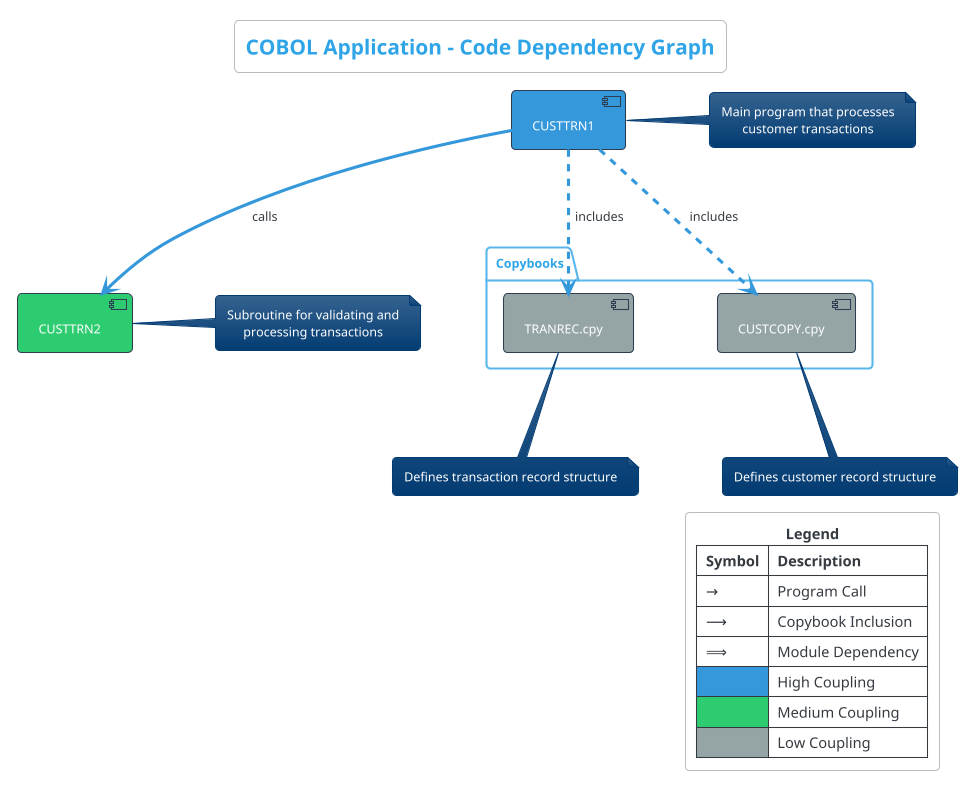

#### 18.6 Interpretation

The diagram shows:

1. **Program Calls**: Direct calls between COBOL programs (CUSTTRN1 calls CUSTTRN2)
2. **Copybook Inclusions**: Programs that include copybooks for data definitions
3. **Module Dependencies**: Overall dependencies between components

The color coding helps identify coupling levels:
- Blue: High coupling (many dependencies)
- Green: Medium coupling
- Gray: Low coupling

This visualization helps in understanding the overall structure of the application and identifying potential areas for refactoring or modularization.


#### 18.7 Prompt 1 for Generating Cypher Query


```
You are a Neo4j and COBOL expert tasked with creating a Cypher query to extract data for a code dependency graph visualization. This visualization will help developers and technical stakeholders understand the structure and dependencies of a legacy COBOL application.

## OBJECTIVE
Create a comprehensive Cypher query that extracts all dependencies between COBOL program modules from a Neo4j database, focusing on:
1. Program calls (which programs call other programs)
2. Copybook inclusions (which programs use which copybooks)
3. Module dependencies (JCL jobs, file dependencies)

## CONTEXT
The Neo4j database contains data imported from the legacy_code_final.json file, which describes a COBOL application with the following components:

### COBOL Programs:
- CUSTTRN1: Main program for processing customer transactions
- CUSTTRN2: Subroutine called by CUSTTRN1 for processing updates

### Copybooks:
- TRANREC.cpy: Transaction record structure
- CUSTCOPY.cpy: Customer record structure

### JCL Jobs:
- TESTJCL: Executes CUSTTRN1

### Files:
- CUSTOMER-FILE: Input customer records
- TRANSACTION-FILE: Input transaction records
- CUSTOMER-FILE-OUT: Output updated customer records
- REPORT-FILE: Output transaction reports

## NEO4J DATA MODEL
The Neo4j database uses the following node labels and relationships:

### Node Labels:
- COBOLProgram: COBOL program modules
- COBOLCopybook: COBOL copybooks
- COBOLJcl: JCL jobs
- COBOLFileControl: File definitions
- COBOLProcedureDivision, COBOLDataDivision, COBOLFileSection, COBOLParagraph: Program structure elements
- COBOLCall: Call statements within programs

### Relationships:
- CONTAINS: Hierarchical structure (e.g., program contains divisions)
- USES: Program uses copybook
- CALLS: Program calls another program
- EXECUTES: JCL executes program
- READS/WRITES: Program reads/writes file

## REQUIREMENTS
1. The query must extract all relevant dependencies to build a complete code dependency graph
2. Use OPTIONAL MATCH for relationships that might not exist
3. Include clear comments explaining each section of the query
4. Return results in a format suitable for visualization (program names, called programs, used copybooks, etc.)
5. Handle potential missing data gracefully
6. Focus on extracting meaningful relationships that show how components depend on each other

## OUTPUT FORMAT
Provide only the Cypher query with clear comments. The query should return data in a format that can be easily used to generate a PlantUML diagram in the next step of the pipeline.
```

#### 18.8 Prompt 2 for Generating PlantUML Script


```
You are a visualization expert specializing in software architecture diagrams. Your task is to create a PlantUML script that generates a professional, visually appealing code dependency graph for a COBOL application.

## OBJECTIVE
Create a PlantUML script that visualizes the dependencies between COBOL program modules, including program calls, copybook inclusions, and module dependencies. The diagram should be detailed enough for technical users while remaining clear and elegant for business stakeholders.

## INPUT DATA
The following data was extracted from a Neo4j database using a Cypher query:

[INSERT CYPHER QUERY RESULT HERE]

This data represents the dependencies between components in a COBOL application with:
- COBOL Programs: CUSTTRN1 (main program) and CUSTTRN2 (subroutine)
- Copybooks: TRANREC.cpy and CUSTCOPY.cpy
- JCL Job: TESTJCL
- Files: CUSTOMER-FILE, TRANSACTION-FILE, CUSTOMER-FILE-OUT, REPORT-FILE

Key dependencies include:
- CUSTTRN1 calls CUSTTRN2
- CUSTTRN1 includes TRANREC.cpy and CUSTCOPY.cpy
- CUSTTRN2 includes TRANREC.cpy
- TESTJCL executes CUSTTRN1
- CUSTTRN1 reads from and writes to various files

## VISUALIZATION REQUIREMENTS
1. **Component Representation**:
   - Use distinct visual styles for different component types (programs, copybooks, JCL jobs, files)
   - Use a professional color scheme with complementary colors
   - Include clear labels for all components

2. **Dependency Representation**:
   - Show all relationships between components with directional arrows
   - Use descriptive labels on relationships (e.g., "calls", "includes", "executes")
   - Organize the layout to minimize crossing lines and maximize clarity

3. **Visual Enhancements**:
   - Add a title, header, and legend
   - Include detailed notes explaining the purpose of key components
   - Add coupling metrics to highlight refactoring opportunities
   - Use shadowing and rounded corners for a modern look
   - Include a footer with relevant information

4. **Technical Details**:
   - The diagram should clearly show program calls
   - Highlight copybook inclusions
   - Show JCL job dependencies
   - Indicate file dependencies (read/write operations)

5. **Business Value**:
   - Include notes that explain the business purpose of key components
   - Highlight highly coupled components that may be refactoring candidates
   - Ensure the diagram is accessible to both technical and non-technical stakeholders

## OUTPUT FORMAT
Provide a complete, well-commented PlantUML script that can be directly used to generate the code dependency graph. The script should follow best practices for PlantUML and be structured for easy maintenance.

## ADDITIONAL GUIDANCE
- Use the skinparam command to customize the appearance
- Use notes strategically to add context without cluttering the diagram
- Consider using different shapes or styles for different types of components
- Ensure the diagram is readable when printed in both color and black and white
- Focus on making the dependencies clear and easy to understand
```

### 19. Complexity Heat Map
- **Purpose**: Identify complex areas of the codebase
- **Target Audience**: Developers, tech leads
- **Key Elements**:
  - Cyclomatic complexity metrics
  - Code size metrics
  - Maintenance hotspots
- **Benefits**: Helps prioritize areas for refactoring or careful documentation

#### 19.1 Complexity Heat Map for COBOL Application

This document provides the necessary Cypher query and PlantUML script to generate a Complexity Heat Map for the COBOL application. The heat map visualizes complex areas of the codebase to help identify maintenance hotspots and prioritize refactoring efforts.

The Complexity Heat Map serves the following purposes:
- Identify complex areas of the codebase that may require special attention
- Visualize cyclomatic complexity metrics across the application
- Highlight code size metrics to identify large components
- Pinpoint maintenance hotspots that combine high complexity with large size
- Assist in prioritizing areas for refactoring or careful documentation

#### 19.2 Cypher Query for Neo4j

The following Cypher query extracts complexity metrics from the Neo4j database:

```cypher
// Complexity Heat Map Query
MATCH (program:COBOLProgram)
MATCH (paragraph:COBOLParagraph)-[:BELONGS_TO]->(program)
WITH program, paragraph,
     // Calculate cyclomatic complexity based on control flow statements
     size([w IN paragraph.words WHERE w IN ['IF', 'ELSE', 'WHEN', 'UNTIL', 'EVALUATE', 'END-EVALUATE', 'END-IF']]) as decisionPoints,
     // Calculate code size metrics
     size(split(paragraph.rawCode, '\n')) as linesOfCode,
     // Count PERFORM statements as a measure of coupling
     size((paragraph)-[:PERFORMS]->()) as performCount
WITH program.name as programName, 
     paragraph.name as paragraphName,
     // Calculate cyclomatic complexity (decision points + 1)
     decisionPoints + 1 as cyclomaticComplexity,
     linesOfCode,
     performCount,
     // Calculate a maintenance index (higher is more complex)
     (decisionPoints + 1) * 0.7 + linesOfCode * 0.2 + performCount * 0.1 as maintenanceIndex
RETURN programName, paragraphName, cyclomaticComplexity, linesOfCode, performCount, maintenanceIndex
ORDER BY maintenanceIndex DESC
LIMIT 20
```

#### 19.3 PlantUML Script

The following PlantUML script generates a heat map visualization of the complexity metrics:

```plantuml
@startmindmap
<style>
mindmapDiagram {
  .low {
    BackgroundColor #92D050
    FontColor black
    FontSize 14
  }
  .medium {
    BackgroundColor #FFFF00
    FontColor black
    FontSize 14
  }
  .high {
    BackgroundColor #FFC000
    FontColor black
    FontSize 14
  }
  .critical {
    BackgroundColor #FF0000
    FontColor white
    FontSize 14
    Bold
  }
  .program {
    BackgroundColor #4472C4
    FontColor white
    FontSize 16
    Bold
  }
  .metrics {
    BackgroundColor #D9D9D9
    FontColor black
    FontSize 12
    Italic
  }
  .title {
    BackgroundColor #002060
    FontColor white
    FontSize 20
    Bold
  }
}
</style>

* <&pulse> COBOL Application Complexity Heat Map <<title>>
** CUSTTRN1 <<program>>
*** 100-PROCESS-TRANSACTIONS <<critical>>
**** CC: 12, LOC: 28, PC: 5 <<metrics>>
*** 200-PROCESS-UPDATE-TRAN <<high>>
**** CC: 8, LOC: 20, PC: 3 <<metrics>>
*** 710-READ-TRAN-FILE <<high>>
**** CC: 7, LOC: 18, PC: 2 <<metrics>>
*** 730-READ-CUSTOMER-FILE <<medium>>
**** CC: 6, LOC: 15, PC: 1 <<metrics>>
*** 700-OPEN-FILES <<medium>>
**** CC: 5, LOC: 25, PC: 0 <<metrics>>
*** 220-PROCESS-DELETE-TRAN <<medium>>
**** CC: 4, LOC: 12, PC: 2 <<metrics>>
*** 210-PROCESS-ADD-TRAN <<medium>>
**** CC: 4, LOC: 14, PC: 2 <<metrics>>
*** 740-WRITE-CUSTOUT-FILE <<low>>
**** CC: 3, LOC: 10, PC: 1 <<metrics>>
*** 850-REPORT-TRAN-STATS <<low>>
**** CC: 2, LOC: 30, PC: 0 <<metrics>>
*** 800-INIT-REPORT <<low>>
**** CC: 1, LOC: 8, PC: 0 <<metrics>>
** CUSTTRN2 <<program>>
*** 100-VALIDATE-TRAN <<critical>>
**** CC: 10, LOC: 32, PC: 0 <<metrics>>
*** 200-PROCESS-TRAN <<high>>
**** CC: 7, LOC: 25, PC: 0 <<metrics>>
*** 000-MAIN <<low>>
**** CC: 2, LOC: 9, PC: 2 <<metrics>>

legend right
  <b>Legend</b>
  |= Metric |= Description |
  | CC | Cyclomatic Complexity |
  | LOC | Lines of Code |
  | PC | PERFORM Count |
  | <back:#92D050>   </back> | Low Complexity (1-3) |
  | <back:#FFFF00>   </back> | Medium Complexity (4-6) |
  | <back:#FFC000>   </back> | High Complexity (7-9) |
  | <back:#FF0000>   </back> | Critical Complexity (10+) |
endlegend
@endmindmap
```

#### 19.4 Interpretation Guide

The heat map uses color coding to indicate complexity levels:

- **Green (Low)**: Cyclomatic complexity of 1-3
  - Simple, straightforward code with minimal branching
  - Generally easy to understand and maintain

- **Yellow (Medium)**: Cyclomatic complexity of 4-6
  - Moderate complexity with some branching logic
  - May require some effort to understand and maintain

- **Orange (High)**: Cyclomatic complexity of 7-9
  - High complexity with significant branching logic
  - Requires careful attention during maintenance
  - Consider refactoring or additional documentation

- **Red (Critical)**: Cyclomatic complexity of 10+
  - Extremely complex code with excessive branching
  - High risk for bugs and maintenance issues
  - Priority candidates for refactoring or detailed documentation

#### 19.5 Benefits

This complexity heat map provides several benefits:

1. **Targeted Refactoring**: Identifies the most complex areas that would benefit most from refactoring
2. **Risk Assessment**: Highlights areas with higher potential for bugs and maintenance issues
3. **Resource Allocation**: Helps allocate development and testing resources to high-risk areas
4. **Knowledge Transfer**: Identifies areas where detailed documentation is most needed
5. **Technical Debt Management**: Provides a visual representation of technical debt in the codebase

#### 19.6 Recommendations

Based on the complexity heat map:

1. Focus refactoring efforts on paragraphs with critical complexity (red)
2. Ensure comprehensive test coverage for high and critical complexity areas
3. Provide detailed documentation for complex paragraphs
4. Consider breaking down complex paragraphs into smaller, more manageable units
5. Implement code reviews with special attention to complex areas
6. Monitor complexity trends over time to ensure technical debt is being addressed

The Complexity Heat Map is a valuable tool for understanding the COBOL application's structure and identifying areas that require special attention. By visualizing complexity metrics, it helps prioritize maintenance efforts and improve the overall quality of the codebase.

#### 19.7 Prompt 1: Generate Cypher Query for Complexity Metrics

```
You are tasked with creating a Cypher query for Neo4j to extract complexity metrics from a COBOL application. These metrics will be used to generate a complexity heat map that identifies complex areas of the codebase.

The application consists of COBOL programs like CUSTTRN1 and CUSTTRN2, with various paragraphs, conditional statements, and file operations.

The Neo4j database contains nodes with labels like:
- COBOLProgram: Represents COBOL programs with properties like name and rawCode
- COBOLProcedureDivision: Contains the procedural logic of programs
- COBOLParagraph: Individual paragraphs within the procedure division
- COBOLCall: Represents calls to other programs
- COBOLFileControl: Represents file operations

Create a comprehensive Cypher query that extracts the following complexity metrics:
1. Lines of code per program
2. Number of paragraphs per program
3. Number of conditional statements (IF, EVALUATE, PERFORM, UNTIL, VARYING) per paragraph and program
4. Number of program calls (dependencies)
5. Number of file operations
6. A calculated complexity score based on these metrics

The query should:
- Calculate a weighted complexity score that considers all metrics
- Categorize programs as High, Medium, or Low complexity
- Order results by complexity score (highest first)
- Handle cases where relationships might not exist using OPTIONAL MATCH

The query will be used with the legacy_code_final.json data that has been imported into Neo4j. The structure includes COBOL programs with procedure divisions containing paragraphs, which in turn contain raw code with conditional statements.

Your output should be only the Cypher query with clear comments explaining each section, ready to be executed in a Neo4j database.
```

#### 19.8 Prompt 2: Generate PlantUML Script for Complexity Heat Map

After executing the Cypher query from Step 1, use this prompt with GPT-4o to generate a PlantUML script for the complexity heat map:

```
Using the results from the following Cypher query that extracted complexity metrics from a COBOL application, create a PlantUML script to generate a complexity heat map:

[INSERT CYPHER QUERY RESULT HERE]

The complexity heat map should:
1. Visualize the complexity of each COBOL program using color coding (red for high, yellow for medium, green for low complexity)
2. Display key complexity metrics for each program:
   - Lines of Code (LOC)
   - Cyclomatic Complexity (CC)
   - Paragraph Count (PC)
   - File Connections (FC)
   - Dependency Count (DC)
   - Overall Complexity Score
3. Highlight specific complexity hotspots (paragraphs with high complexity)
4. Show relationships between programs
5. Include visualizations of complexity distribution and metrics

The diagram should be visually appealing and easy to understand for all stakeholders, including developers, tech leads, executives, and business stakeholders. Use color coding, clear labels, and professional styling to enhance readability and create a business-elegant presentation.

Specific requirements:
- Use a heat map color scheme (red, yellow, green) to indicate complexity levels
- Include detailed notes explaining complexity hotspots and maintenance priorities
- Add a metrics visualization section showing comparative complexity
- Include a complexity distribution chart
- Use shadowing and rounded corners for a modern look
- Ensure all components have descriptive labels and metrics
- Organize the layout for maximum clarity

The diagram will be used by developers and tech leads to identify areas for refactoring and by executives to understand technical debt in the application.

Provide the complete PlantUML script that can be directly used to generate the complexity heat map. The script should be well-commented and structured for easy maintenance.
```


## Documentation and Knowledge Transfer Diagrams

### 20. Conceptual Domain Model
- **Purpose**: Represent the business concepts and their relationships
- **Key Elements**:
  - Business entities
  - Business rules
  - Domain vocabulary
- **Benefits**: Bridges the gap between technical implementation and business understanding


#### 20.1 Conceptual Domain Model for Customer Transaction System

The conceptual domain model represents the core business entities and their relationships in the customer transaction system. The system primarily manages customer records and processes different types of transactions (add, update, delete) against these records.

#### 20.2 Business Entities

1. **Customer** - The core entity representing customer information
2. **Transaction** - Represents operations performed on customer records
3. **Account** - Represents customer's financial account information
4. **Order** - Represents customer's order information
5. **Report** - Represents transaction processing reports

#### 20.3 Business Rules

1. Customer records are uniquely identified by a customer key
2. Transactions can be of type: ADD, UPDATE, DELETE
3. Update transactions can modify account balance or order information
4. Update actions can be REPLACE or ADD
5. Transactions must be processed in sequence by key
6. Duplicate customer keys are not allowed for ADD transactions
7. Customer keys must exist for UPDATE and DELETE transactions

#### 20.4 Neo4j Cypher Query

The following Cypher query creates the conceptual domain model in Neo4j:

```cypher
// Clear existing data (optional)
MATCH (n) DETACH DELETE n;

// Create Business Entities
CREATE (customer:BusinessEntity {name: 'Customer', description: 'Core entity representing customer information'})
CREATE (transaction:BusinessEntity {name: 'Transaction', description: 'Operations performed on customer records'})
CREATE (account:BusinessEntity {name: 'Account', description: 'Customer financial account information'})
CREATE (order:BusinessEntity {name: 'Order', description: 'Customer order information'})
CREATE (report:BusinessEntity {name: 'Report', description: 'Transaction processing reports'})

// Create Business Attributes for Customer
CREATE (custKey:BusinessAttribute {name: 'Customer Key', description: 'Unique identifier for customer'})
CREATE (custName:BusinessAttribute {name: 'Customer Name', description: 'Name of the customer'})
CREATE (custAddr:BusinessAttribute {name: 'Customer Address', description: 'Address of the customer'})
CREATE (custCity:BusinessAttribute {name: 'Customer City', description: 'City of the customer'})
CREATE (custState:BusinessAttribute {name: 'Customer State', description: 'State of the customer'})
CREATE (custCountry:BusinessAttribute {name: 'Customer Country', description: 'Country of the customer'})

// Create Business Attributes for Transaction
CREATE (tranCode:BusinessAttribute {name: 'Transaction Code', description: 'Type of transaction (ADD, UPDATE, DELETE)'})
CREATE (tranKey:BusinessAttribute {name: 'Transaction Key', description: 'Key identifying the target customer'})
CREATE (tranAction:BusinessAttribute {name: 'Transaction Action', description: 'Action to perform (REPLACE, ADD)'})
CREATE (tranField:BusinessAttribute {name: 'Transaction Field', description: 'Field to modify (BALANCE, ORDERS)'})
CREATE (tranData:BusinessAttribute {name: 'Transaction Data', description: 'Data for the transaction'})

// Create Business Attributes for Account
CREATE (acctBalance:BusinessAttribute {name: 'Account Balance', description: 'Current balance in customer account'})

// Create Business Attributes for Order
CREATE (ordersYTD:BusinessAttribute {name: 'Orders YTD', description: 'Year-to-date order count'})

// Create Business Attributes for Report
CREATE (reportStats:BusinessAttribute {name: 'Report Statistics', description: 'Transaction processing statistics'})
CREATE (reportErrors:BusinessAttribute {name: 'Report Errors', description: 'Transaction processing errors'})

// Create Relationships between Entities
CREATE (customer)-[:HAS_ACCOUNT]->(account)
CREATE (customer)-[:PLACES]->(order)
CREATE (transaction)-[:TARGETS]->(customer)
CREATE (transaction)-[:MODIFIES]->(account)
CREATE (transaction)-[:AFFECTS]->(order)
CREATE (transaction)-[:GENERATES]->(report)

// Create Relationships between Entities and Attributes
CREATE (customer)-[:HAS_ATTRIBUTE]->(custKey)
CREATE (customer)-[:HAS_ATTRIBUTE]->(custName)
CREATE (customer)-[:HAS_ATTRIBUTE]->(custAddr)
CREATE (customer)-[:HAS_ATTRIBUTE]->(custCity)
CREATE (customer)-[:HAS_ATTRIBUTE]->(custState)
CREATE (customer)-[:HAS_ATTRIBUTE]->(custCountry)

CREATE (transaction)-[:HAS_ATTRIBUTE]->(tranCode)
CREATE (transaction)-[:HAS_ATTRIBUTE]->(tranKey)
CREATE (transaction)-[:HAS_ATTRIBUTE]->(tranAction)
CREATE (transaction)-[:HAS_ATTRIBUTE]->(tranField)
CREATE (transaction)-[:HAS_ATTRIBUTE]->(tranData)

CREATE (account)-[:HAS_ATTRIBUTE]->(acctBalance)
CREATE (order)-[:HAS_ATTRIBUTE]->(ordersYTD)
CREATE (report)-[:HAS_ATTRIBUTE]->(reportStats)
CREATE (report)-[:HAS_ATTRIBUTE]->(reportErrors)

// Create Business Rules
CREATE (rule1:BusinessRule {name: 'Unique Customer Key', description: 'Customer records are uniquely identified by a customer key'})
CREATE (rule2:BusinessRule {name: 'Transaction Types', description: 'Transactions can be of type: ADD, UPDATE, DELETE'})
CREATE (rule3:BusinessRule {name: 'Update Fields', description: 'Update transactions can modify account balance or order information'})
CREATE (rule4:BusinessRule {name: 'Update Actions', description: 'Update actions can be REPLACE or ADD'})
CREATE (rule5:BusinessRule {name: 'Transaction Sequence', description: 'Transactions must be processed in sequence by key'})
CREATE (rule6:BusinessRule {name: 'No Duplicate Keys', description: 'Duplicate customer keys are not allowed for ADD transactions'})
CREATE (rule7:BusinessRule {name: 'Key Must Exist', description: 'Customer keys must exist for UPDATE and DELETE transactions'})

// Connect Rules to Entities
CREATE (rule1)-[:APPLIES_TO]->(customer)
CREATE (rule2)-[:APPLIES_TO]->(transaction)
CREATE (rule3)-[:APPLIES_TO]->(transaction)
CREATE (rule4)-[:APPLIES_TO]->(transaction)
CREATE (rule5)-[:APPLIES_TO]->(transaction)
CREATE (rule6)-[:APPLIES_TO]->(transaction)
CREATE (rule7)-[:APPLIES_TO]->(transaction)

// Return all nodes and relationships
MATCH (n) RETURN n;
```

#### 20.5 PlantUML Diagram

The following PlantUML script creates a visual representation of the conceptual domain model:

```plantuml
@startuml Conceptual Domain Model

' Styling
skinparam backgroundColor white
skinparam handwritten false
skinparam shadowing false
skinparam defaultFontName Arial
skinparam defaultFontSize 14
skinparam roundCorner 10
skinparam dpi 300

skinparam class {
  BackgroundColor #F8F9FA
  ArrowColor #2C3E50
  BorderColor #2C3E50
  FontColor #2C3E50
}

skinparam note {
  BackgroundColor #FFF9C4
  BorderColor #FFD54F
  FontColor #5D4037
}

' Title
title <b><size:24>Conceptual Domain Model</size></b>\n<size:16>Customer Transaction Processing System</size>

' Business Entities
class "Customer" as Customer << Business Entity >> {
  + Customer Key
  + Customer Name
  + Customer Address
  + Customer City
  + Customer State
  + Customer Country
}

class "Transaction" as Transaction << Business Entity >> {
  + Transaction Code
  + Transaction Key
  + Transaction Action
  + Transaction Field
  + Transaction Data
}

class "Account" as Account << Business Entity >> {
  + Account Balance
}

class "Order" as Order << Business Entity >> {
  + Orders YTD
}

class "Report" as Report << Business Entity >> {
  + Report Statistics
  + Report Errors
}

' Relationships
Customer "1" -- "1" Account : has >
Customer "1" -- "*" Order : places >
Transaction "*" -- "1" Customer : targets >
Transaction "*" -- "0..1" Account : modifies >
Transaction "*" -- "0..1" Order : affects >
Transaction "1" -- "*" Report : generates >

' Business Rules
note right of Customer
  <b>Business Rules:</b>
  - Customer records are uniquely identified by a customer key
end note

note right of Transaction
  <b>Business Rules:</b>
  - Transactions can be of type: ADD, UPDATE, DELETE
  - Update transactions can modify account balance or order information
  - Update actions can be REPLACE or ADD
  - Transactions must be processed in sequence by key
  - Duplicate customer keys are not allowed for ADD transactions
  - Customer keys must exist for UPDATE and DELETE transactions
end note

' Legend
legend right
  <b>Legend</b>
  |= Symbol |= Description |
  | << Business Entity >> | Core business concept |
  | -- | Association between entities |
  | "*" | Many (zero or more) |
  | "1" | Exactly one |
  | "0..1" | Zero or one |
endlegend

@enduml
```

This conceptual domain model provides a comprehensive view of the business concepts and their relationships in the customer transaction processing system. It serves as a bridge between the technical implementation details and the business understanding, making it valuable for all involved in the system.

#### 20.6 Prompt 1: Generate Cypher Query for Neo4j Domain Model

```
You are tasked with creating a Cypher query to build a conceptual domain model in Neo4j for a legacy COBOL application. The model should represent business concepts and their relationships for a customer transaction processing system.

Input:
1. The file 'legacy_code_final.json' contains the COBOL program definitions with detailed structure
2. The file 'callgraph.txt' shows the program structure and call relationships

The COBOL application is a customer transaction processing system with two main programs:
- CUSTTRN1: Main program that processes transactions (add, update, delete)
- CUSTTRN2: Called by CUSTTRN1 to handle update transactions

Key business entities include:
1. Customer (with attributes like name, address, city, state, country)
2. Transaction (with types: ADD, UPDATE, DELETE)
3. Account (with balance information)
4. Order (with year-to-date information)
5. Report (for transaction statistics and errors)
6. File (physical files used in the system)
7. Process (business processes in the system)

Business rules include:
1. Customer records are uniquely identified by a customer key
2. Transactions can be of type: ADD, UPDATE, DELETE
3. Update transactions can modify account balance or order information
4. Update actions can be REPLACE or ADD
5. Transactions must be processed in sequence by key
6. Duplicate customer keys are not allowed for ADD transactions
7. Customer keys must exist for UPDATE and DELETE transactions
8. Transaction processing generates statistical reports

Create a comprehensive Cypher query that:
1. Creates all business entities as nodes with appropriate labels and properties
2. Creates all business attributes as nodes with appropriate labels and properties
3. Creates all business rules as nodes with appropriate labels and properties
4. Establishes relationships between entities, attributes, and rules
5. Uses clear and descriptive relationship types
6. Includes comments explaining the purpose of each section

The query should be well-structured, optimized for Neo4j, and suitable for visualization in the Neo4j browser.
```

#### 20.7 Prompt 2: Generate PlantUML Script for Domain Model Visualization

```
You are tasked with creating a PlantUML script to visualize a conceptual domain model for a legacy COBOL application. The visualization should be elegant, professional, and easily understandable by both technical and non-technical stakeholders.

Input:
1. The Cypher query below was used to create the domain model in Neo4j
2. The model represents a customer transaction processing system from a COBOL application

[INSERT CYPHER QUERY FROM PROMPT 1 OUTPUT HERE]

Create a comprehensive PlantUML script that:
1. Visualizes all business entities (Customer, Transaction, Account, Order, Report, File, Process)
2. Shows the attributes of each entity
3. Illustrates the relationships between entities with appropriate cardinality
4. Includes business rules as notes attached to relevant entities
5. Uses packages to group related entities
6. Implements a professional and elegant visual style with:
   - Appropriate colors and styling
   - Clear typography
   - Logical layout
   - Proper spacing and alignment
   - Informative title and legend

The diagram should be optimized for readability and comprehension by all stakeholders, including developers, executives, and tech leads. It should effectively bridge the gap between technical implementation and business understanding.

Use the following styling guidelines:
- Use a clean, professional color scheme
- Group related entities in packages
- Use orthogonal lines for relationships
- Include a descriptive title and legend
- Add appropriate notes for business rules
- Use stereotypes to indicate entity types
```
