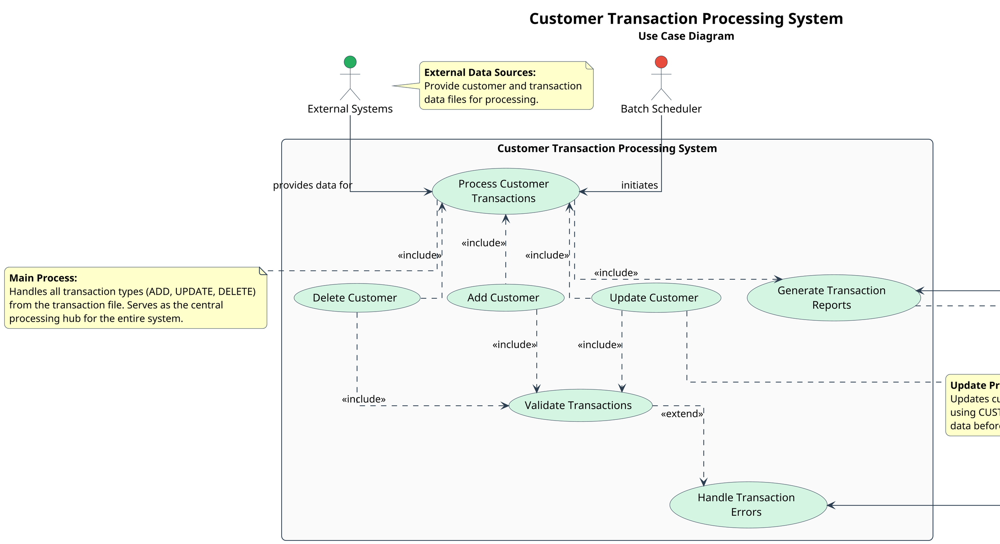

# Use Case Diagram - Customer Transaction Processing System

## Purpose
This document provides the Cypher query and PlantUML script for generating a Use Case Diagram of the COBOL Customer Transaction Processing System.

- **Purpose**: Identify the main functions of the system from a user perspective
- **Target Audience**: All stakeholders (developers, executives, tech leads, stakeholders)
- **Key Elements**:
  - System boundary
  - Actors (users, external systems)
  - Use cases (Add Customer, Update Customer, Delete Customer, etc.)
- **Benefits**: Provides a functional view of the system capabilities

## Cypher Query for Neo4j

The following Cypher query can be used to extract the use case information from the COBOL application:

```cypher
// Define the system boundary by identifying the main COBOL programs
MATCH (p:COBOLProgram)
WHERE p.name IN ['CUSTTRN1', 'CUSTTRN2']

// Find main paragraphs that represent use cases
OPTIONAL MATCH (p)-[:CONTAINS]->(para:COBOLParagraph)
WHERE para.name IN [
  '100-PROCESS-TRANSACTIONS',
  '200-PROCESS-UPDATE-TRAN',
  '210-PROCESS-ADD-TRAN',
  '220-PROCESS-DELETE-TRAN',
  '299-REPORT-BAD-TRAN',
  '830-REPORT-TRAN-PROCESSED',
  '850-REPORT-TRAN-STATS'
]

// Find file interactions to identify external systems
OPTIONAL MATCH (p)-[:READS|WRITES]->(f:COBOLFile)

// Find program calls to identify interactions
OPTIONAL MATCH (p1:COBOLProgram)-[:CALLS]->(p2:COBOLProgram)
WHERE p1.name = 'CUSTTRN1' AND p2.name = 'CUSTTRN2'

// Return the results
RETURN 
  p.name as Program,
  collect(distinct para.name) as UseCases,
  collect(distinct f.name) as ExternalSystems,
  collect(distinct p2.name) as CalledPrograms
```

## PlantUML Script

The following PlantUML script creates a comprehensive Use Case Diagram for the Customer Transaction Processing System:



## Diagram Explanation

The Use Case Diagram illustrates:

1. **System Boundary**: The "Customer Transaction Processing System" rectangle represents the system boundary, containing all use cases.

2. **Actors**:
   - **Batch Scheduler** (Red): Initiates the batch processing job
   - **Operations Team** (Blue): Reviews reports and resolves errors
   - **External Systems** (Green): Provides customer and transaction data files

3. **Primary Use Cases**:
   - **Process Customer Transactions**: The main function that processes all transaction types
   - **Add Customer**: Creates new customer records
   - **Update Customer**: Modifies existing customer records (balance, orders)
   - **Delete Customer**: Removes customer records
   - **Validate Transactions**: Ensures transaction data is valid
   - **Generate Transaction Reports**: Creates reports on processing results
   - **Handle Transaction Errors**: Manages and reports transaction errors

4. **Relationships**:
   - **Include**: Indicates that one use case includes the functionality of another
   - **Extend**: Indicates optional behavior that may be triggered under certain conditions

## Benefits

This Use Case Diagram provides:

1. A clear functional view of the system capabilities
2. Visibility into how external actors interact with the system
3. Understanding of the main business processes supported by the application
4. A foundation for modernization planning and knowledge transfer

The diagram serves as an essential tool for all stakeholders to understand the system's functionality without needing to delve into the technical implementation details. The color coding and detailed notes enhance comprehension for both technical and non-technical audiences.

## Prompt 1: Neo4j Cypher Query Generation

```
You are a COBOL and Neo4j expert tasked with creating a Cypher query to extract data for a Use Case Diagram from a Neo4j database containing COBOL application information.

## Context
The database contains information about a legacy COBOL application called "Customer Transaction Processing System" with two main programs:
1. CUSTTRN1 - Main program that processes customer transactions
2. CUSTTRN2 - Subroutine called by CUSTTRN1 to validate and process update transactions

## Requirements
Create a Cypher query that will:
1. Identify the main COBOL programs (CUSTTRN1, CUSTTRN2)
2. Extract paragraphs that represent use cases (especially those handling transaction processing)
3. Identify file interactions to determine external systems
4. Capture program calls to understand interactions between components

## Important Neo4j Structure Information
- COBOL programs are represented as nodes with the label `:COBOLProgram`
- Paragraphs are represented as nodes with the label `:COBOLParagraph`
- Files are represented as nodes with the label `:COBOLFile`
- Relationships include:
  - `[:CONTAINS]` - Program contains a paragraph
  - `[:CALLS]` - Program calls another program
  - `[:READS]` - Program reads from a file
  - `[:WRITES]` - Program writes to a file

## Expected Output
Provide a well-commented Cypher query that returns:
1. Program names
2. Use case paragraphs associated with each program
3. External systems (files) that interact with the programs
4. Program call relationships

The query should be optimized for Neo4j and include clear comments explaining each section.
```

## Prompt 2: PlantUML Use Case Diagram Generation

```
You are a UML and software architecture expert tasked with creating a PlantUML script for a Use Case Diagram based on data extracted from a Neo4j database.

## Context
The data represents a legacy COBOL application called "Customer Transaction Processing System" with two main programs:
1. CUSTTRN1 - Main program that processes customer transactions
2. CUSTTRN2 - Subroutine called by CUSTTRN1 to validate and process update transactions

## Neo4j Query Results
The following data was extracted from Neo4j (replace this with the actual results from Prompt 1):

```json
{
  "Program": "CUSTTRN1",
  "UseCases": [
    "100-PROCESS-TRANSACTIONS",
    "200-PROCESS-UPDATE-TRAN",
    "210-PROCESS-ADD-TRAN",
    "220-PROCESS-DELETE-TRAN",
    "299-REPORT-BAD-TRAN",
    "830-REPORT-TRAN-PROCESSED",
    "850-REPORT-TRAN-STATS"
  ],
  "ExternalSystems": [
    "CUSTOMER-FILE",
    "TRANSACTION-FILE",
    "CUSTOMER-FILE-OUT",
    "REPORT-FILE"
  ],
  "CalledPrograms": [
    "CUSTTRN2"
  ]
}
```